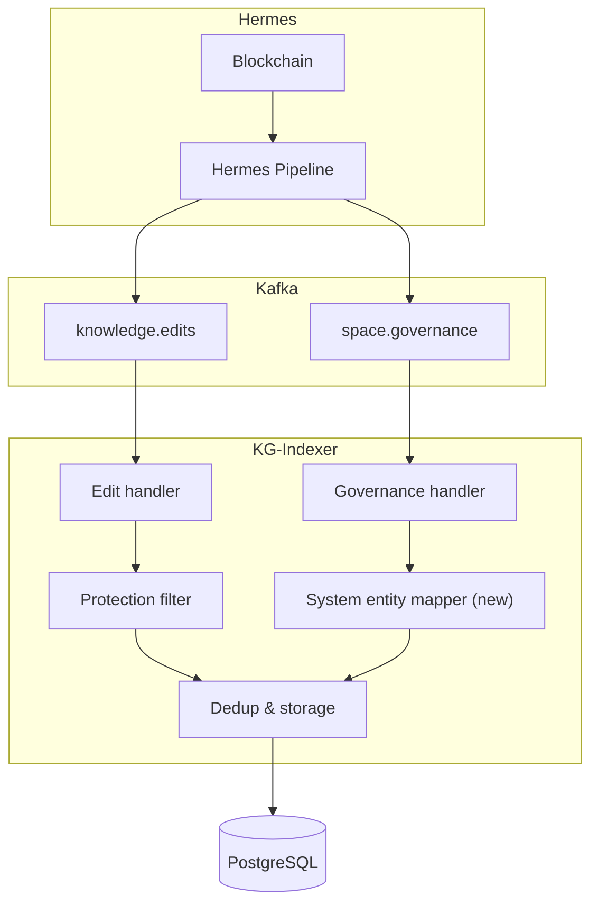

# System Entities Tech Design

## 1. Overview

This document describes how to implement system entities in the Gaia KG-Indexer. The goal is to materialize onchain governance events as knowledge graph entities with protected properties, so that the same entity can carry both onchain truth and user-contributed knowledge.

The implementation is scoped to two components. The **SDK** gains a set of well-known UUIDs for system types, protected properties, and protected relation types. The **KG-Indexer** gains two new behaviors: it creates system entities when it receives Action events, and it filters out operations that target protected properties or relation types when it processes `EDITS_PUBLISHED` events. Everything downstream (database schema, search indexer, scoring, API) remains unchanged because system entities are standard GRC-20 entities flowing through existing infrastructure.

## 2. Architecture context

The KG-Indexer currently consumes six Kafka topics, each carrying a specific event type from the Hermes pipeline. Governance events already arrive on the `space.governance` topic and are handled by the governance module, but they only write to the `proposals` and `proposal_votes` tables. System entities introduce a parallel path where those same governance events also produce GRC-20 entities, values, and relations in the knowledge graph tables.

The protection filter is a new check inserted into the existing edit processing path. When a `knowledge.edits` message arrives, the indexer already decodes the GRC-20 payload and extracts operations. The filter inspects each operation before it reaches storage and drops any that reference a protected property ID or protected relation type.



The edit handler path gains the protection filter between decoding and storage. The governance handler path gains the system entity mapper that converts Action events into entity, value, and relation operations. Both paths converge at the dedup and storage layer, where multiple operations targeting the same entity or value within a single edit are merged using last-write-wins semantics before being written to PostgreSQL. System entities use the exact same insertion logic as user-created entities.

<aside>
⚠️
The edits operation filtering process is responsible for detecting user edits targeting system entities that would, if applied, break the on-chain data in the knowledge layer
</aside>

## 3. Well-known IDs

System entities require a set of globally known UUIDs that all indexers agree on. These IDs are defined in the SDK (`sdk/src/core/ids.rs`) so that any consumer of the knowledge graph can identify system entities and their protected properties.

### 3.1 Generating the UUIDs

All system IDs follow the `derived_uuid` pattern from the GRC-20 spec, which uses UUID v5 (SHA-1 based, deterministic) with a fixed namespace. The input string follows the convention `geo:system:<category>:<name>`.

```rust
const GEO_SYSTEM_NAMESPACE: Uuid = Uuid::new_v5(
    &Uuid::NAMESPACE_URL,
    b"geo:system"
);

// Example: deriving the System type ID
let system_type_id = Uuid::new_v5(
    &GEO_SYSTEM_NAMESPACE,
    b"type:System"
);
```

The namespace itself is derived from `Uuid::NAMESPACE_URL`, a standard UUID constant defined in RFC 4122 (`6ba7b811-9dad-11d1-80b4-00c04fd430c8`) that serves as the conventional root namespace for URL-based UUID v5 derivation. Every system UUID is derived from this single namespace with a category-prefixed name, ensuring no collisions between types, properties, and relation types.

### 3.2 System types

These are entities that live in the Root Space. Every system entity receives a `Types` relation pointing to the `System` type, plus a more specific type for the event that created it.

| Name | Derivation input | Description |
| --- | --- | --- |
| System | `type:System` | Base type for all system entities |
| Space | `type:Space` | A registered onchain space |
| Proposal | `type:Proposal` | A governance proposal |

### 3.3 Protected properties

These property IDs are reserved for system use. The indexer ignores any `EDITS_PUBLISHED` operation that references one of these IDs.

| Name | Derivation input | Data type | Description |
| --- | --- | --- | --- |
| Space Address | `property:SpaceAddress` | BYTES | The onchain contract address of the space |
| Proposal Id | `property:ProposalId` | BYTES | The onchain proposal identifier |
| Voting Mode | `property:VotingMode` | INTEGER | The proposal voting mode (Fast or Slow) |
| Created By | `property:CreatedBy` | BYTES | The `fromSpaceId` that initiated the event |
| Created At Block | `property:CreatedAtBlock` | INTEGER | The block number when the event was emitted |

### 3.4 Protected relation types

System type assignments use a dedicated `SystemTypes` relation type, separate from the existing `Types` relation type (`8f151ba4-de20-4e3c-9cb4-99ddf96f48f1`). The existing `Types` remains available for user-defined type assignments on any entity, while `SystemTypes` is reserved exclusively for the indexer to assign system types (System, Space, Proposal) to system entities.

Since `SystemTypes` is a distinct relation type ID, the protection check is the same pattern as property protection: any relation operation that uses `SYSTEM_TYPES_RELATION_TYPE_ID` as its `type_id` is dropped. No stateful tracking of individual relation IDs is needed.

| Name | Derivation input | Description |
| --- | --- | --- |
| SystemTypes | `relation_type:SystemTypes` | Type assignment relation for system entities, protected from user edits |

### 3.5 SDK additions

The following constants are added to `sdk/src/core/ids.rs`:

```rust
// System type entity IDs
pub const SYSTEM_TYPE_ID: &str = "<derived>";
pub const SPACE_TYPE_ID: &str = "<derived>";
pub const PROPOSAL_TYPE_ID: &str = "<derived>";

// Protected property IDs
pub const SPACE_ADDRESS_PROPERTY_ID: &str = "<derived>";
pub const PROPOSAL_ID_PROPERTY_ID: &str = "<derived>";
pub const VOTING_MODE_PROPERTY_ID: &str = "<derived>";
pub const CREATED_BY_PROPERTY_ID: &str = "<derived>";
pub const CREATED_AT_BLOCK_PROPERTY_ID: &str = "<derived>";

// Protected relation type IDs
pub const SYSTEM_TYPES_RELATION_TYPE_ID: &str = "<derived>";

// Collected sets for protection checks
pub const PROTECTED_PROPERTY_IDS: &[&str] = &[
    SPACE_ADDRESS_PROPERTY_ID,
    PROPOSAL_ID_PROPERTY_ID,
    VOTING_MODE_PROPERTY_ID,
    CREATED_BY_PROPERTY_ID,
    CREATED_AT_BLOCK_PROPERTY_ID,
];

pub const PROTECTED_RELATION_TYPE_IDS: &[&str] = &[
    SYSTEM_TYPES_RELATION_TYPE_ID,
];
```

The actual UUID values will be computed by running the derivation function once and hardcoding the results. This avoids runtime computation and makes the IDs greppable across the codebase. For example, the System type ID derivation:

```rust
// Step 1: derive the system namespace
let namespace = Uuid::new_v5(&Uuid::NAMESPACE_URL, b"geo:system");
// namespace = <deterministic UUID>

// Step 2: derive the System type ID from the namespace
let system_type_id = Uuid::new_v5(&namespace, b"type:System");
// system_type_id = <deterministic UUID, hardcoded as SYSTEM_TYPE_ID>
```

Every ID in the tables above follows this same two-step pattern with its corresponding derivation input.

## 4. Protection filter

The protection filter prevents user edits from modifying system-managed state. It sits between the GRC-20 decode step and the squash/storage step in the existing edit handler pipeline.

### 4.1 Where it hooks in

The current `handle_edit` function in `kg-indexer/src/handlers/edits.rs` follows this flow:

```
decode_payload 
	→ extract_entities 
	→ extract_values 
	→ extract_relations 
	→ squash 
	→ EditResult
```

The filter applies after extraction and before squashing. It removes value operations that reference protected property IDs and relation operations that target system-created relations.

```rust
pub fn handle_edit(edit: &HermesEdit) -> Result<EditResult, HandlerError> {
    let edit_id = parse_edit_id(&edit.id)?;
    let space_id = parse_space_id(edit.space_id.as_slice())?;
    let meta = EditMetadata::from_edit(edit);

    let grc20_edit = decode_payload(&edit.payload)?;

    let entities = extract_entities(&grc20_edit, &space_id, &meta);
    let value_ops = extract_values(&grc20_edit, &space_id);
    let relation_ops = extract_relations(&grc20_edit, &space_id);

    // New: filter protected operations
    let value_ops = filter_protected_values(value_ops);
    let relation_ops = filter_protected_relations(relation_ops);

    let values = squash_values(&value_ops);
    let relations = squash_relations(&relation_ops);

    Ok(EditResult { edit_id, entities, values, relations })
}
```

### 4.2 Value protection

The value filter checks each `ValueOp`'s `property_id` against the `PROTECTED_PROPERTY_IDS` set. Any operation (set or delete) referencing a protected property is dropped.

```rust
use sdk::core::ids::PROTECTED_PROPERTY_IDS;
use std::collections::HashSet;
use once_cell::sync::Lazy;

static PROTECTED_PROPERTIES: Lazy<HashSet<Uuid>> = Lazy::new(|| {
    PROTECTED_PROPERTY_IDS
        .iter()
        .map(|id| Uuid::parse_str(id).expect("invalid protected property ID"))
        .collect()
});

fn filter_protected_values(ops: Vec<ValueOp>) -> Vec<ValueOp> {
    ops.into_iter()
        .filter(|op| !PROTECTED_PROPERTIES.contains(&op.property_id))
        .collect()
}
```

The set is initialized once at startup using `Lazy`. Since the protected IDs are compile-time constants, the parse will never fail in practice.

### 4.3 Relation protection

The relation filter enforces two rules on `CreateRelation` operations:

1. **Protected relation types.** Any `Create` where `type_id` matches a protected relation type ID (e.g., `SYSTEM_TYPES_RELATION_TYPE_ID`) is dropped. Users cannot assign system types to entities.
2. **Protected property entities as endpoints.** Since properties are themselves entities in the knowledge graph, any `Create` where `from_id` or `to_id` matches a protected property ID is dropped. Users cannot create relations pointing to or from system property entities. Only the KG-Indexer can reference these entities in relations.

```rust
static PROTECTED_RELATION_TYPES: Lazy<HashSet<Uuid>> = Lazy::new(|| {
    PROTECTED_RELATION_TYPE_IDS
        .iter()
        .map(|id| Uuid::parse_str(id).expect("invalid protected relation type ID"))
        .collect()
});

fn filter_protected_relations(ops: Vec<RelationOp>) -> Vec<RelationOp> {
    ops.into_iter()
        .filter(|op| match op {
            RelationOp::Create(rel) => {
                let type_protected = PROTECTED_RELATION_TYPES.contains(&rel.type_id);
                let from_protected = PROTECTED_PROPERTIES.contains(&rel.from_id);
                let to_protected = PROTECTED_PROPERTIES.contains(&rel.to_id);
                !type_protected && !from_protected && !to_protected
            }
            // Update, Unset, and Delete operate by relation ID and do not
            // carry type_id or from/to fields. See open questions (section 6)
            // for how these should be handled.
            _ => true,
        })
        .collect()
}
```

The `Create` filter covers the primary attack surface because users must create a relation before they can update, unset, or delete it. The `Update`, `Unset`, and `Delete` variants (`UpdateRelationItem`, `UnsetRelationItem`, `DeleteRelationItem`) only carry the relation `id` and `space_id`, not the `type_id` or entity endpoints, which makes filtering them by protected type or endpoint impossible without a database lookup or stateful tracking. This is addressed as an open question in section 6.

## 5. Event-to-entity mapping

The system entity mapper is a new module in the KG-Indexer that converts governance Action events into the same `EntityItem`, `ValueOp`, and `RelationOp` structures used by the edit handler. This means system entities flow through the same storage path as user-created entities without any special database logic.

### 5.1 Module structure

A new handler module `kg-indexer/src/handlers/system_entities.rs` contains the mapping functions. Each function takes a governance event message and returns the entities, values, and relations to create.

```rust
pub struct SystemEntityResult {
    pub entities: Vec<EntityItem>,
    pub values: Vec<ValueOp>,
    pub relations: Vec<RelationOp>,
}
```

This mirrors the shape of `EditResult` but without the `edit_id` field since system entities are not created from GRC-20 edits.

### 5.2 Deterministic ID derivation

Entity IDs are derived using UUID v5 with the same `GEO_SYSTEM_NAMESPACE` described in section 3.1.

```rust
fn derive_system_entity_id(event_type: &str, unique_data: &str) -> Uuid {
    Uuid::new_v5(
        &GEO_SYSTEM_NAMESPACE,
        format!("geo:system:{}:{}", event_type, unique_data).as_bytes(),
    )
}

fn derive_system_relation_id(type_name: &str, entity_id: &Uuid) -> Uuid {
    Uuid::new_v5(
        &GEO_SYSTEM_NAMESPACE,
        format!("geo:system:rel:{}:{}", type_name, entity_id).as_bytes(),
    )
}
```

Relation IDs for type assignments follow the same namespace but use the prefix `geo:system:rel:` to avoid collisions with entity IDs.

### 5.3 Value construction

System values are constructed using the same `ValueOp` struct and the same `derive_value_id` function already used by the edit handler. The value ID is derived from `Hash(entity_id, property_id, space_id)`, which means system values and user values share the same ID space. This is intentional because the protection filter prevents user edits from overwriting system values.

```rust
fn make_system_value(
    entity_id: &Uuid,
    property_id: &Uuid,
    space_id: &Uuid,
    // value fields...
) -> ValueOp {
    ValueOp {
        id: derive_value_id(entity_id, property_id, space_id),
        change_type: ValueChangeType::Set,
        entity_id: *entity_id,
        property_id: *property_id,
        space_id: *space_id,
        // ... set the appropriate value column
        ..Default::default()
    }
}
```

### 5.4 Type relation construction

Every system entity gets at least two system type relations: one to the `System` type and one to the event-specific type (e.g., `Space` or `Proposal`). These use the `SYSTEM_TYPES_RELATION_TYPE_ID` rather than the regular `TYPE_RELATION_TYPE_ID`, which means the protection filter will block any user attempt to create, modify, or delete system type assignments.

```rust
fn make_system_type_relation(
    entity_id: &Uuid,
    type_entity_id: &Uuid,
    type_name: &str,
    space_id: &Uuid,
) -> SetRelationItem {
    let relation_id = derive_system_relation_id(type_name, entity_id);
    SetRelationItem {
        id: relation_id,
        entity_id: relation_id, // reified entity for the relation
        type_id: Uuid::parse_str(SYSTEM_TYPES_RELATION_TYPE_ID).unwrap(),
        from_id: *entity_id,
        to_id: *type_entity_id,
        space_id: *space_id,
        // optional fields: None
        ..Default::default()
    }
}
```

### 5.5 GOVERNANCE.SPACE_ID_REGISTERED mapping

This mapping fires when the KG-Indexer receives a `HermesCreateSpace` message (which corresponds to the `GOVERNANCE.SPACE_ID_REGISTERED` action). The indexer already handles this event in `handlers/spaces.rs` to insert into the `spaces` table. The system entity mapper runs alongside that handler to also create the knowledge graph representation.

```rust
pub fn map_space_registered(
    space: &HermesCreateSpace,
    meta: &BlockchainMetadata,
) -> Result<SystemEntityResult, HandlerError> {
    let space_id = parse_uuid(&space.space_id)?;
    let entity_id = derive_system_entity_id(
        "GOVERNANCE.SPACE_ID_REGISTERED",
        &space_id.to_string(),
    );

    let address = extract_space_address(space);
    let timestamp = meta.created_at.to_string();
    let block = meta.block_number.to_string();

    let entity = EntityItem {
        id: entity_id,
        created_at: timestamp.clone(),
        created_at_block: block.clone(),
        updated_at: timestamp,
        updated_at_block: block.clone(),
    };

    let values = vec![
        make_system_value_bytes(&entity_id, &SPACE_ADDRESS_PROPERTY_ID, &space_id, &address),
        make_system_value_bytes(&entity_id, &CREATED_BY_PROPERTY_ID, &space_id, &from_space_bytes),
        make_system_value_integer(&entity_id, &CREATED_AT_BLOCK_PROPERTY_ID, &space_id, meta.block_number as i64),
    ];

    let relations = vec![
        RelationOp::Create(make_system_type_relation(&entity_id, &SYSTEM_TYPE_ID, "System", &space_id)),
        RelationOp::Create(make_system_type_relation(&entity_id, &SPACE_TYPE_ID, "Space", &space_id)),
    ];

    Ok(SystemEntityResult {
        entities: vec![entity],
        values,
        relations,
    })
}
```

The entity is written to the space identified by `space_id`, which is the space that was just registered.

### 5.6 GOVERNANCE.PROPOSAL_CREATED mapping

This mapping fires when the KG-Indexer receives a `HermesProposalCreated` message. The existing governance handler writes to the `proposals` table. The system entity mapper also creates the knowledge graph representation.

```rust
pub fn map_proposal_created(
    msg: &HermesProposalCreated,
    meta: &BlockchainMetadata,
) -> Result<SystemEntityResult, HandlerError> {
    let space_id = parse_uuid(&msg.space_id)?;
    let proposal_id = parse_uuid(&msg.proposal_id)?;
    let proposer_id = parse_uuid(&msg.proposer_id)?;

    let entity_id = derive_system_entity_id(
        "GOVERNANCE.PROPOSAL_CREATED",
        &format!("{}:{}", space_id, proposal_id),
    );

    let voting_mode = map_voting_mode(msg.voting_mode);
    let timestamp = meta.created_at.to_string();
    let block = meta.block_number.to_string();

    let entity = EntityItem {
        id: entity_id,
        created_at: timestamp.clone(),
        created_at_block: block.clone(),
        updated_at: timestamp,
        updated_at_block: block.clone(),
    };

    let values = vec![
        make_system_value_bytes(&entity_id, &PROPOSAL_ID_PROPERTY_ID, &space_id, &msg.proposal_id),
        make_system_value_integer(&entity_id, &VOTING_MODE_PROPERTY_ID, &space_id, voting_mode as i64),
        make_system_value_bytes(&entity_id, &CREATED_BY_PROPERTY_ID, &space_id, &msg.proposer_id),
        make_system_value_integer(&entity_id, &CREATED_AT_BLOCK_PROPERTY_ID, &space_id, meta.block_number as i64),
    ];

    let relations = vec![
        RelationOp::Create(make_system_type_relation(&entity_id, &SYSTEM_TYPE_ID, "System", &space_id)),
        RelationOp::Create(make_system_type_relation(&entity_id, &PROPOSAL_TYPE_ID, "Proposal", &space_id)),
    ];

    Ok(SystemEntityResult {
        entities: vec![entity],
        values,
        relations,
    })
}
```

The entity ID includes both `space_id` and `proposal_id` to ensure uniqueness across spaces, matching the RFC specification.

### 5.7 Integration into the main processing loop

The system entity mapper is called from the same `process_message` function in `main.rs` that handles all other event types. The governance events already have their own match arms. The mapper runs after the existing handlers, and its results are written using the same `storage.insert_entities`, `storage.insert_values`, and `storage.insert_relations` functions within the same database transaction.

```rust
KgMessage::CreateSpace(ref space) => {
    // Existing: insert into spaces table
    let space_item = handlers::spaces::handle_create_space(space)?;
    storage.insert_spaces(&[space_item], &mut tx).await?;

    // New: create system entity in knowledge graph
    let system_result = handlers::system_entities::map_space_registered(space, meta)?;
    storage.insert_entities(&system_result.entities, &mut tx).await?;
    storage.insert_values(&system_result.values_to_set(), &mut tx).await?;
    storage.insert_relations(&system_result.relations_to_create(), &mut tx).await?;
}
```

Because both the existing handler and the system mapper run in the same transaction, a failure in either causes the entire block to roll back. This preserves the invariant that onchain state and knowledge graph state are always consistent.

Re-indexing is safe because the storage layer uses `ON CONFLICT ... UPDATE` for entities, values, and relations. If the same governance event is processed twice, the deterministic IDs produce identical rows and the upsert logic prevents duplicates, making system entity creation inherently idempotent.

## 6. Open questions

**Should system entities publish GRC-20 edits to IPFS?**. Publishing edits would allow full knowledge graph replication by replaying GRC-20 ops, without needing to replay blockchain events. The tradeoff is added complexity in the KG-Indexer (it would need IPFS write capabilities) and the question of which identity signs these edits. This decision does not block the initial implementation because system entities are already deterministically reproducible from blockchain events.

**Permission model for system writes.** The KG-Indexer writes entities directly to spaces via database operations, bypassing the normal GRC-20 edit submission flow. This works because the indexer operates at the database level rather than the protocol level. If system entities eventually need to be published as GRC-20 edits, the indexer would need a mechanism to publish content to spaces it does not have editor permissions for.

**Protecting system relations against Update, Unset, and Delete.** The `Create` filter blocks users from creating relations with protected types or endpoints, but `UpdateRelationItem`, `UnsetRelationItem`, and `DeleteRelationItem` only carry the relation `id` and `space_id`. Without a `type_id` or entity endpoints on these structs, the filter cannot determine whether the targeted relation is system-managed. Possible approaches include a database lookup to resolve the relation's type before filtering, maintaining an in-memory set of system-created relation IDs, or using the deterministic ID derivation to recognize system relation IDs

**Future event types.** All emitted events will eventually have knowledge generated. The mapper module is designed so that adding a new event type means adding a new mapping function and a new match arm in the processing loop, without changes to the protection filter or storage layer.

**Transaction details on system entities.** Do we need to include transaction details on system entities for full traceability, such as including the tx hash? Doing so would require updating the data consumption pipeline from the substream to include onchain log details.
