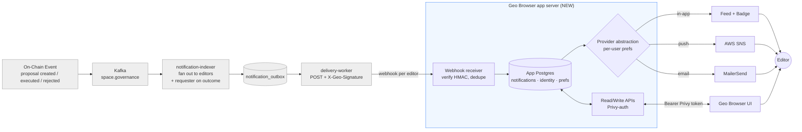
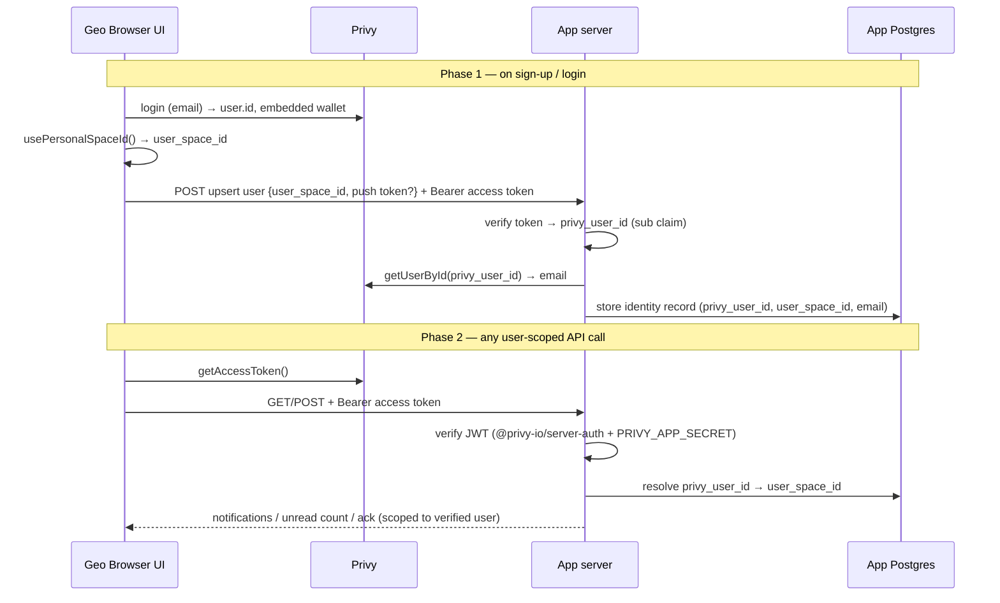

# Notifications MVP

**One-liner:** Stand up a Geo Browser app server that ingests notifications from the Gaia delivery worker, persists them, and delivers them to users via in-app feed, push (AWS SNS), and email (MailerSend) — starting with three governance notification types.

**Status:** Draft for team review · **Owner:** Yaco (eng) / Preston (product) · **Date:** 2026-06-09

## Why
- Geo users have no way to find out about space activity without manually opening the app and polling. ([GEO-2172](https://linear.app/geobrowser/issue/GEO-2172/notification-product-requirements))
- The Gaia notification-service (indexer + delivery worker) already produces per-user webhook notifications, but **no app server consumes them yet** — the last mile to the user doesn't exist.
- Product picked the first three notification types to focus the work ([Slack thread](https://defi-wonderland.slack.com/archives/C08K8NM5477/p1780963820491619)): membership requests, editorship requests, new proposals for editors.
- For: Geo Browser users who are **editors** of a space and need to act on incoming governance.

## Scope
**In:**
- A new **Geo Browser app server** with its own Postgres DB that receives signed webhooks from the Gaia delivery worker and stores notifications.
- Three notification types (all are `proposal_created` events; see "Who gets what" below): **membership requests**, **editorship requests**, **new proposals for editors**.
- **Requester outcome notifications:** notify the **requester** when their membership/editorship request is **approved or rejected** (`proposal_executed` / `proposal_rejected`). Unlike the three above (which target space editors), this targets the requester — so it **requires a notification-indexer change** to fan out to the requester (see Implementation status).
- Three delivery channels — **in-app feed**, **push (AWS SNS)**, **email (MailerSend)** — abstracted behind a provider interface so the concrete services are swappable. **All channels default on.**
- Per-user, per-channel **preferences**: a user can enable/disable each channel.
- An **identity store** owned by the app server (Geo has no identity service today): the front-end upserts the user on sign-up/login, persisting `privy_user_id` ↔ `user_space_id` (their personal space) ↔ email ↔ push token(s). This is what lets the app server resolve an inbound webhook's `user_space_id` to a reachable user and lets the front-end fetch "my notifications".
- Read APIs: list notifications (newest first, limit 100), unread count (for the badge), mark one-or-many read, mark all read.
- Identity/registration APIs: upsert user, register/unregister a push token.

**Out:**
- Other notification types from GEO-2172 (bounties, points, votes, comments, trending) — explicitly deferred. Other proposal-outcome cases beyond membership/editorship approval/rejection (e.g. "a proposal I created was voted on") are also deferred.
- App servers for any front-end other than Geo Browser. (Each front-end gets its own app server later; we build one now.)
- Changes to the on-chain contracts (none needed). **A notification-indexer change *is* in scope** for the requester outcome notification — see Implementation status. The delivery-worker is unchanged.
- A webhook self-registration API (the Geo Browser webhook is seeded manually into `app_webhooks`, per current v1).

## Architecture
The Gaia notification-service (left of the dashed line) already exists. Everything in the **Geo Browser app server** and the channels/UI (right) is new for this MVP.



## Who gets what (MVP notification types)
The first three types originate from `proposal_created` and the indexer fans out **one notification per editor of the proposal's space**, differing only by what the proposal *does* (its `actions`). The fourth — the requester outcome — targets the **requester** instead, on the proposal's approval/rejection:

| MVP notification type | Underlying event | Distinguished by | Recipients |
|---|---|---|---|
| **Membership request** | `proposal_created` | proposal contains an `add_member` action | **Editors of the space** (they vote on it) |
| **Editorship request** | `proposal_created` | proposal contains an `add_editor` action | **Editors of the space** (they vote on it) |
| **New proposal for editors** | `proposal_created` | any proposal | **Editors of the space** |
| **Request approved / rejected** | `proposal_executed` / `proposal_rejected` | the proposal was a membership/editorship request | **The requester** (proposer / `target_address` of the membership action) |

**Net:** the first three notify the **editors** of the proposal's space; the requester outcome notifies the **requester** of that membership/editorship proposal. The app server classifies the first three by inspecting the `actions` array (confirmed present on `proposal_created` payloads — see Implementation status). Members (non-editors) receive nothing in the MVP.

**Classification rule (recommended):** if the proposal's `actions` contain an `add_editor` → *editorship request*; else if they contain an `add_member` → *membership request*; else → *new proposal*. A proposal with both is labeled by the higher-privilege action (editor > member). Final labeling/copy is a product decision.

### Implementation status (what exists today)
- ✅ **Editor-targeted types (the first three) work today with no indexer change.** The notification-indexer emits `proposal_created` → editors of the space, and the payload **includes the `actions` array** with `type` (`add_member`/`add_editor`/…) and `target_address` (`notification-indexer/src/models.rs`). *(Note: `TECH_DESIGN.md`'s field table omits `actions`; the code and `WEBHOOK_INTEGRATION.md` are authoritative — worth a one-line doc fix.)*
- 🔨 **Requester outcome notification needs a notification-indexer change.** Today `proposal_executed` / `proposal_rejected` fan out to **editors only** — and for a membership request the requester is *not yet* a member/editor, so they'd receive nothing. The indexer must additionally resolve the requester's `user_space_id` (from the proposal's `proposer_id` or the membership action's `target_address`, via the front-page-entity lookup the indexer already uses for bounties) and emit an outbox row addressed to them. The app server cannot synthesize this from editor-addressed webhooks alone.
- 🔨 **To build (app server + UI):** the Geo Browser app server (everything downstream of the webhook) and the Geo Browser UI surfaces. The app server's webhook row must be seeded into `app_webhooks`.

## User flow
- An on-chain governance event (a new proposal — e.g. someone requests membership/editorship) is indexed by the Gaia notification-indexer, which creates one outbox row per editor of the space.
- The delivery worker POSTs a signed webhook to the Geo Browser app server, one call per editor per event.
- The app server verifies the HMAC signature, deduplicates on `idempotency_key`, resolves the `user_space_id` to a local user, and persists the notification.
- The app server fans the notification out to the user's **enabled** channels: writes it to the in-app feed, and/or sends a push via SNS, and/or an email via MailerSend.
- In Geo Browser, the user sees the notification (feed and/or unread badge) and can mark it read; reads sync back to the app server.

```mermaid
sequenceDiagram
    participant Chain as On-Chain
    participant NI as notification-indexer
    participant DW as delivery-worker
    participant AS as App server
    participant DB as App Postgres
    participant CH as Channels (in-app / SNS / MailerSend)

    Chain->>NI: proposal_created (space_id, actions)
    Note over NI: ...or proposal_executed / proposal_rejected (outcome)
    NI->>NI: created → fan out to editors;<br/>outcome → also fan out to requester
    NI->>DW: outbox rows (1 per recipient)
    loop per recipient
        DW->>AS: POST webhook + X-Geo-Signature
        AS->>AS: verify HMAC, dedupe on idempotency_key
        AS->>DB: persist notification (for user_space_id)
        AS->>DB: read user's channel preferences
        AS->>CH: deliver to enabled channels only
        AS-->>DW: 2xx (or 409 if duplicate)
    end
```

## Team breakdown
Product drives the decisions here — the open questions below should be resolved before backend/UI lock their own designs.

### Product
- **Why this matters:** editors miss governance they're expected to vote on; proactive notifications drive participation and are the foundation for the broader engagement strategy in GEO-2172.
- **Success signal:** editors receive membership/editorship/proposal notifications within seconds of the on-chain event, and requesters are notified when their request is approved/rejected — across enabled channels, with no duplicates.
- **Decisions product owns (block everyone else):**
  - ~~**Channel default:**~~ **Decided:** all channels (in-app, push, email) **default on** for a new user.
  - ~~**In-app surface this iteration:**~~ **Decided:** **both** — a badge showing unread count, and a feed listing the user's notifications by time.
  - **Notification copy/labeling:** how a membership request vs. editorship request vs. generic proposal vs. approved/rejected outcome reads to the user (classification rule recommended above).
  - **Requester identity:** confirm the requester is the proposal's `proposer_id` vs. the membership action's `target_address` (see Open questions) — this is who the approved/rejected notification is addressed to.

### UI (Geo Genesis web)
- Build two in-app surfaces — a **badge** (unread count, from the unread-count API) and a **feed** (user's notifications newest-first, from the list API) — plus a preferences screen to toggle channels. On sign-up/login, **upsert the user to the app server** with their Privy ID, personal space ID (`user_space_id`), email, and push token. Unblocked once the API shape is locked.

### Backend
- **Gaia notification-service (notification-indexer):** the editor-targeted types work today. **One indexer change is in scope:** on `proposal_executed` / `proposal_rejected` for a membership/editorship proposal, also resolve the requester's `user_space_id` and emit an outbox row addressed to them (reusing the existing front-page-entity lookup). Also seed the Geo Browser webhook into `app_webhooks`.
- **New Geo Browser app server:** webhook receiver (HMAC verify + idempotency), Postgres persistence, Privy↔user identity mapping, **server-side Privy access-token verification on user-scoped endpoints (net-new for the Geo stack)**, per-channel preferences, a provider-abstracted last-mile delivery layer (MailerSend for email, AWS SNS for push), and the read APIs. Unblocked once the identity-mapping source of truth (below) is decided.

### Smart contracts
- **No work.** The required events already exist on-chain and the indexer already consumes them.

## App server API (feature-level)
For the authenticated user (R = read, W = write):
- **List notifications** (R) — the user's notifications, newest first, limit 100.
- **Unread count** (R) — count of unread notifications (backs the badge).
- **Mark read** (W) — accepts one or more notification IDs.
- **Mark all read** (W) — marks all of the user's notifications read.
- **Preferences** (R/W) — read or update per-channel enable/disable (in-app, push, email).
- **Upsert user** (W) — register/update the caller's identity record. The front-end sends `user_space_id` (personal space) and an optional push token; the **`privy_user_id` and email are derived server-side from the verified Privy token** (see Authentication) — the email is **never** trusted from the request body. Called by the front-end on sign-up/login.
- **Register / unregister push token** (W) — add or remove an SNS device token for the user.

Plus an **inbound webhook receiver** (not user-facing): verifies `X-Geo-Signature`, dedupes on `idempotency_key`, persists, and fans out to enabled channels.

### Authentication (Privy server-side verification — new capability)
Every user-scoped endpoint identifies the caller by **verifying a Privy access token server-side** — a capability that **does not exist anywhere in the Geo stack today** (geobrowser only validates a Privy session client-side; its Next.js server trusts an `httpOnly` wallet-address cookie that carries no proof-of-possession and is scoped to the geobrowser origin, so it cannot be reused by a separate app server).

- The front-end calls Privy's `getAccessToken()` and sends it as a `Bearer` token.
- The app server verifies the JWT with `@privy-io/server-auth` + `PRIVY_APP_SECRET`, extracts the Privy user ID from the verified token, and resolves it to a `user_space_id` via the identity store.
- **All write/POST endpoints (preferences update, mark-read, mark-all-read, upsert user, push-token register/unregister) MUST verify the token before mutating, and MUST derive the acting user from the verified token — never from a client-supplied user/space ID in the request body.** Reads are scoped to the same verified identity.
- The inbound **webhook receiver is exempt** from Privy auth — it is authenticated by the delivery worker's `X-Geo-Signature` HMAC instead.

Exact request/response schemas and pagination beyond the 100-item cap are for the app server's own tech-design doc.



## Cross-team interfaces
Integration points that need a joint technical design before implementation. Name the touchpoint; the shapes live in the follow-up tech design.

- **Delivery Worker → App Server (webhook):** Already specified in `notification-service/WEBHOOK_INTEGRATION.md` (payload, `X-Geo-Signature` HMAC, `idempotency_key`, retry/409 semantics). Integration items: (a) seed the Geo Browser row in `app_webhooks`; (b) confirm the `proposal_created` payload carries the `actions` array so the app server can tell membership vs. editorship vs. generic proposal apart.
- **Indexer → App Server (requester outcome):** the new indexer fan-out must emit `proposal_executed` / `proposal_rejected` addressed to the **requester's** `user_space_id` (not just editors), with enough payload to tell the app server this is a membership/editorship outcome. Joint item: which payload field identifies the requester and how the outcome is distinguished from the editor-targeted copy.
- **Identity mapping (App Server DB):** the app server is the source of truth — Geo has no identity service today. The front-end already holds the full binding (`usePrivy()` → Privy `user.id` + email; `usePersonalSpaceId()` → `user_space_id`; embedded wallet address) and upserts it on sign-up/login. Interface item: the upsert payload shape and when it fires.
- **App Server → UI:** the front-end presents a **Privy access token** (`getAccessToken()`) as a Bearer credential; the app server verifies it server-side (`@privy-io/server-auth` + `PRIVY_APP_SECRET`) and derives the acting user from the token. Interface item: token format/claims the app server expects and error/refresh handling on the UI side. (See [Authentication](#authentication-privy-server-side-verification--new-capability).)
- **App Server → Providers:** a provider abstraction in app-server code with two concrete implementations for MVP — **MailerSend** (email) and **AWS SNS** (push) — so providers can be swapped without touching delivery logic. (Note: SES is reserved for calendar events; not used here.)

## Dependencies & sequencing
1. **Product** resolves channel defaults + in-app surface + requester identity (proposer vs. target_address) + identity-mapping source of truth (blocks UI and backend design).
2. **Backend (indexer)** adds the requester fan-out for `proposal_executed` / `proposal_rejected`, confirms the webhook `actions` payload detail, and seeds the Geo Browser webhook (blocks the outcome notification + classification).
3. **Backend** builds the app server: webhook receiver + Postgres → identity mapping → preferences → provider-abstracted delivery → read APIs.
4. **UI** builds the feed/badge + preferences screen against the app server APIs (blocked on 1 and the API shape from 3).

## Assumptions
- The three editor-targeted types are `proposal_created` events distinguished by `actions`; the indexer already fans out to editors and the payload already carries `actions`, so they need no indexer or contract change. *(Verified against `notification-indexer/src/models.rs`.)* The requester outcome type is the one piece needing an indexer change (new fan-out to the requester).
- Geo Browser authenticates via Privy with **email login**, so every user has a Privy email and an embedded wallet — both available to the front-end to send in the upsert.
- The front-end's `usePersonalSpaceId()` returns the user's personal space ID and this equals the `user_space_id` notifications are addressed to.
- Push tokens come from device/browser registration on the front-end. Email is **resolved server-side from Privy** via the verified `privy_user_id` (`getUserById`) at upsert and saved — not accepted from the client. Email-login means Privy's email is verified, so the saved value is trustworthy. MailerSend is already configured; AWS SNS is the push provider.
- The Geo Browser webhook is seeded manually into `app_webhooks` (no registration API in v1).
- Privy issues a verifiable access token (`getAccessToken()`) and `@privy-io/server-auth` + `PRIVY_APP_SECRET` can validate it server-side. No existing Geo backend verifies Privy today, so the app server adds this from scratch.

## Open questions
- [product] **Labeling/copy** for membership request vs. editorship request vs. generic proposal (classification rule recommended above is the default).
- [backend] **Email freshness:** the email is resolved server-side from Privy (`getUserById`) at upsert and stored (decided — never trusted from the client). Remaining detail is the refresh policy: re-fetch on every login upsert is the recommended default, plus a re-fetch on hard bounce. Confirm that's sufficient vs. needing a periodic resync.
- [backend] **Push token lifecycle:** how web push tokens are obtained/refreshed and registered with SNS (browser push vs. native), and how stale tokens are pruned.
- [backend/ui] **Auth — resolved direction:** verify a Privy access token server-side (Bearer + `@privy-io/server-auth` + `PRIVY_APP_SECRET`), derive the user from the token, and require it on all write/POST endpoints. Note this is **net-new** — nothing in the Geo stack verifies Privy server-side today. Remaining detail: token-refresh/expiry handling on the UI and whether reads also require it (recommended: yes).
- [product/backend] **Requester identity for the outcome notification:** is the requester the proposal's `proposer_id`, or the `target_address` of the `add_member`/`add_editor` action? They're usually the same (a user proposes their own membership), but not guaranteed — the indexer needs one definitive field to address the approved/rejected notification.
- [backend] **Outcome event coverage:** `proposal_executed` covers approval; `proposal_rejected` (rejection poller) covers expiry/rejection. Confirm both reliably fire for membership/editorship proposals and that the requester can be resolved at that point.
- [all] Each cross-team interface above needs a joint tech-design session before implementation starts.

## Out of scope for this PRD
- App-server data model (table columns) and concrete API schemas — belong in the app server tech-design doc. (Auth *direction* is decided here; detailed token validation/refresh handling is for that doc.)
- The other GEO-2172 notification types (bounties, points, votes, comments, trending) and proposal-outcome cases other than membership/editorship approval/rejection.
- Multi-app-server fan-out (additional front-ends each get their own app server later).
- Webhook self-registration API, subscription/event-type filtering, and per-webhook rate limiting (tracked as open questions in the notification-service tech design).
