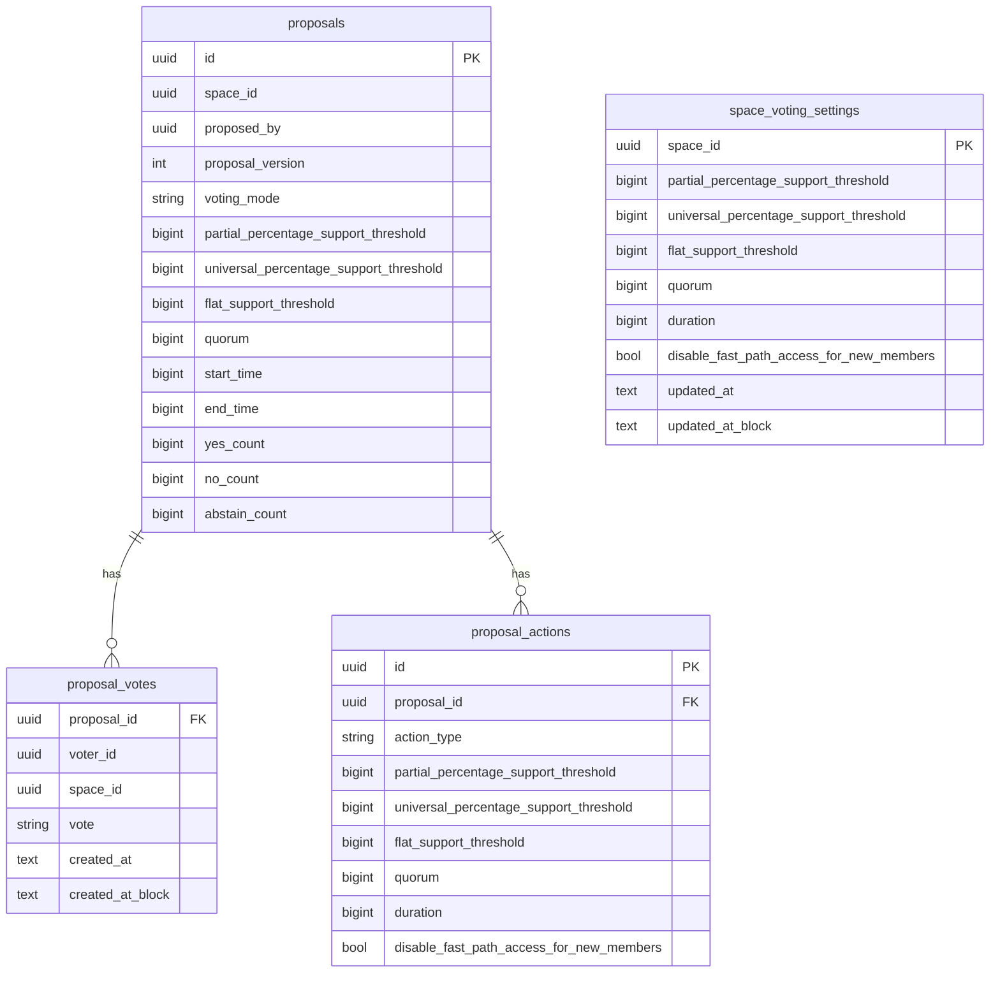

# feat: Support Geo governance mainnet indexing changes

## Overview

Update Gaia's governance indexing pipeline to match the new Geo governance contract shape before mainnet.

Today Gaia's indexing stack assumes:

- proposal voting settings can be reduced to one threshold plus quorum
- proposal votes are keyed by `(proposal_id, voter_id)` with no proposal version
- `PROPOSAL_VOTED` data is `(proposalId, voteOption)`
- `updateVotingSettings(...)` uses the older 4-field struct
- proposal executability can be derived from the old fast/slow threshold formulas

The new contracts break those assumptions. We need to carry richer voting settings, track the latest proposal version, decode new action payloads, and reset latest-state votes correctly when a proposal is updated.

## Problem Statement

The current indexing shape is not forward-compatible with the new governance contracts:

1. `hermes-pipeline/src/decode.rs` decodes the old `VotingSettings` tuple and old `PROPOSAL_VOTED` payload.
2. `hermes-schema/proto/governance.proto` models proposal settings as `quorum + flat_threshold + percentage_threshold`, which is too lossy for the new contract.
3. `kg-indexer` stores a single `threshold` on `proposals` and stores one vote row per `(proposal_id, voter_id)`.
4. The tally worker and vote storage assume votes remain valid across proposal updates, which is no longer true once votes are scoped to the latest proposal version.
5. `api/src/proposals/status.ts`, `api/src/proposals/queries.ts`, and `proposal-executor/src/detect.ts` all rely on the old indexed fields and old execution formulas.

If left unchanged, Gaia will:

- decode governance events incorrectly
- keep stale votes or stale tallies attached to the latest proposal version
- compute proposal status incorrectly for slow-path early execution
- expose stale or misleading proposal data to downstream consumers

## Proposed Solution

Treat this as a contract-schema migration across the governance ingest path:

1. Update Hermes constants, protobufs, and decode logic to ingest the new governance event payloads without lossy reduction.
2. Update KG persistence to store the latest proposal version, the full proposal parameter set, and a latest-state table for DAO-global voting settings.
3. Rework vote storage and tallying so proposal updates reset latest-state votes and tallies cleanly.
4. Preserve existing proposal query contracts as much as possible by introducing compatibility projections in the API read layer.
5. Update downstream proposal-status consumers to derive status from the richer indexed fields using the new formulas.

### Compatibility Goal

Minimize migration effort across existing apps.

Compatibility-first principles:

- keep proposal reads keyed by proposal ID only
- keep proposal list/detail endpoint shapes stable where possible
- preserve existing top-level response fields such as `status`, `canExecute`, `threshold`, `quorum`, and vote totals
- prefer additive fields over breaking renames or removals
- isolate contract-shape changes behind `api/src/proposals/queries.ts`, `api/src/proposals/status.ts`, and `api/src/proposals/router.ts`
- do not require app callers to understand proposal versioning or slow-path early-execution semantics in the first pass

### Architecture Decision

Keep the indexing layer latest-state-oriented for proposals, while stopping the compression of contract state into a single threshold field.

That means:

- Hermes should emit the full decoded contract payloads.
- KG should persist proposal settings in a shape that can represent both global voting settings and per-proposal parameters.
- DAO-global voting settings should live in a dedicated latest-state table such as `space_voting_settings`, keyed by `space_id`.
- KG should assign proposal versions without a hot-path read-before-write by using an atomic increment on the latest-state `proposals` row.
- API/executor status logic can still be computed locally where practical, but only after the richer fields are indexed.
- proposal read APIs should resolve to the latest proposal version by default; query callers should not be required to pass a version.
- proposal version should remain latest-state metadata for ingest, vote writes, tallying, and optional display metadata.
- the API should maintain a legacy-compatible projection for proposal reads so current apps can keep using the existing query contracts with minimal changes
- existing proposal query contracts should be treated as the compatibility boundary; new global voting-settings data should not leak into them unless a concrete consumer requires it

### Scope

In scope:

- `hermes-substream` action constants
- `hermes-relay` action re-exports
- `hermes-schema` governance protobufs
- `hermes-pipeline` governance decode and transform
- `kg-indexer` governance models, handlers, storage, and tests
- `kg-indexer/src/consumer.rs` governance event dispatch
- shared DB schema in `api/src/services/storage/schema.ts`
- proposal status and execution queries that rely on the indexed governance shape
- compatibility-preserving updates to proposal read models and response contracts in `api/src/proposals`

Out of scope:

- UI form updates for create-dao initial topic data
- factory trust metadata (`proxyIsChildOfFactory`)
- production migrations or deployment steps
- archive/recover/clear space UI behavior beyond documenting the indexer follow-up

## Local Research

Relevant existing work in this repo:

- `docs/plans/2026-03-04-feat-decode-subspace-proposal-actions-plan.md`
- `docs/plans/2026-03-19-feat-space-topic-proposal-e2e-flows-plan.md`
- `docs/plans/2026-03-02-feat-proposal-auto-executor-plan.md`
- `hermes-pipeline/docs/action-data-mapping.md`
- `hermes-pipeline/src/decode.rs`
- `hermes-pipeline/src/pipelines/governance.rs`
- `hermes-schema/proto/governance.proto`
- `kg-indexer/src/handlers/governance.rs`
- `kg-indexer/src/storage.rs`
- `api/src/services/storage/schema.ts`
- `api/src/proposals/status.ts`
- `api/src/proposals/queries.ts`
- `proposal-executor/src/detect.ts`

Institutional learnings:

- No relevant prior solution was found in `docs/solutions/` for proposal versioning or the new voting-settings shape.
- Existing governance plans in this repo consistently keep contract decode in Hermes, typed persistence in KG, and API semantics layered on top of indexed rows.

## Technical Approach

### Phase 1: Update Hermes governance event coverage

#### `hermes-substream/src/lib.rs`

Add the new raw action constants:

- `GOVERNANCE.VOTING_SETTINGS_UPDATED`
- optionally `GOVERNANCE.SPACE_ID_ARCHIVED`
- optionally `GOVERNANCE.SPACE_ID_RECOVERED`

#### `hermes-relay/src/actions.rs`

Re-export the new governance action constants so Hermes consumers can match them cleanly.

#### `hermes-schema/proto/governance.proto`

Replace the old lossy governance shapes with new ones that preserve the contract data.

Required proto changes:

- expand `UpdateVotingSettingsAction` from 4 fields to 6 fields:
  - `partial_percentage_support_threshold`
  - `universal_percentage_support_threshold`
  - `flat_support_threshold`
  - `quorum`
  - `duration`
  - `disable_fast_path_access_for_new_members`
- replace `ProposalSettings` with a shape that can represent all 7 `ProposalParameters` values:
  - `voting_mode`
  - `partial_percentage_support_threshold`
  - `universal_percentage_support_threshold`
  - `flat_support_threshold`
  - `quorum`
  - `start_date`
  - `last_date`
- add `proposal_version` to `HermesProposalVoted`
- add a new event message for global DAO voting-settings changes, for example `HermesVotingSettingsUpdated`

Important constraint:

- do not collapse the new proposal settings back to `flat_threshold` or `percentage_threshold`; that would recreate the same bug in a different place
- do not add `proposal_version` to create/update Hermes messages for this migration; KG will track latest-state version progression locally on create/update writes

#### `hermes-pipeline/src/decode.rs`

Update governance ABI decoding:

- update the selector and tuple decoding for `updateVotingSettings(...)` to the 6-field struct
- replace `ProposalSettingsUsedDataType = (uint256, uint256, uint8, uint256, uint256)` with the new 7-field `ProposalParameters` decode
- replace `ProposalVotedDataType = (bytes16, uint8)` with `(bytes16, uint8, uint8)` or the exact encoded order used on-chain for `(proposalId, proposalVersion, voteOption)`
- add typed decode structs that preserve proposal version and the full parameter set

#### `hermes-pipeline/src/pipelines/governance.rs`

Update governance transformation logic:

- parse `PROPOSAL_SETTINGS_SELECTED` into the new full parameter struct
- include `proposal_version` in voted messages
- emit a new Hermes governance event for `VOTING_SETTINGS_UPDATED`
- continue handling orphaned `PROPOSAL_SETTINGS_SELECTED` events for fast-to-slow escalation, but update the emitted payload to the new settings shape

Implementation note:

- proposal IDs should still be keyed by `bytes16`
- settings squashing should remain keyed by proposal ID
- proposal version belongs in the voted payload and in KG latest-state metadata, not in the create/update Hermes message shape

### Phase 2: Rework KG governance persistence for latest-state proposals

#### `api/src/services/storage/schema.ts`

Add the columns needed to persist the new governance shape.

Migration workflow requirement:

- make all schema changes in `api/src/services/storage/schema.ts`
- generate migrations with `drizzle-kit generate`
- do not hand-author SQL migration files for this work

Recommended DB changes:

- `proposals`
  - add `proposal_version`
  - add:
    - `partial_percentage_support_threshold`
    - `universal_percentage_support_threshold`
    - `flat_support_threshold`
  - keep `quorum`, `start_time`, `end_time`
- `proposal_actions`
  - replace old `UpdateVotingSettings` payload columns with:
    - `partial_percentage_support_threshold`
    - `universal_percentage_support_threshold`
    - `flat_support_threshold`
    - `quorum`
    - `duration`
    - `disable_fast_path_access_for_new_members`
- `proposal_votes`
  - keep the existing latest-state shape keyed by `(proposal_id, voter_id)`
  - do not persist historical votes across proposal updates
- add a new latest-state table for global DAO voting settings, `space_voting_settings`, keyed by `space_id`

Rollout requirements:

- prefer additive generated migrations and transitional dual-read logic over destructive schema replacement
- keep old read contracts working while writers and readers roll forward independently where practical during deployment

#### ERD

#### `kg-indexer/src/models/governance.rs`

Update the internal governance models to match the new schema:

- `ProposalItem` should carry `proposal_version` and the 3 threshold fields
- `ProposalVoteItem` can remain latest-state only
- `ProposalActionPayload::UpdateVotingSettings` should carry the new 6-field payload
- add a model for `space_voting_settings` latest-state rows

#### `kg-indexer/src/handlers/governance.rs`

Update mapping logic:

- map the new proto fields without collapsing them to one threshold
- map `proposal_version` on voted messages
- treat `PROPOSAL_SETTINGS_SELECTED` as latest-state proposal parameter data:
  - after create/update, it populates the current latest proposal row
  - on fast-to-slow escalation, it mutates the current latest proposal row without incrementing `proposal_version`
- map `HermesVotingSettingsUpdated` into a storage-ready `space_voting_settings` row
- stop deriving `threshold` from `voting_mode`; preserve all contract fields

#### `kg-indexer/src/consumer.rs`

Update governance event dispatch to route the new `VOTING_SETTINGS_UPDATED` Hermes event into the governance handler.

#### `kg-indexer/src/storage.rs`

Update storage methods:

- add an atomic proposal-version allocator on the `proposals` row:
  - create writes `proposal_version = 1`
  - update writes `proposal_version = proposal_version + 1` and uses `RETURNING proposal_version`
- `insert_proposals`
- `update_proposal`
- `insert_proposal_actions`
- `insert_proposal_votes`
- `update_proposal_settings`
- add `upsert_space_voting_settings`
- add a latest-state proposal reset path on proposal update:
  - delete existing `proposal_votes` for the proposal
  - replace `proposal_actions`
  - reset denormalized tallies to `0/0/0`
- add vote-version validation in the write path:
  - compare the event's `proposal_version` to `proposals.proposal_version`
  - ignore and log votes that do not match the current latest proposal version

Important behavioral change:

- when a `PROPOSAL_UPDATED` event arrives, increment `proposals.proposal_version`, replace actions for the proposal row, delete all existing latest-state votes for that proposal, and reset tallies
- do not attempt to preserve stale votes in KG for this migration
- keep `proposal_actions` latest-version-oriented for this migration; do not introduce full per-version action history unless a downstream consumer proves it is needed
- do not read the current proposal version from KG before writing a create/update event; assign it atomically in storage and then use that assigned version for all related writes in the transaction
- when a vote arrives for a non-latest version, do not write it into latest-state storage

### Phase 3: Fix vote tallying and proposal-reset semantics

#### `kg-indexer/src/storage.rs`

Update the tally worker so all aggregates are computed from the latest-state vote set only.

Current bug:

- tally logic assumes votes remain valid after a proposal update

Required change:

- compute `yes_count`, `no_count`, and `abstain_count` from the current latest-state vote set only
- when a proposal update resets latest-state votes, tallies must reset to `0/0/0`

Fast-path auto-execution inference also needs to read the new proposal fields:

- fast-path status should compare `yes_count` against `flat_support_threshold`
- not against the removed generic `threshold` column
- if a proposal rolls to a new version before any new votes land, tallies should reset to the empty latest-state vote set rather than carrying forward counts from the prior version

### Phase 4: Update downstream proposal-status consumers

#### `api/src/proposals/types.ts`

Keep public proposal types as stable as possible while making richer governance fields available internally.

Compatibility requirement:

- proposal query callers should continue to fetch proposals by proposal ID only
- list/detail endpoints should always return the latest indexed version of a proposal
- `proposalVersion` may be included in responses as metadata, but it should not be required as a query parameter
- keep the existing core response contract stable where possible:
  - `status`
  - `canExecute`
  - `threshold`
  - `quorum`
  - `votes`
  - existing action response discriminants
- do not force existing clients to adopt the new 3-threshold model unless they explicitly opt into additive fields

#### `api/src/proposals/status.ts`

Replace the current two-branch logic:

- fast path should use `flat_support_threshold`
- slow path can no longer be modeled as "wait for end time, then apply one percentage threshold"
- incorporate `universal_percentage_support_threshold` for slow-path early execution
- keep `partial_percentage_support_threshold` for late execution after the voting window

#### `api/src/proposals/queries.ts`

Update SQL fragments:

- `sqlIsProposed`
- `sqlIsExecutable`
- `sqlIsRejected`

These fragments must be rewritten against the new columns and the new contract semantics.

Query behavior requirement:

- `getProposalWithVotes(...)` should load the proposal row for the proposal ID and join the latest-state `proposal_votes` rows for that proposal
- `listProposalsInSpace(...)` should always surface the latest proposal version stored on the `proposals` row
- user-vote lookups should resolve against the latest-state vote rows automatically
- do not add a `proposalVersion` query parameter to the public read APIs

Compatibility projection requirement:

- continue projecting a legacy `threshold` field in query results:
  - fast path: `threshold = flat_support_threshold`
  - slow path: `threshold = partial_percentage_support_threshold`
- expose richer governance fields as additive metadata rather than replacements
- keep `queries.ts` as the main compatibility boundary so apps do not need direct awareness of the new DB columns
- keep global DAO voting settings out of proposal query contracts unless a concrete caller needs them

#### `api/src/proposals/router.ts`

Keep response contracts as stable as possible.

Required router behavior:

- preserve existing response envelopes and field names unless there is no safe compatibility mapping
- compute `status` and `canExecute` from the new backend logic without requiring caller-side changes
- allow additive metadata such as `proposalVersion`, `isEarlyExecutable`, or richer threshold fields only if they do not break existing consumers and there is a clear consumer for them
- keep existing action discriminants stable, extending `UPDATE_VOTING_SETTINGS` with additive optional fields instead of replacing the payload shape outright

#### `proposal-executor/src/detect.ts`

Update detection SQL to match the new slow-path semantics.

Runtime decision:

- use the indexed fields for execution eligibility
- support slow-path early execution directly in the SQL/status logic
- do not require on-chain `canExecuteProposal(bytes16)` reads in the runtime path
- treat `canExecuteProposal(...)` only as a debugging or validation aid if needed during development

### Phase 5: Rollout and migration safety

Compatibility during rollout matters because Hermes, KG, API, and executor may not all deploy at the same time.

Required rollout rules:

- prefer additive protobuf and DB changes first
- keep transitional read logic focused on service deployment ordering rather than historical-row compatibility
- treat `threshold` as a compatibility projection in the API/query layer rather than a long-term stored source-of-truth field
- treat `space_voting_settings` as internal/latest-state storage first; add API exposure only when there is a concrete caller
- document any required deployment ordering between Hermes, KG, API, and executor

### Phase 6: Optional follow-up for space lifecycle actions

The contract doc also introduces:

- `SPACE_ID_ARCHIVED`
- `SPACE_ID_RECOVERED`
- `SPACE_ID_CLEARED`

Gaia currently only has `SPACE_ID_CLEARED` as a raw action constant and does not model archive/recover state.

Follow-up options:

- extend `space.creations` / space lifecycle indexing to persist archived state
- add `archived_at` or `is_archived` to `spaces`
- update search/API consumers accordingly

This is not required to unblock the governance mainnet indexing changes.

## Spec Flow Notes

Primary write/read flows to preserve:

1. A proposal is created with full proposal parameters and proposal version `1`.
2. The proposal actions and full parameter set are indexed without lossy reduction.
3. A vote lands for the current proposal version; tallies reflect the latest-state votes.
4. Read APIs return the proposal by ID and surface the latest indexed version automatically.
5. The proposal is updated to version `2`; actions are replaced for the proposal row, old votes are deleted, and tallies reset.
6. New votes land for version `2`; tallies rebuild from the latest-state votes while read APIs continue to resolve by proposal ID alone.
7. A `VOTING_SETTINGS_UPDATED` action lands for the DAO and updates the `space_voting_settings` latest-state row.
8. Existing apps continue to consume proposal list/detail APIs with minimal or no required query-contract changes.
9. Downstream consumers compute status and executability using the new indexed fields only.

Edge cases to cover:

- proposal update without any new votes
- fast-to-slow escalation via orphaned `PROPOSAL_SETTINGS_SELECTED`
- global voting settings updated after a proposal already exists
- proposal vote payload decoded with the wrong version order
- vote arrives for a stale proposal version after a proposal update
- proposal status drift between API SQL and contract truth
- proposal create/update version assignment remains correct without any storage pre-read in the write path

## Acceptance Criteria

- [ ] Hermes decodes `updateVotingSettings(...)` using the new 6-field struct.
- [ ] Hermes decodes `PROPOSAL_SETTINGS_SELECTED` into the full 7-field proposal-parameter shape.
- [ ] Hermes decodes `PROPOSAL_VOTED` as `(proposalId, proposalVersion, voteOption)`.
- [ ] Hermes emits a dedicated event for `VOTING_SETTINGS_UPDATED`.
- [ ] KG stores the latest `proposal_version` on proposals.
- [ ] KG assigns proposal versions atomically without reading current proposal version before create/update writes.
- [ ] Proposal updates delete stale vote rows and reset latest-state tallies.
- [ ] Votes for non-latest proposal versions are ignored by the latest-state write path.
- [ ] Proposal tallies are computed from the latest-state vote set only.
- [ ] `UpdateVotingSettings` proposal actions persist the new 6-field voting-settings payload.
- [ ] Global DAO voting settings are persisted in a dedicated latest-state `space_voting_settings` table.
- [ ] All DB schema changes are made in `api/src/services/storage/schema.ts` and migrations are generated via `drizzle-kit generate`.
- [ ] Proposal read APIs continue to query by proposal ID only and always return the latest indexed version.
- [ ] Existing proposal list/detail query contracts remain stable except for additive fields and documented compatibility mappings.
- [ ] API status logic is updated to use the richer indexed proposal settings.
- [ ] Proposal executor detection is updated for the new proposal shape using indexed proposal settings only.
- [ ] Tests cover proposal creation, proposal update to a new version with vote reset, latest-state voting, and voting-settings updates.

## Success Metrics

- No governance event from the new contracts is decoded into a stale or lossy shape.
- Proposal version updates no longer leave stale votes attached to the latest proposal state.
- API/executor status computations match the new indexed governance semantics for the covered test cases.
- Mainnet governance proposals can be indexed from the richer governance fields, with any legacy `threshold` response preserved only as a compatibility projection.

## Dependencies & Risks

### Main risks

- **Schema drift across layers:** Hermes, KG, API, and executor each currently encode the old governance assumptions separately.
- **Stale latest-state votes:** If proposal updates do not clear votes, the indexer will compute status from votes that no longer apply to the latest contract version.
- **Incorrect status formulas:** The old "one threshold per proposal" logic cannot represent slow-path early execution.
- **Migration complexity:** This is a schema migration affecting both writers and readers.
- **Mixed-version rollout:** independently deployed Hermes/KG/API services can break each other if the migration is not additive.
- **Version allocation drift:** if KG derives proposal versions from wall-clock ordering or ad hoc reads, indexed versions can diverge from contract vote payloads.

### Mitigations

- change protobuf and DB schema first, then update downstream readers against the new fields
- add explicit proposal-update vote-reset tests before changing tally logic
- keep the old plan documents linked in this plan for implementation references
- use one shared reference formula per layer and document any intentional divergence
- use additive schema/proto changes and transitional compatibility reads so services can roll forward safely
- allocate proposal versions with an atomic increment on the `proposals` row rather than time-based ordering

## Dependencies & Prerequisites

- contract ABI/source confirmation for:
  - new `updateVotingSettings(...)` selector and tuple layout
  - exact `PROPOSAL_VOTED` field ordering
  - `VOTING_SETTINGS_UPDATED` action hash
  - proposal create/update do not expose proposal version directly, so KG must derive latest-state version progression from create/update events
- DB migration for the proposal and vote schema changes, generated from `api/src/services/storage/schema.ts` via `drizzle-kit generate`
- regenerated `hermes-schema` protobuf bindings after proto updates
- no historical backfill is required for this rollout because the target chain starts with no existing indexed governance data

## References & Research

### Internal References

- `hermes-pipeline/src/decode.rs`
- `hermes-pipeline/src/pipelines/governance.rs`
- `hermes-schema/proto/governance.proto`
- `kg-indexer/src/models/governance.rs`
- `kg-indexer/src/handlers/governance.rs`
- `kg-indexer/src/storage.rs`
- `api/src/services/storage/schema.ts`
- `api/src/proposals/status.ts`
- `api/src/proposals/queries.ts`
- `proposal-executor/src/detect.ts`
- `docs/plans/2026-03-04-feat-decode-subspace-proposal-actions-plan.md`
- `docs/plans/2026-03-02-feat-proposal-auto-executor-plan.md`
- `docs/plans/2026-03-19-feat-space-topic-proposal-e2e-flows-plan.md`

### External Contract Context

- Geo governance contract change summary provided in this thread
- `canExecuteProposal(bytes16 _proposalId)`
- `latestProposalVersion(bytes16 _proposalId)`

## Open Questions

1. Should Gaia add separate version-history APIs later for old proposal revisions, or keep this migration strictly latest-state only?
2. Should `VOTING_SETTINGS_UPDATED` remain current-state only in KG, or should a future follow-up keep a change history table as well?
3. Should archive/recover lifecycle indexing be bundled into the same migration, or explicitly deferred?
