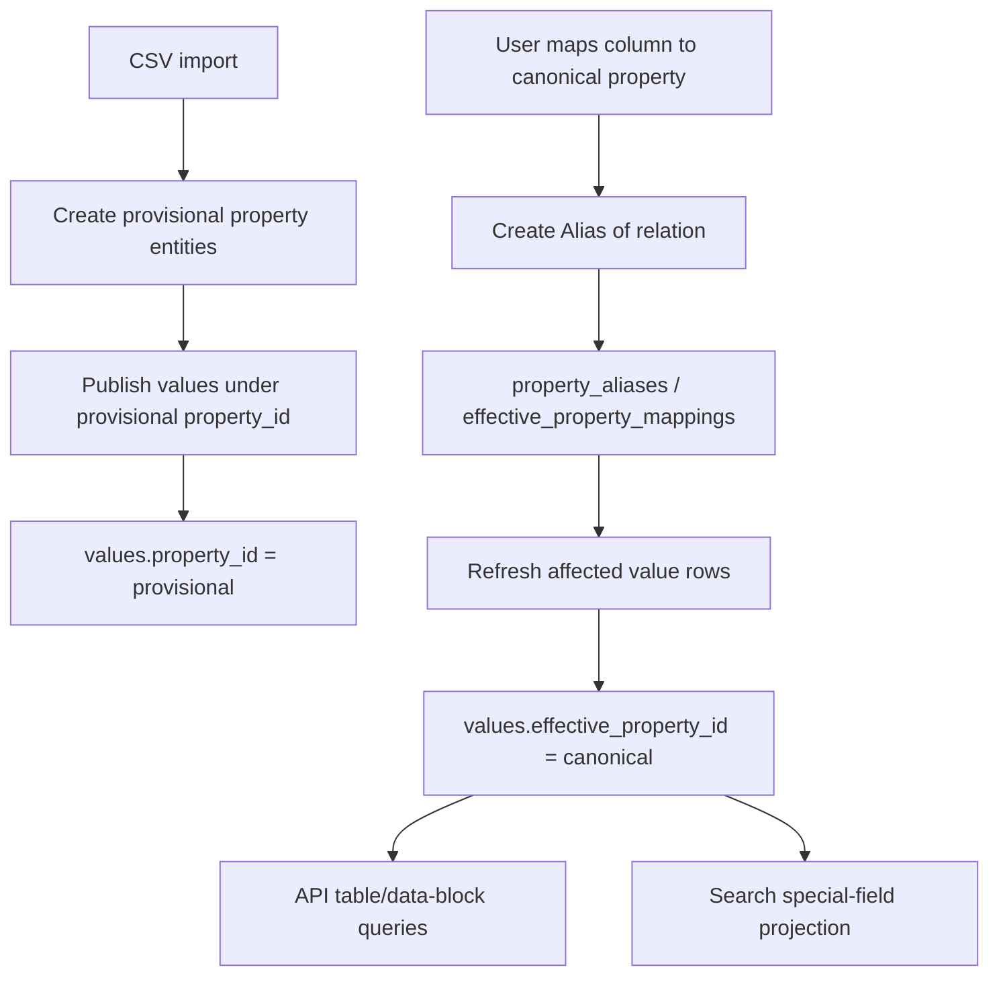
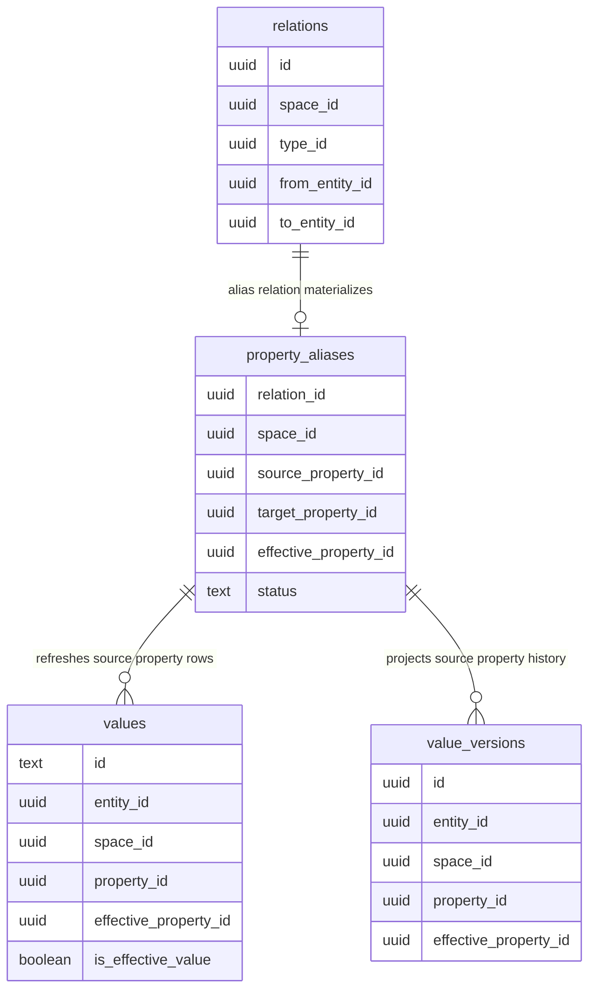
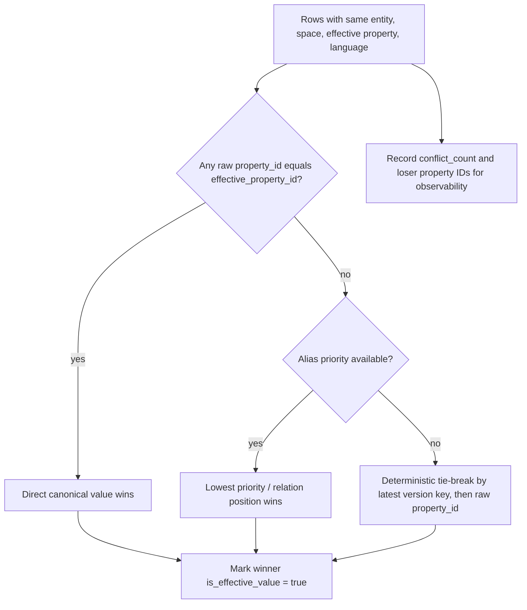

# feat: Add property aliases with materialized effective property resolution

## Summary

Add a knowledge-layer alias system and make property aliases efficient enough for CSV import, table/data-block queries, search projection, and versioned reads. The GRC-20 edit log remains raw and provenance-preserving; Gaia materializes `effective_property_id` as a read-model projection.

---

## Problem Frame

CSV import currently asks users to map columns to property IDs before publishing. If they do not, values land under column-specific or wrong property IDs, and Gaia's current storage shape treats that property ID as part of the value slot identity. Retrofitting the ID later is not a metadata update: live values, versioned values, ordering functions, search projection, and diff rendering all key directly on `property_id`.

The target behavior is to let imports publish immediately under provisional property IDs, then let users map those provisional properties to canonical properties later without rewriting the raw edit history or paying alias-resolution joins on every hot query.

---

## Direct Answers

- **Do we need new GRC-20 ops?** No. Alias creation is a normal `CreateRelation` between property entities. Alias deletion is the existing `DeleteRelation`. The resolver policy lives in Gaia's indexing/read layer.
- **Is `sameAs` a knowledge-layer relation?** It can be, but this plan should not use broad `sameAs` semantics as the indexed contract. Use a narrower `Alias of` / `Property alias of` relation whose meaning is scoped to resolver behavior.
- **Is this basically aliases?** Yes. The feature should be framed as generic alias ontology first, with property alias resolution as the first implemented consumer.
- **What becomes materialized?** `property_id` remains raw provenance. `effective_property_id` and winner/conflict metadata are Gaia read-model fields maintained by indexers.

---

## Requirements

- R1. No new GRC-20 op is required for aliases; aliases are normal knowledge-layer relations between entities.
- R2. Gaia must preserve the raw published property ID on every value for auditability, replay, and proposal diff provenance.
- R3. Gaia must materialize an alias-aware `effective_property_id` for current value reads so filtering, sorting, and table/data-block computation remain index-driven.
- R4. Property alias resolution must be scoped by space, because GRC-20 spaces can hold different views and mappings for the same property entity.
- R5. Provisional properties created during CSV import must behave as first-class property entities with names, descriptions, data-type hints, and later alias relations.
- R6. Alias changes must backfill existing values for the affected source property and space without requiring a rewrite of historical GRC-20 edits.
- R7. Queries that ask for entities by canonical property must include values imported under aliased provisional properties.
- R8. Search projection must treat aliases to `Name`, `Description`, and `Image URL` as those special fields after alias backfill.
- R9. Direct canonical values must win over aliased values when both exist for the same entity, effective property, and space.
- R10. Multiple provisional properties mapping to the same canonical property must produce deterministic winner selection and a visible conflict signal.
- R11. Versioned and diff APIs must expose enough information to distinguish raw property identity from effective property identity.
- R12. Alias processing must avoid recursive runtime resolution in hot paths; cycles and alias chains are resolved or rejected during materialization.

---

## Key Technical Decisions

- KTD1. **Aliases are knowledge-layer relations, not protocol ops:** use a normal relation type such as `Alias of` or `Property alias of` from source property to target property. GRC-20 already models schema semantics in the knowledge layer, and property entities are normal entities. Adding an op would overfit the protocol to one resolver policy.
- KTD2. **Prefer `Alias of` over generic `sameAs`:** `sameAs` implies identity equivalence across all semantics. The CSV problem needs narrower resolver behavior: values written under source property should be read as target property within a scope. If the UI wants to label this "same as," the indexed relation should still be precise.
- KTD3. **Keep raw and effective IDs side by side:** `property_id` remains the protocol slot; `effective_property_id` is a mutable read-model projection. This keeps replay truthful while allowing alias updates to reclassify old imported rows.
- KTD4. **Materialize winners, not just mappings:** add an `is_effective_value` flag or equivalent resolved-winner marker so hot query functions can filter to one row per `(entity_id, effective_property_id, space_id, language)` without conflict joins.
- KTD5. **Resolve aliases in the indexer, not only in API SQL:** `kg-indexer` writes the materialized fields for live/value-version rows. API functions can stay simple and index-friendly, and search-indexer can consume the same effective semantics.
- KTD6. **Use space-local alias policy:** an alias relation in space S maps values in space S. Cross-space alias policies are deferred because they require trust/resolution semantics beyond CSV import.
- KTD7. **Expose raw identity by default where provenance matters:** proposal diffs and raw `valuesList`-style GraphQL fields should retain `propertyId`; additive fields such as `effectivePropertyId`, `rawPropertyId`, or `aliasSource` carry resolver information.

---

## High-Level Technical Design

### Alias Resolution Flow



### Read Model Shape



### Conflict Resolution



---

## Scope Boundaries

In scope:

- Define the alias relation semantics and constants.
- Materialize current property alias mappings from indexed relations.
- Add alias-aware live value reads through `effective_property_id`.
- Backfill existing values when aliases are created, deleted, or changed.
- Update API SQL functions that filter, sort, search, or compute by property ID.
- Update search-indexer for aliases to special fields.
- Expose raw and effective property identity in API types where relevant.
- Document CSV provisional-property semantics.

Deferred to follow-up work:

- A full generic entity alias resolver for non-property entities.
- Cross-space alias trust policies.
- Alias-aware authorization or moderation controls.
- UI flows for reviewing CSV mappings and conflict resolution.
- Optional canonicalization edits that rewrite provisional values into canonical property slots.
- Language-aware value identity fixes beyond preserving the current model's behavior.

Outside this plan:

- New GRC-20 binary operations.
- Mutating the raw `property_id` of already-indexed values as if published history had changed.
- Treating aliases as global ontology truth across all spaces.

---

## Implementation Units

### U1. Define Alias Ontology and SDK Constants

- **Goal:** Establish the relation type and semantic contract that represents aliases in the graph.
- **Requirements:** R1, R4, R5, R12
- **Dependencies:** None
- **Files:**
  - `sdk/src/core/ids.rs`
  - `docs/protocol/knowledge-graph-ontology.md`
  - `kg-indexer/docs/DECISIONS.md`
  - `sdk/src/lib.rs`
- **Approach:** Add a relation type constant for `Alias of` or `Property alias of`. Direction should be source/provisional property -> target/canonical property. Document that the first supported resolver consumes aliases only when both endpoints are property entities or when the source is used as a value `property_id`.
- **Patterns to follow:** Existing system ID constants and protected ID commentary in `sdk/src/core/ids.rs`; ontology relation/property documentation in `docs/protocol/knowledge-graph-ontology.md`.
- **Test scenarios:**
  - Add a unit test proving any derived alias relation ID is stable if the ID is derived.
  - Add a documentation/constant test if the repo already checks system ID uniqueness.
  - Verify alias relation type is not added to protected relation IDs unless the root space must exclusively author it.
- **Verification:** Reviewers can answer "do we need new ops?" from the docs: no, aliases are normal relations.

### U2. Add Alias and Effective-Property Storage

- **Goal:** Extend the database schema with materialized alias mappings and effective value projection fields.
- **Requirements:** R2, R3, R4, R6, R9, R10
- **Dependencies:** U1
- **Files:**
  - `api/src/services/storage/schema.ts`
  - `api/drizzle/<generated>_property_aliases.sql`
  - `kg-indexer/src/models/values.rs`
  - `kg-indexer/src/storage.rs`
  - `kg-indexer/tests/e2e.rs`
- **Approach:** Add a `property_aliases` or `effective_property_mappings` table keyed by `(space_id, source_property_id)`, with target/effective property, relation provenance, status, and conflict/cycle diagnostics. Add `effective_property_id` to `values`, defaulting to `property_id`, plus an `is_effective_value` flag for resolved winners. Add `effective_property_id` to `value_versions` as a projection field while preserving raw `property_id`.
- **Technical design:** Directional column set:
  - `property_aliases`: `space_id`, `source_property_id`, `target_property_id`, `effective_property_id`, `relation_id`, `status`, `reason`
  - `values`: `effective_property_id`, `is_effective_value`, `effective_mapping_relation_id`, `effective_conflict_count`
  - `value_versions`: `effective_property_id`, `effective_mapping_relation_id`
- **Patterns to follow:** Typed value column and index shape in `api/src/services/storage/schema.ts`; bulk insert patterns in `kg-indexer/src/storage.rs`.
- **Test scenarios:**
  - Migration creates `effective_property_id` for existing rows with value equal to raw `property_id`.
  - New value insert without aliases writes `effective_property_id = property_id` and `is_effective_value = true`.
  - Alias mapping table rejects duplicate active source mappings for the same space unless represented as a conflict status.
  - Indexes exist for `(effective_property_id, space_id)` and `(entity_id, effective_property_id, space_id)` on effective winners.
  - Effective-property indexes support the same cardinality class as existing property indexes on a fixture with at least 500k value rows.
- **Verification:** Current queries can continue using raw `property_id`, while new effective-property indexes are available for hot-path reads.

### U3. Materialize Alias Relations in kg-indexer

- **Goal:** Detect alias relations as normal indexed relations and update materialized mapping state.
- **Requirements:** R1, R4, R6, R12
- **Dependencies:** U1, U2
- **Files:**
  - `kg-indexer/src/handlers/edits.rs`
  - `kg-indexer/src/storage.rs`
  - `kg-indexer/src/models/relations.rs`
  - `kg-indexer/src/main.rs`
  - `kg-indexer/tests/e2e.rs`
  - `kg-indexer/tests/system_relations_integration.rs`
- **Approach:** After relation writes, detect creates/deletes where `type_id` is the alias relation type. Upsert or remove the corresponding mapping row, resolve alias chains to a final effective property, mark cycles/conflicts as inactive, then schedule value refresh for affected `(space_id, source_property_id)` rows.
- **Technical design:** Directional resolver behavior:
  - One-hop aliases are the expected path.
  - Chains are resolved during materialization, not at query time.
  - Cycles disable the involved mappings and leave affected values effective to their raw property IDs.
  - Deleting an alias relation reverts affected values back to raw property ID or to the next valid mapping.
- **Patterns to follow:** Existing protected relation filtering in `kg-indexer/src/handlers/edits.rs`; batch DB update methods in `kg-indexer/src/storage.rs`.
- **Test scenarios:**
  - Creating `Column A --Alias of--> Name` in a space creates an active mapping for that space.
  - Deleting the alias relation removes or deactivates the mapping and refreshes affected values.
  - A chain `A -> B -> Name` materializes `A -> Name` and `B -> Name`.
  - A cycle `A -> B -> A` marks mappings inactive and does not rewrite effective IDs.
  - An alias relation in one space does not affect values in another space.
- **Verification:** Replaying the same edit log produces the same mapping table and effective value rows.

### U4. Resolve Effective Values on Insert and Backfill

- **Goal:** Keep `values` and `value_versions` effective projection fields current for new edits and alias changes.
- **Requirements:** R2, R3, R6, R9, R10, R11
- **Dependencies:** U2, U3
- **Files:**
  - `kg-indexer/src/storage.rs`
  - `kg-indexer/src/models/values.rs`
  - `kg-indexer/src/handlers/edits.rs`
  - `kg-indexer/src/main.rs`
  - `kg-indexer/tests/e2e.rs`
- **Approach:** Before inserting value rows, resolve each `(space_id, property_id)` through the mapping table and write `effective_property_id`. After inserts or alias refreshes, recompute effective winners for affected `(entity_id, space_id, effective_property_id, language)` groups. Use direct canonical value priority first, then alias priority, then deterministic tie-breaks.
- **Technical design:** Directional refresh shape:
  - Alias changed: refresh rows where `space_id = S` and `property_id IN affected_sources`.
  - Value inserted: resolve only distinct `(space_id, property_id)` pairs in the batch.
  - Winner recompute: update only groups touched by the batch or alias change.
- **Patterns to follow:** `insert_values`, `delete_values`, and `insert_value_versions` bulk array binding in `kg-indexer/src/storage.rs`.
- **Test scenarios:**
  - Value inserted after alias creation lands with canonical `effective_property_id`.
  - Value inserted before alias creation is backfilled after alias creation.
  - Direct canonical value beats provisional aliased value for the same entity and space.
  - Two provisional aliases to the same canonical property produce one winner and a conflict count.
  - Deleting the winning direct value promotes the next deterministic aliased winner.
  - Versioned rows retain raw `property_id` and gain projected `effective_property_id`.
  - Refreshing one alias over a 10 MB CSV-scale fixture updates only rows for the affected `(space_id, source_property_id)`.
  - Retrying an interrupted alias refresh is idempotent and resumes without rewriting already-correct rows unnecessarily.
- **Verification:** Hot-path reads can filter by `effective_property_id` and `is_effective_value` without joining the alias table.

### U5. Update API Query Semantics for Property-Based Reads

- **Goal:** Make property-based API computation use effective property semantics while keeping raw identity available.
- **Requirements:** R3, R7, R9, R10, R11
- **Dependencies:** U2, U4
- **Files:**
  - `api/drizzle/<generated>_effective_property_queries.sql`
  - `api/src/services/storage/schema.ts`
  - `api/src/kg/__tests__/valueScalarsPlugin.test.ts`
  - `api/src/kg/__tests__/entitiesOrderedByScore.test.ts`
  - `api/src/versioned/queries.ts`
  - `api/src/versioned/types.ts`
  - `api/src/versioned/__tests__/diff.test.ts`
- **Approach:** Update computed functions and query helpers that search by property ID to use `effective_property_id` and `is_effective_value` where the caller intends semantic property lookup. Keep raw value fields exposed and add effective fields to TypeScript types. Name/description helpers should read effective winners so aliases to system properties work.
- **Technical design:** Directional query rule:
  - Semantic lookup: `effective_property_id = requested_property_id AND is_effective_value`.
  - Raw/provenance lookup: `property_id = requested_property_id`.
  - Versioned diff display: expose both raw and effective property IDs, but do not hide raw rows unless a caller explicitly requests an alias-resolved view.
- **Patterns to follow:** Existing `entities_ordered_by_property` dynamic SQL in `api/drizzle/0060_optimize-entities-ordered-by-property.sql`, property helper functions in `api/drizzle/0027_property-entity-functions.sql` and `api/drizzle/0040_add-format-to-property-info.sql`, and versioned row mapping in `api/src/versioned/queries.ts`. Do not edit historical migrations; create a new migration that replaces affected functions.
- **Test scenarios:**
  - `entities_ordered_by_property(Name)` includes entities whose only name-like value was imported under an aliased provisional property.
  - `entities_name(entity)` returns aliased `Name` when no direct `Name` exists.
  - Direct `Name` beats aliased provisional name.
  - Raw values API still exposes the provisional `propertyId`.
  - Versioned diff response includes `effectivePropertyId` for aliased values while preserving original `propertyId`.
  - `EXPLAIN` for alias-aware property sort/filter queries uses effective-property indexes rather than a relation/alias join.
- **Verification:** API callers can query canonical properties without knowing which provisional column property originally held the data.

### U6. Update Search Projection for Special Properties

- **Goal:** Ensure aliases to `Name`, `Description`, and `Image URL` update OpenSearch documents.
- **Requirements:** R8, R9, R10
- **Dependencies:** U2, U4, U5
- **Files:**
  - `search-indexer/src/consumer/entities_consumer.rs`
  - `search-indexer/src/processor/mod.rs`
  - `search-indexer/src/lookup.rs`
  - `search-indexer/src/loader/mod.rs`
  - `search-indexer/tests/orchestrator_integration.rs`
  - `search-indexer/tests/e2e-kafka-search-api/src/main.rs`
  - `search-indexer/tests/e2e-kafka-search-api/seed-values.sql`
- **Approach:** Teach search indexing to resolve effective property IDs for special fields. For new edits, either resolve through a small Postgres-backed mapping cache or consume the effective projection from Postgres after kg-indexer writes it. For alias changes, run a targeted backfill over affected value rows and patch documents by `{entity_id}_{space_id}`.
- **Technical design:** Directional projection rule:
  - If `effective_property_id = NAME_PROPERTY_ID`, update `name` and `name_raw`.
  - If `effective_property_id = DESCRIPTION_PROPERTY_ID`, update `description`.
  - If `effective_property_id = IMAGE_URL_PROPERTY_ID`, update `image_url`.
  - If an alias is deleted, recompute the field from current effective winners instead of blindly unsetting.
- **Patterns to follow:** Existing special property extraction in `search-indexer/src/consumer/entities_consumer.rs`; lookup helpers that read `values` from Postgres in `search-indexer/src/lookup.rs`; bulk patch patterns in `search-indexer/src/loader/mod.rs`.
- **Test scenarios:**
  - Create entity with provisional `Full Name`; add alias to `Name`; search document gets `name`.
  - Entity with direct `Name` and provisional `Full Name` keeps direct `Name` in search.
  - Alias deletion removes the provisional contribution and restores direct or empty field correctly.
  - Bulk alias backfill patches all affected docs in the space and does not update other spaces.
  - Unknown non-special property aliases do not create arbitrary OpenSearch fields.
  - Alias to `Name` over a high-cardinality import is processed as a background bulk patch rather than synchronous per-row document updates.
- **Verification:** Search results and OpenSearch documents reflect canonical fields after alias changes without requiring full reindex.

### U7. Support Provisional Properties in CSV Import

- **Goal:** Make CSV import publish immediately with provisional properties and later alias mappings.
- **Requirements:** R5, R6, R7, R10
- **Dependencies:** U1, U3, U4, U5
- **Files:**
  - `proposal-executor/src/execute.ts`
  - `proposal-executor/src/detect.ts`
  - `api/src/ipfs/index.ts`
  - `api/src/versioned/proposal-diff.ts`
  - `docs/protocol/knowledge-graph-ontology.md`
  - `docs/rfcs/0004-data-block-filter-spec.md`
- **Approach:** Importers should mint deterministic provisional property IDs per import source, column header, and target space, then create property entities with `Name`, `Description`, and data-type hints inferred from CSV data. A later mapping action publishes alias relations from provisional properties to canonical properties.
- **Technical design:** Directional importer behavior:
  - Header `Population` with no selected property creates/imports `CSV column: Population`.
  - Values are published under the provisional property.
  - User later maps `CSV column: Population -> Population`.
  - Mapping creates an alias relation and triggers indexer refresh; it does not rewrite old value ops.
- **Patterns to follow:** Existing proposal diff enrichment that resolves property names; GRC-20 property ontology documentation.
- **Test scenarios:**
  - Import with no mappings creates values under deterministic provisional property IDs.
  - Mapping a provisional property creates an alias relation, not rewritten value ops.
  - Proposal diff for the mapping clearly shows alias relation creation.
  - Importer does not alias to a target property with incompatible data-type hint without surfacing an error or warning.
- **Verification:** A CSV can be imported before column-property mapping, then mapped later with effective queries reflecting the canonical property.

### U8. Add Backfill, Observability, and Operational Guardrails

- **Goal:** Make alias rollout safe for existing data and visible when mappings are expensive or conflicted.
- **Requirements:** R6, R10, R12
- **Dependencies:** U2, U3, U4, U6
- **Files:**
  - `kg-indexer/src/storage.rs`
  - `kg-indexer/src/main.rs`
  - `hermes-instrumentation/src/metrics.rs`
  - `monitoring/k8s/hermes-lag-alerts.yaml`
  - `docs/runbooks/search-services.md`
  - `docs/gotchas.md`
- **Approach:** Add a bounded backfill path for existing rows after migration and after alias changes. Emit counters for mappings created, rows refreshed, conflicts detected, cycles disabled, and search docs patched. Keep alias refresh scoped to affected space/source properties.
- **Patterns to follow:** Existing metrics and operational docs for indexer lag/backlog.
- **Test scenarios:**
  - Backfill can be run repeatedly without changing already-correct rows.
  - Backfill batches large affected sets without holding one long transaction.
  - Cycle detection increments a metric and leaves effective rows unchanged.
  - Search backfill failures are retryable and do not corrupt `values`.
  - A 500k-1M value-row fixture records rows scanned, rows updated, batch duration, and retry count metrics during alias refresh.
- **Verification:** Operators can detect alias refresh lag, conflict rates, and cycle errors without inspecting raw database rows.

---

## Acceptance Examples

- AE1. Given a CSV column `Full Name` imported as provisional property `P1`, when the user aliases `P1 -> Name`, then `entities_name(entity)` and search `name` use the `P1` value while raw `values.property_id` remains `P1`.
- AE2. Given a direct `Name` value and an aliased `Full Name` value on the same entity, when reading by effective `Name`, then the direct `Name` wins and the conflict is observable.
- AE3. Given the same provisional property alias in space A only, when space B has values under that provisional property, then space B values remain effective to the provisional property.
- AE4. Given an alias cycle, when kg-indexer processes the relation batch, then the mapping is disabled, metrics/logs record the cycle, and values remain queryable under raw property IDs.
- AE5. Given an alias deletion, when the refresh completes, then affected values either revert to raw property IDs or resolve through another valid mapping.

---

## System-Wide Impact

- **Protocol semantics:** no new op; aliases are graph facts represented by relations.
- **Storage:** `values` gains materialized resolver state; `value_versions` gains projected effective identity; mapping state is persisted separately for efficient refresh.
- **API:** property-based reads become semantic by default where callers pass a property ID for filtering/sorting. Raw provenance remains available.
- **Search:** special fields must be recomputed when property aliases point to or away from system properties.
- **Import UX:** CSV import can proceed without column mapping by creating provisional properties first.
- **Performance:** hot reads use indexed columns and winner flags instead of joining alias relations on every request.

---

## Performance Characteristics

The design intentionally shifts work to import and alias-change time so steady-state reads stay index-driven. A 10 MB CSV is usually modest in bytes but can still produce hundreds of thousands to low millions of value rows depending on cell size. Performance planning should size by `non_empty_cells`, not file bytes.

### Import-Time Cost

Initial CSV import remains O(non-empty cells):

- create or reuse one provisional property entity per unmapped column
- write one value row per non-empty cell
- default each value to `effective_property_id = property_id`
- mark non-conflicting rows as `is_effective_value = true`

For a 10 MB CSV, common shapes such as `50k rows x 20 columns` or `100k rows x 10 columns` can produce roughly 1M value rows. The importer should batch value publication and indexer writes; provisional properties themselves are not the bottleneck.

### Alias-Creation Cost

Creating one alias relation is O(values in the source column for that space), not O(all imported values):

- insert one relation and one materialized mapping row
- refresh `values` rows where `(space_id, property_id) = (S, source_property_id)`
- recompute winners only for touched `(entity_id, space_id, effective_property_id, language)` groups
- patch OpenSearch only if the target effective property is `Name`, `Description`, or `Image URL`

Mapping all columns in a 10-column, 1M-cell import is still roughly O(1M) value-row refreshes, but it should run as one coalesced materialization job rather than ten independent table-wide passes.

### Query-Time Cost

Semantic property queries must never resolve aliases by joining through `relations` at request time. Hot reads should use materialized predicates:

```sql
WHERE effective_property_id = $property_id
  AND space_id = $space_id
  AND is_effective_value = true
```

Required index families:

- `values(effective_property_id, space_id)` for property-in-space scans
- `values(entity_id, effective_property_id, space_id)` for entity property lookups
- a partial or composite winner index covering `is_effective_value = true`
- matching `value_versions` indexes for historical/diff lookups by effective property when those APIs support alias-resolved views

With those indexes, alias-aware reads stay in the same performance class as current `property_id` reads.

### Backfill and Refresh Rules

Alias refresh must be asynchronous, resumable, and scoped:

- batch by `(space_id, source_property_id)`
- update in bounded chunks, for example 5k-25k rows per transaction after measuring WAL and lock behavior
- avoid full-table locks and avoid recomputing unrelated properties
- coalesce multiple alias changes in the same space before recomputing winners
- make refresh idempotent so retrying a batch does not change correct rows
- store progress or use a deterministic cursor over affected value IDs

Search refresh should be a separate background path. For an alias to `Name` over 100k imported rows, OpenSearch may need up to 100k document patches. That should not block alias creation or the API request that publishes the alias relation.

### Conflict-Resolution Cost

Winner computation is local to the affected effective property groups. Direct canonical values win first, then aliases by priority/position, then deterministic tie-break. The implementation should update winner flags with set-based SQL over touched groups rather than row-by-row application code.

### Verification Targets

Performance verification should include:

- import fixture approximating a 10 MB CSV with at least 500k-1M values
- one-column alias refresh timing and row count
- all-column alias refresh timing with coalesced recomputation
- `EXPLAIN`/query-plan checks proving property sorts and filters use effective-property indexes
- search special-property refresh timing for a high-cardinality alias to `Name`
- retry/resume behavior for interrupted alias refresh

---

## Risks & Mitigations

- **Risk: `sameAs` semantics become too broad.** Mitigation: implement `Alias of` or `Property alias of` semantics and document that property resolution is the first supported resolver.
- **Risk: alias changes trigger large backfills.** Mitigation: scope refresh by `(space_id, source_property_id)`, batch updates, and expose metrics.
- **Risk: duplicate effective values create silent ambiguity.** Mitigation: materialize a winner flag and conflict count; direct canonical values win.
- **Risk: search-indexer races kg-indexer on alias changes.** Mitigation: search backfill should read current effective winners from Postgres and retry when rows are not yet available.
- **Risk: versioned diffs become confusing if effective IDs are mutable.** Mitigation: expose both raw and effective IDs and keep raw property ID as the diff's provenance anchor.
- **Risk: aliases to incompatible data types produce bad sorting/filtering.** Mitigation: validate source and target data-type hints before creating active mappings; mark incompatible mappings inactive or conflicted.

---

## Documentation Plan

- Update `docs/protocol/knowledge-graph-ontology.md` with alias relation semantics, direction, and scope.
- Add a `docs/gotchas.md` entry explaining raw `property_id` versus materialized `effective_property_id`.
- Update `docs/rfcs/0004-data-block-filter-spec.md` or a follow-up RFC to clarify that semantic property filters use effective IDs.
- Add runbook notes for alias backfill metrics and search projection refresh.

---

## Sources & Research

- `kg-indexer/src/handlers/edits.rs` derives value IDs from entity, property, and space, so raw `property_id` cannot be changed as a metadata-only update.
- `kg-indexer/src/storage.rs` writes live and versioned values with `(entity_id, property_id, space_id)` lookup semantics.
- `api/src/services/storage/schema.ts` shows current typed value storage and indexes that the effective projection should mirror.
- `api/drizzle/0060_optimize-entities-ordered-by-property.sql` is the main property-sort function that should switch to effective property semantics for semantic reads.
- `search-indexer/src/consumer/entities_consumer.rs` currently recognizes special fields only by literal property IDs.
- `docs/protocol/knowledge-graph-ontology.md` documents schema semantics as graph-layer ontology, which matches alias-as-relation rather than alias-as-op.
- External research skipped intentionally: this design is governed by local GRC-20/Gaia protocol and indexing constraints rather than an external library or standard API.
