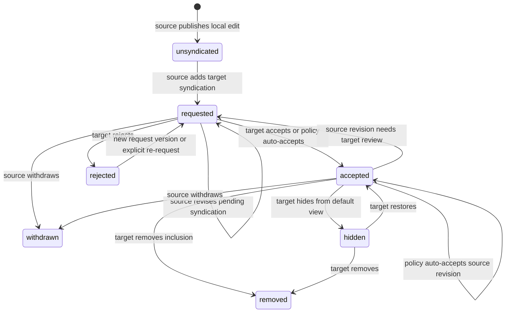
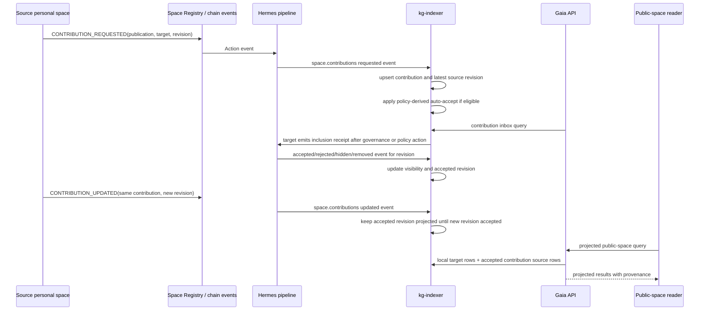
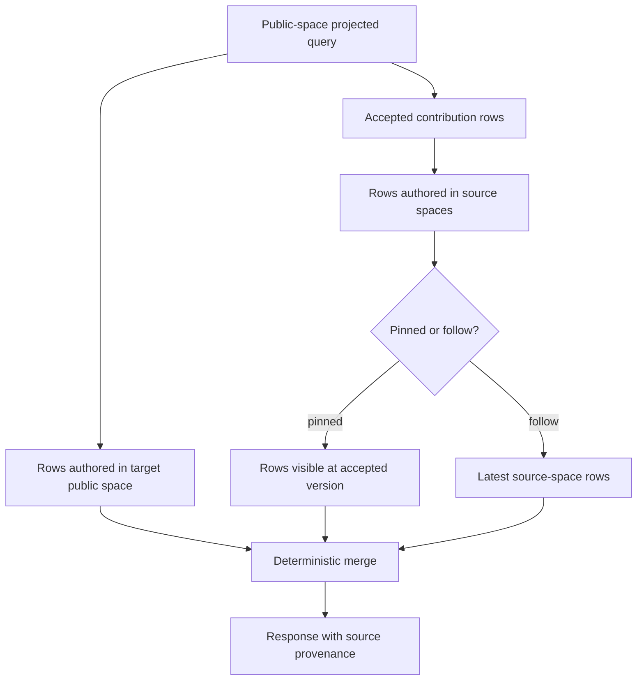

# feat: Add personal-space contribution aggregation

## Summary

Add support for people to publish knowledge edits from their personal spaces and request inclusion in public spaces without transferring authorship. Syndication can be added or revised after the source edit is published. Gaia will index contribution requests, source-authored syndication revisions, public-space inclusion receipts, and public-space policies, then expose projected public-space views that combine local public content with accepted external contributions.

---

## Problem Frame

Today, publishing to a public space requires the contributor to join that space and use its governance path before the content appears there. That makes the first contribution expensive and pushes users toward public-space membership even when the better model is personal authorship plus public curation.

The current system already has the right primitives to avoid content copying: edits are emitted from the publishing space, values and relations retain `space_id`, DAO proposals govern public-space actions, and Atlas treats topic edges as non-canonical-granting. The missing layer is a first-class way for a source space to request public aggregation, revise that syndication later, and for a target public space to accept, reject, hide, or remove that inclusion.

---

## Requirements

### Authoring and Provenance

- R1. A contributor can publish an edit in their personal space and request that one or more public spaces include that contribution.
- R2. The source personal space remains the authoring space for all values, relations, edit versions, and provenance displays.
- R3. Public-space inclusion must not copy values or relations into the target public space by default.
- R4. A public space can later remove an inclusion without deleting or mutating the source-space content.

### Public-Space Governance

- R5. Each public space can choose an aggregation policy of `open`, `trusted`, `governed`, or `closed`.
- R6. Open policy includes matching requests immediately while preserving source provenance and later moderation.
- R7. Trusted policy auto-accepts requests only from spaces that satisfy the public space's trust rule.
- R8. Governed policy requires an explicit inclusion receipt from the public space before content appears in its default projected view.
- R9. Closed policy records no public inclusion from external requests unless the public space emits an explicit exception.

### Inclusion Lifecycle

- R10. Contribution lifecycle states are `requested`, `accepted`, `rejected`, `hidden`, `withdrawn`, and `removed`.
- R11. Requests, acceptances, rejections, removals, and withdrawals must be idempotent under replay.
- R12. Pinned inclusion uses the edit/version in the accepted syndication revision until the target accepts a later revision.
- R13. Follow inclusion may track later source-space updates only when the target public-space policy or receipt permits it.

### Public Views and APIs

- R14. Public-space projected reads include local target-space data plus accepted external contributions.
- R15. Pending or rejected requests are visible in contribution-management endpoints but not in the default projected public-space view.
- R16. API responses must expose source space, target space, contribution status, inclusion mode, root entity IDs, tag IDs, and relevant edit/version identifiers.
- R17. Search or front-page surfaces that claim to show a public space must account for accepted external contributions, even if full-text search support ships after core KG projection.

### Safety and Operations

- R18. Spam and accidental duplicate requests must be bounded by deterministic contribution IDs, dedupe rules, and target-space moderation controls.
- R19. The implementation must preserve existing local, transitive, and canonical query semantics unless callers explicitly request projected public-space behavior.
- R20. Rebuilding from chain/Kafka history must reproduce the same contribution states and public-space projections.

### Post-Publish Syndication Mutability

- R21. A contributor can publish an edit in their personal space with no public-space syndication, then add one or more target public spaces later, either one at a time or in a batch.
- R22. A contributor can add or withdraw any individual target public-space syndication without republishing the underlying knowledge edit or affecting other target spaces.
- R23. A contributor can revise target-specific syndication metadata after publication, including tags, root entity set, inclusion mode, and pinned edit/version.
- R24. Target public-space approvals are revision-specific: projected reads use the last accepted syndication revision until the target policy or a target receipt accepts a later revision.
- R25. Withdrawing one target-space syndication must not affect the same source publication's syndication state in other target spaces.
- R26. Batch UI flows may edit several target syndications at once, but protocol, indexing, governance, and replay state must remain independently addressable per target space.

### Public-Space Indexer Efficiency

- R27. A public-space indexer must not need to ingest every edit from every editor, member, or trusted personal space to maintain that public space's projected view.
- R28. Every source-authored syndication request or update must be target-addressed onchain with `toSpaceId = target_public_space_id` so indexers can filter relevant events before looking at IPFS.
- R29. Contribution request/update events must carry a compact routing manifest in event data: source space, target space, publication ID, contribution ID, revision ID, content URI, payload/content hash, roots, tags, mode, and optional operation summary.
- R30. Full edit payload fetching must be driven by inclusion state: accepted or auto-accepted revisions are fetched for projection, pending revisions are fetched only for explicit preview or moderation workflows.
- R31. Follow mode must still be event-driven. Later source edits should become public-space projection candidates only when the source emits a target-specific `CONTRIBUTION_UPDATED` revision for that public space.
- R32. Multi-target UI flows must emit independently filterable per-target events, even when they are submitted in one transaction, so a public-space indexer can ignore unrelated targets without decoding opaque target arrays.

---

## Key Technical Decisions

- KTD1. Preserve source-space authorship and add inclusion receipts instead of copying public-space rows. This matches the existing `knowledge.edits` and `space_id` model and avoids ambiguous update/delete ownership.
- KTD2. Introduce contribution-specific protocol actions and a `space.contributions` Kafka topic. Existing proposal, topic, moderation, and trust topics carry adjacent semantics but none represent source-authored public aggregation cleanly.
- KTD3. Use deterministic target-specific `contribution_id` values as the lifecycle key. Replay, dedupe, updates, and moderation become tractable when every source revision and target receipt points at one stable source-target edge.
- KTD4. Store current contribution visibility and revision state separately from event history. The event stream remains the source of truth, while the API needs compact current-state tables for projections, distribution management, and inbox queries.
- KTD5. Make projected public-space reads opt-in. Existing `local`, `transitive`, and `canonical` behavior should not silently widen because that would change API contracts and conflict resolution.
- KTD6. Treat `pinned` as the default accepted mode and `follow` as an explicit trust decision. Pinned mode limits public-space risk because reviewed content cannot drift through later personal-space edits.
- KTD7. Gate automation by public-space policy but keep manual receipts authoritative. Policy can auto-accept some requests, but an explicit target-space receipt always wins for the contribution ID.
- KTD8. Keep public-space adoption as a separate future action. Adoption can copy or republish content into the public space later, but aggregation V1 should remain a provenance-preserving projection.
- KTD9. Separate source publication identity from target syndication identity. A `publication_id` identifies the source-space content package; a `contribution_id` identifies that publication's syndication edge to one target public space.
- KTD10. Treat source-authored request/update events as versioned syndication revisions. Revising tags, roots, pinned edit/version, or mode creates a new revision for the same source-target edge rather than a duplicate contribution.
- KTD11. Make target receipts accept or reject a specific source revision. This prevents a proposal that reviewed revision A from accidentally approving revision B if the source updates the syndication while governance is in progress.
- KTD12. Avoid compound lifecycle statuses like `accepted_with_pending_update`. Store target visibility and latest revision review separately, then derive UI labels from `accepted_revision_id`, `latest_revision_id`, `visibility_status`, and `latest_review_status`.
- KTD13. Make public-space indexing target-addressed, not membership-addressed. Editors and members can publish many unrelated personal-space edits; only contribution events addressed to the public space should enter that public space's indexing path.
- KTD14. Put routing metadata onchain and keep full edit content offchain. The event tells an indexer whether a revision is relevant and whether it should be fetched; IPFS holds the full GRC-20 edit payload.
- KTD15. Decouple contribution-event ingestion from payload materialization. Hermes should emit manifest-level contribution events without fetching full content, while accepted-revision materialization fetches and decodes only the payloads that are actually projected.
- KTD16. Do not define follow mode as passive source-space watching. Follow mode means future target-specific revisions can be auto-accepted under the target's policy, not that the target indexer scans all future source-space `EDITS_PUBLISHED` events.

---

## High-Level Technical Design

### Contribution Lifecycle



### Event and Projection Flow



### Projection Model



### Post-Publish Syndication Change Model

The best model is a two-layer distribution graph:

```text
source publication
  publication_id
  source_space_id
  initial_edit_id

target syndication edge
  contribution_id = deterministic(publication_id, target_space_id)
  target_space_id
  latest_revision_id
  accepted_revision_id
  visibility_status
  latest_review_status

source syndication revision
  revision_id
  contribution_id
  root_entity_ids
  tag_ids
  mode: pinned | follow
  pinned_edit_id
  pinned_version_key
```

This keeps publication and distribution separate. A single source publication can have zero, one, or many target syndication edges. A user can publish an edit in their personal space, come back later, and add target public spaces by creating target-specific syndication edges. Changing where the edit is syndicated changes edges and revisions; it does not mutate the original edit.

Target governance remains in control because every target receipt references an exact `revision_id`. If the source changes the root set, tags, pinned version, or mode while a proposal is active, the old proposal can only accept the old revision. The public-space projection keeps showing the last accepted revision until the newer revision is accepted or auto-accepted by policy.

Post-publish operations:

| Operation | Source action | Target governance effect | Projection behavior |
| --- | --- | --- | --- |
| Add target space | Create `CONTRIBUTION_REQUESTED` for a new `contribution_id` | Apply target policy | Hidden until accepted unless policy auto-accepts |
| Remove target space | Emit `CONTRIBUTION_WITHDRAWN` for that target edge | No target approval required | Removed from that target only |
| Add or remove tags | Emit `CONTRIBUTION_UPDATED` with a new revision | Apply target policy to revision | Last accepted revision remains visible |
| Change roots | Emit `CONTRIBUTION_UPDATED` with a new revision | Requires acceptance unless policy auto-accepts | Last accepted roots remain visible |
| Update pinned version | Emit `CONTRIBUTION_UPDATED` with new pinned edit/version | Requires acceptance unless policy auto-accepts | Old pinned version remains visible |
| Switch `pinned` to `follow` | Emit `CONTRIBUTION_UPDATED` with mode change | Requires explicit receipt or trusted/open policy | Old accepted mode remains active |
| Batch edit targets | Emit one edge update per target | Each target policy applies independently | No all-or-nothing cross-space coupling |

Batch syndication is a client and transaction convenience, not a shared lifecycle object. Each target public space still gets its own `contribution_id`, latest revision, accepted revision, policy decision, moderation history, and projection state.

### Public-Space Indexer Efficiency Model

Current `EDITS_PUBLISHED` indexing is payload-first: the event exposes an IPFS content URI, Hermes prefetches the payload, decodes the GRC-20 edit, and only then can downstream indexing know the full entity/property contents. That is fine for a global edit stream, but it is the wrong primitive for a public-space projection indexer if syndication can originate from arbitrary personal spaces.

The contribution path should be manifest-first:

```text
target-addressed contribution event
  fromSpaceId = source personal space
  toSpaceId = target public space
  action = CONTRIBUTION_REQUESTED | CONTRIBUTION_UPDATED
  topic = contribution_id
  data = routing manifest

routing manifest
  publication_id
  revision_id
  content_uri
  content_hash
  root_entity_ids
  tag_ids
  mode
  operation_summary
  payload_size_hint
```

The public-space indexer only needs to subscribe to actions where `toSpaceId` is the public space, plus that public space's own governance, policy, and local edit events. It does not need to scan all `EDITS_PUBLISHED` events from editors, members, or trusted source spaces. Later source updates are relevant only when the source emits another target-addressed `CONTRIBUTION_UPDATED` event.

Payload fetching policy:

| State | Fetch full IPFS edit payload? | Reason |
| --- | --- | --- |
| Requested, governed | No by default | The routing manifest is enough for inbox counts, filtering, and governance routing. |
| Requested, reviewer opens preview | Yes, on demand | Human review may need full content, but this is not on the hot indexing path. |
| Auto-accepted by open/trusted policy | Yes | The revision immediately enters projection. |
| Accepted by target receipt | Yes | The revision enters projection and must be materialized. |
| Rejected, removed, withdrawn | No | The revision is not projected. |
| Accepted old revision with pending newer revision | Only old accepted revision | Projection must not silently widen to the pending revision. |

Performance tradeoff:

| Design | Public-space event work | IPFS work | Main downside |
| --- | --- | --- | --- |
| Index all editor/member personal spaces | Scales with all source edits from every editor/member | Fetch/decode every source edit to discover relevance | Unbounded for active members; bad cache-miss and decode amplification. |
| Watch accepted source spaces only | Scales with all edits from accepted sources | Fetch/decode or inspect summaries for every later source edit | Better, but follow mode still becomes passive surveillance of source spaces. |
| Single multi-target event with target array | One source event per revision | Target indexers must decode every event or rely on a global router | Efficient for publishers but poor for independent target indexers. |
| Target-addressed routing manifest | Scales with revisions addressed to the public space | Fetch only accepted or previewed revisions | More onchain event bytes and one logical event per target. |

The recommended design is the target-addressed routing manifest. It spends modest extra event bytes to avoid unbounded offchain work. A client can still batch several target updates in one transaction, but the transaction should emit one independently filterable contribution event per target space.

---

## Scope Boundaries

### In Scope

- New protocol/event documentation for contribution requests, inclusion receipts, withdrawals, and public-space policy changes.
- Hermes schema and pipeline support for contribution events.
- KG indexer persistence for source publications, target syndication edges, revisioned roots/tags/modes, policies, and replay-safe status updates.
- API endpoints for contribution inbox/review and projected public-space reads.
- Source-space distribution management queries that let clients show and revise where an already-published edit is syndicated.
- Manifest-first indexing where public-space indexers can identify relevant contribution revisions from onchain event data before fetching IPFS payloads.
- Tests that prove personal-space authored content appears in the public projection only when policy or receipts allow it.

### Deferred to Follow-Up Work

- Contract implementation for the new actions if the contracts live outside this repository.
- Full public-space adoption/copy semantics where the target space republishes source content as target-authored content.
- Ranking, reputation, or vote-weighted conflict resolution for accepted external contributions.
- Notification workflows for new contribution requests and moderation changes.
- Full OpenSearch projection if the first implementation exposes projected public-space front pages through KG/API reads.

### Out of Scope

- Making topic edges canonical-granting.
- Letting a source space unilaterally endorse itself as part of a governed public space.
- Replacing existing direct public-space proposals or editor/member governance flows.
- Changing existing `local`, `transitive`, or `canonical` query semantics for callers that do not request projection.

---

## Acceptance Examples

- AE1. Given a personal space publishes an edit and requests aggregation into a governed public space, when the request is indexed, then the contribution appears in the public-space inbox but not in the public-space projected view.
- AE2. Given the governed public space accepts that request, when a projected public-space query runs, then the response includes the accepted source-space content with source-space provenance.
- AE3. Given the public space rejects the request, when projected reads and inbox reads run, then projected reads omit it and inbox reads show `rejected`.
- AE4. Given the public space uses open policy, when a valid contribution request is indexed, then the contribution becomes `accepted` without a separate governance receipt.
- AE5. Given the source space withdraws a previously accepted contribution, when the withdrawal is indexed, then the public-space projection no longer includes it.
- AE6. Given a pinned contribution is accepted and the source emits a later target-specific update revision, when projected reads run, then the public view uses the accepted version until a target receipt accepts the later revision.
- AE7. Given a follow contribution is accepted by a trusted policy, when the source emits a target-specific update revision for the same root entity, then projected reads use the latest eligible accepted source-space state.
- AE8. Given duplicate request events for the same deterministic contribution ID, when the indexer replays them, then only one contribution edge exists and visibility/review state is deterministic.
- AE9. Given a personal-space edit is published with no public target, when the source later requests syndication to a governed public space, then the request appears in that public space's inbox without creating a new knowledge edit.
- AE10. Given an accepted pinned contribution, when the source updates its syndicated tags or pinned edit/version, then projected public reads continue using the last accepted revision until the target accepts or auto-accepts the new revision.
- AE11. Given the same source publication is syndicated to two public spaces, when the source withdraws one target syndication, then only that target's projection changes.
- AE12. Given a proposal was created to accept revision A, when the source emits revision B before execution, then executing the proposal accepts only revision A and leaves revision B pending or rejected according to policy.
- AE13. Given a client batch-adds three target spaces after publication, when the events are indexed, then each target has an independent `contribution_id`, policy decision, review status, and projected visibility.
- AE14. Given a public-space indexer processes contribution events, when an unrelated personal-space edit is published by an editor or member, then the public-space indexer does not fetch or decode that edit.
- AE15. Given a governed contribution request is pending, when the request is indexed, then the indexer stores the routing manifest and does not fetch the full IPFS payload unless a reviewer asks for preview.
- AE16. Given a contribution revision is accepted or auto-accepted, when materialization runs, then the indexer fetches and decodes exactly that revision's content URI and validates the content hash before projection.
- AE17. Given an accepted follow contribution's source later publishes an unrelated local edit, when no target-specific `CONTRIBUTION_UPDATED` event exists, then the public-space projection remains unchanged.

---

## System-Wide Impact

- Protocol indexing gains a new contribution event family and probably a new Kafka topic.
- KG storage gains projection-specific state that joins source-space edit/version data to target public spaces through revisioned syndication edges.
- Payload fetching moves from eager request-time fetching to accepted-revision materialization for contribution content.
- API consumers get a new projected public-space scope that can return rows whose `space_id` is not the requested public-space ID.
- Source-space authoring clients get a distribution-management surface for adding or editing syndication after publication.
- Public-space governance becomes a moderation surface, not only a publishing surface.
- Search and front-page code must stop assuming "public-space content" means only rows authored directly by that public space.

---

## Phased Delivery

1. **Protocol and event contract:** Document contribution actions and add mock events so all downstream work can be tested without live contract changes.
2. **Manifest indexing backbone:** Add protobufs, Hermes transform, KG consumer parsing, and contribution persistence without eager payload fetching.
3. **Accepted payload materialization and API projection:** Fetch accepted revisions, add contribution-management endpoints, and add projected public-space read support.
4. **Policy automation and moderation:** Apply open/trusted/governed/closed policies and target-space receipts consistently.
5. **Search/front-page integration:** Extend public-space discovery surfaces to include accepted contributions.

---

## Implementation Units

### U1. Protocol Event Contract

- **Goal:** Define the contribution aggregation protocol surface that Gaia will index.
- **Requirements:** R1, R2, R5, R10, R11, R18, R20, R21, R22, R23, R24, R25, R26, R27, R28, R29, R31, R32.
- **Dependencies:** None.
- **Files:**
  - `docs/protocol/actions.md`
  - `docs/protocol/data-encoding.md`
  - `docs/protocol/dao-space.md`
  - `docs/protocol/space-registry.md`
  - `docs/protocol/contribution-aggregation.md`
  - `hermes-substream/src/lib.rs`
  - `hermes-relay/src/actions.rs`
  - `hermes-relay/src/source/mock_events.rs`
- **Approach:** Add a new protocol document that defines `CONTRIBUTION_REQUESTED`, `CONTRIBUTION_UPDATED`, `CONTRIBUTION_ACCEPTED`, `CONTRIBUTION_REJECTED`, `CONTRIBUTION_HIDDEN`, `CONTRIBUTION_REMOVED`, `CONTRIBUTION_WITHDRAWN`, and `CONTRIBUTION_POLICY_SET`. Use `fromSpaceId = source_space_id`, `toSpaceId = target_public_space_id`, and `topic = contribution_id` for source-authored request/update/withdraw events. ABI-encoded data carries the routing manifest: `publication_id`, `revision_id`, content URI, content hash, edit/version identifiers, root entity IDs, tag IDs, inclusion mode, operation summary, payload size hint, and policy/status metadata. Treat request/update/withdraw events as source-authored and inclusion receipt events as target-authored.
- **Patterns to follow:** Existing action docs in `docs/protocol/actions.md`, topic encoding notes in `docs/protocol/data-encoding.md`, and mock action builders in `hermes-relay/src/source/mock_events.rs`.
- **Test scenarios:**
  - Build a request action with source, target, edit ID, two root entity IDs, two tag IDs, and `pinned` mode; assert the action constant, topic contribution ID, from/to spaces, and encoded data shape.
  - Build a request action for an edit that was already published earlier and assert no new knowledge edit event is required.
  - Build an update action for the same contribution ID with a new revision ID and changed tags or pinned version.
  - Build a multi-target client batch and assert it emits one independently filterable contribution event per target space.
  - Build each receipt action and assert target-space authorship is represented by the event fields.
  - Build an acceptance receipt that references a specific revision ID and assert it cannot be confused with a later source revision.
  - Build a withdrawal action and assert the source space can emit it without target-space authorship.
  - Build duplicate request actions for the same input tuple and assert they share the same deterministic contribution ID.
  - Assert mock topology fixtures can include a request, update, acceptance, withdrawal, and policy set event in deterministic block order.
- **Verification:** Protocol docs describe every field needed by downstream indexers, and mock event tests prove the event shapes are stable.

### U2. Hermes Contribution Stream

- **Goal:** Convert raw contribution actions into typed Kafka messages.
- **Requirements:** R10, R11, R16, R20, R21, R23, R24, R26, R27, R28, R29, R30, R31, R32.
- **Dependencies:** U1.
- **Files:**
  - `hermes-schema/proto/contributions.proto`
  - `hermes-schema/build.rs`
  - `hermes-schema/src/lib.rs`
  - `hermes-schema/src/pb/mod.rs`
  - `hermes-pipeline/src/pipelines/contributions.rs`
  - `hermes-pipeline/src/pipelines/mod.rs`
  - `hermes-pipeline/src/emit.rs`
  - `hermes-pipeline/src/main.rs`
  - `hermes-pipeline/src/decode.rs`
  - `hermes-pipeline/src/pipelines/prefetch.rs`
  - `hermes-pipeline/src/cache/mock.rs`
- **Approach:** Add a `space.contributions` topic with typed messages for request, update, receipt, withdrawal, and policy events. Decode contribution action data with structured ABI decoding instead of string parsing, including `publication_id`, `contribution_id`, `revision_id`, content URI, content hash, roots, tags, mode, operation summary, and payload size hint. Do not fetch full IPFS edit payloads in this pipeline for request/update events; contribution ingestion must stay manifest-only. Keep contribution messages separate from governance proposals: proposals can produce target-space receipts, but contribution state should not be inferred from proposal status alone.
- **Patterns to follow:** The `space.governance`, `space.moderation`, and `space.topics` pipelines for topic headers, `KafkaEvent` implementations, sequence handling, and per-block emission ordering.
- **Test scenarios:**
  - Decode a valid `CONTRIBUTION_REQUESTED` action into a `HermesContributionRequested` message with normalized 16-byte IDs.
  - Decode a valid `CONTRIBUTION_UPDATED` action into a new revision for an existing contribution ID.
  - Decode routing manifest fields from event data and assert no IPFS cache lookup is performed for a pending contribution request.
  - Decode valid accepted, rejected, hidden, removed, and withdrawn events into distinct typed variants or a status message with the expected status enum.
  - Decode an acceptance receipt and assert it carries the accepted revision ID, not only the contribution ID.
  - Decode a policy-set action for all four policies.
  - Reject or mark unknown malformed events with missing contribution ID, missing revision ID for revisioned events, invalid source/target length, or unsupported mode/status.
  - Emit multiple contribution events in one block and assert sequence metadata is stable relative to other pipeline outputs.
  - Assert contribution request/update URIs are not added to the eager `prefetch_block` path.
- **Verification:** Hermes pipeline tests prove each action emits exactly one typed contribution message with the expected Kafka topic, key, event-type header, and metadata.

### U3. KG Contribution Persistence

- **Goal:** Persist source publications, target syndication edges, revisioned routing manifests, inclusion state, and policy data in PostgreSQL.
- **Requirements:** R2, R4, R5, R10, R11, R12, R13, R16, R18, R20, R21, R22, R23, R24, R25, R26, R27, R28, R29, R30, R31, R32.
- **Dependencies:** U2.
- **Files:**
  - `api/src/services/storage/schema.ts`
  - `api/drizzle/0062_create_contribution_aggregation.sql`
  - `api/drizzle/meta/_journal.json`
  - `kg-indexer/src/consumer.rs`
  - `kg-indexer/src/main.rs`
  - `kg-indexer/src/handlers/contributions.rs`
  - `kg-indexer/src/models/contributions.rs`
  - `kg-indexer/src/models/mod.rs`
  - `kg-indexer/src/storage.rs`
  - `kg-indexer/tests/e2e.rs`
  - `kg-indexer/tests/contribution_aggregation_integration.rs`
- **Approach:** Add tables for `space_contribution_publications`, `space_contributions`, `space_contribution_revisions`, `space_contribution_revision_entities`, `space_contribution_revision_tags`, and `space_contribution_policies`. Use `publication_id` as the source content package, `contribution_id` as the per-target syndication edge, and `revision_id` as the immutable source-authored routing manifest. Store target visibility separately from latest revision review so accepted old revisions can remain projected while newer revisions wait for governance. Apply events idempotently by contribution ID, revision ID, and event order.
- **Technical design:** Directional table shape:

  ```text
  space_contribution_publications
    publication_id
    source_space_id
    initial_edit_id
    created_at_block

  space_contributions
    contribution_id
    publication_id
    source_space_id
    target_space_id
    latest_revision_id
    accepted_revision_id
    visibility_status: requested | accepted | hidden | withdrawn | removed
    latest_review_status: requested | accepted | rejected
    status_reason
    created_at_block
    updated_at_block

  space_contribution_revisions
    revision_id
    contribution_id
    content_uri
    content_hash
    requested_edit_id
    pinned_edit_id
    pinned_version_key
    mode: pinned | follow
    operation_summary
    payload_size_hint
    created_at_block

  space_contribution_revision_entities
    revision_id
    entity_id

  space_contribution_revision_tags
    revision_id
    tag_id

  space_contribution_policies
    space_id
    policy: open | trusted | governed | closed
    updated_at_block
  ```

- **Patterns to follow:** Existing governance persistence in `kg-indexer/src/storage.rs`, typed subspace modeling in `kg-indexer/src/models/subspaces.rs`, and Drizzle schema enum/table patterns in `api/src/services/storage/schema.ts`.
- **Test scenarios:**
  - Insert a request and assert a publication row, target contribution row, revision manifest row, root entity rows, and tag rows are created with source provenance.
  - Replay the same request and assert no duplicate publication, contribution, revision, root entity row, or tag row is created.
  - Insert a pending governed request and assert no full edit payload row is created by contribution persistence.
  - Apply acceptance after request and assert `visibility_status` changes to `accepted`, `accepted_revision_id` is populated, and the revision manifest is retained.
  - Apply a source update after acceptance and assert `latest_revision_id` changes while `accepted_revision_id` and projected materialized payload remain unchanged.
  - Apply rejection for the latest revision and assert the contribution can remain visible at the previously accepted revision.
  - Apply withdrawal after acceptance and assert `visibility_status` becomes `withdrawn`.
  - Apply removal after acceptance and assert `visibility_status` becomes `removed`.
  - Add two target spaces for the same publication and assert each target has an independent contribution ID and visibility/review state.
  - Apply events out of legal lifecycle order and assert the handler either ignores stale transitions or records them according to the documented state machine.
  - Apply `CONTRIBUTION_POLICY_SET` for each policy and assert the policy table upserts idempotently.
- **Verification:** KG e2e fixtures prove contribution events survive Kafka parsing, handler mapping, storage writes, replay, and block ordering.

### U4. Policy Evaluation and Auto-Acceptance

- **Goal:** Apply target public-space policies consistently when contribution requests arrive.
- **Requirements:** R5, R6, R7, R8, R9, R18, R21, R23, R24, R26, R30, R31.
- **Dependencies:** U3.
- **Files:**
  - `kg-indexer/src/handlers/contributions.rs`
  - `kg-indexer/src/storage.rs`
  - `api/src/services/storage/schema.ts`
  - `kg-indexer/tests/contribution_aggregation_integration.rs`
  - `kg-indexer/tests/subspace_integration.rs`
- **Approach:** Evaluate policy whenever a source request or update creates a new revision. `open` auto-accepts valid latest revisions unless the target explicitly removed the contribution; `governed` leaves the latest revision requested while any older accepted revision remains projected; `closed` records or ignores new revisions according to the protocol doc; `trusted` accepts only when the source space satisfies the target trust rule at that time. The first trusted rule should reuse existing edges and roles rather than inventing reputation: editor/member, verified/related, or a documented allowlist if one exists.
- **Patterns to follow:** Existing membership and subspace storage for editor/member and verified/related lookups, plus Atlas's distinction between explicit trust and topic membership.
- **Test scenarios:**
  - Open policy auto-accepts a valid request and marks it accepted without a receipt.
  - Governed policy stores the request as pending and requires an accepted receipt before projection.
  - Closed policy prevents the request from entering the default projected view.
  - Trusted policy accepts an editor/member source and leaves an unrelated source pending.
  - Trusted policy accepts a verified or related source and does not accept a source that only shares a topic.
  - A governed accepted contribution receives a source update and keeps projecting the old accepted revision while the new revision is pending.
  - An open accepted contribution receives a source update and auto-accepts the new revision unless the target previously removed the contribution.
  - A follow-mode source publishes a local edit without a target-specific contribution update and assert the public-space projection is unchanged.
  - A later explicit rejection or removal receipt overrides a prior policy-derived acceptance.
- **Verification:** Policy tests prove topic edges alone do not create public trust and that explicit target-space receipts remain authoritative.

### U5. Contribution API and Review Inbox

- **Goal:** Expose contribution requests, target-space review state, and source-space distribution state through stable API endpoints.
- **Requirements:** R4, R10, R14, R15, R16, R18, R21, R22, R23, R24, R25, R26.
- **Dependencies:** U3, U4.
- **Files:**
  - `api/src/contributions/index.ts`
  - `api/src/contributions/router.ts`
  - `api/src/contributions/queries.ts`
  - `api/src/contributions/types.ts`
  - `api/src/contributions/__tests__/queries.test.ts`
  - `api/src/contributions/__tests__/router.test.ts`
  - `api/src/services/storage/schema.ts`
- **Approach:** Add read endpoints for target contribution inboxes, contribution details, and source-space syndication management. Mount the router through the same feature-router composition path used by existing `api/src/*/index.ts` modules, identifying the exact top-level entry point during implementation. Keep write endpoints out of scope unless the product already has an API path for composing onchain actions; this repo should expose indexed state rather than pretending to execute governance. Responses should normalize UUIDs consistently and include source and target space IDs, publication ID, contribution ID, latest revision ID, accepted revision ID, roots, tags, mode, visibility status, latest review status, timestamps, and provenance.
- **Proposed endpoints:** Directional API contract:

  ```text
  GET /spaces/:targetSpaceId/contributions?visibilityStatus=requested|accepted|hidden|withdrawn|removed
  GET /spaces/:targetSpaceId/contributions/:contributionId
  GET /spaces/:targetSpaceId/contribution-policies
  GET /spaces/:sourceSpaceId/syndications?publicationId=...
  GET /spaces/:sourceSpaceId/syndications/:contributionId
  ```

- **Patterns to follow:** Proposal API route/query/type split in `api/src/proposals/*`, UUID normalization in `api/src/utils/uuid.ts`, and status-filter test style in `api/src/proposals/__tests__/status.test.ts`.
- **Test scenarios:**
  - List requested contributions for a target public space and assert accepted contributions can be filtered out.
  - List accepted contributions and assert each item includes source space, target space, root entity IDs, tag IDs, mode, and status.
  - Fetch a contribution by ID and assert UUIDs, publication ID, contribution ID, latest revision ID, and accepted revision ID are normalized like proposal responses.
  - List source-space syndications for a publication and assert accepted, pending, rejected, withdrawn, and removed targets can be displayed together.
  - Fetch a contribution with a pending newer revision and assert both accepted and latest revision metadata are exposed.
  - Request an invalid target space ID and assert validation returns the existing API error shape.
  - Request a missing contribution ID and assert not-found behavior.
  - Query by source space and target space if the endpoint supports source filtering.
- **Verification:** API tests prove contribution review and source distribution state are queryable without widening existing proposal or versioned APIs.

### U6. Accepted Contribution Payload Materialization

- **Goal:** Fetch and decode full edit payloads only for contribution revisions that need projection or explicit preview.
- **Requirements:** R12, R13, R14, R16, R24, R27, R28, R29, R30, R31.
- **Dependencies:** U3, U4.
- **Files:**
  - `kg-indexer/src/handlers/contributions.rs`
  - `kg-indexer/src/storage.rs`
  - `kg-indexer/src/models/contributions.rs`
  - `api/src/services/storage/schema.ts`
  - `hermes-pipeline/src/pipelines/prefetch.rs`
  - `hermes-pipeline/src/pipelines/edits.rs`
  - `kg-indexer/tests/contribution_aggregation_integration.rs`
- **Approach:** Add an accepted-revision materialization path that reads `accepted_revision_id`, fetches that revision's `content_uri`, validates `content_hash`, decodes the GRC-20 edit payload, and stores or emits the rows needed by projected public-space reads. Do not add contribution request/update URIs to the existing eager `prefetch_block` path. Pending governed requests should store routing manifests only; preview fetches should be an explicit API or background moderation path with rate limits.
- **Patterns to follow:** Existing IPFS cache/retry behavior in `hermes-pipeline/src/pipelines/prefetch.rs` and GRC-20 payload decoding in `hermes-pipeline/src/pipelines/edits.rs`, but move the trigger from "every edit event in a block" to "accepted contribution revision needs materialization."
- **Test scenarios:**
  - Covers AE15. Index a pending governed request and assert the materializer does not fetch the full IPFS payload.
  - Covers AE16. Accept a revision and assert exactly that content URI is fetched, hash-validated, decoded, and projected.
  - Accept revision A, receive pending revision B, and assert only revision A's payload is materialized for projection.
  - Auto-accept an open-policy update and assert the materializer fetches the new accepted revision once.
  - Replay the same acceptance event and assert payload materialization is idempotent by revision ID and content hash.
  - Submit a contribution with an invalid content hash and assert it is not projected even if the routing manifest was accepted.
- **Verification:** Materialization tests prove public-space indexing cost scales with accepted or previewed contribution revisions, not with all personal-space edits from possible contributors.

### U7. Projected Public-Space Reads

- **Goal:** Add opt-in public-space projection that merges target-space local data with accepted external contributions.
- **Requirements:** R2, R3, R12, R13, R14, R15, R16, R19, R21, R24, R25, R30, R31.
- **Dependencies:** U3, U4, U6.
- **Files:**
  - `api/src/versioned/queries.ts`
  - `api/src/versioned/router.ts`
  - `api/src/versioned/types.ts`
  - `api/src/versioned/enrich.ts`
  - `api/src/versioned/__tests__/router.test.ts`
  - `api/src/versioned/__tests__/integration.test.ts`
  - `api/src/services/storage/schema.ts`
  - `docs/research/aggregation.md`
- **Approach:** Add a projected scope that callers must request explicitly, such as `spaceScope=projected` or `includeContributions=true`. Local target-space rows remain highest priority. Projection always resolves through `accepted_revision_id`, not `latest_revision_id`. Accepted pinned revisions resolve against the pinned edit/version in that revision; accepted follow revisions resolve against current source-space state for the roots in that accepted revision. Responses must include enough provenance for clients to render "from source space X, included by public space Y."
- **Patterns to follow:** Existing versioned query helpers and the aggregation research doc's deterministic nearest/local conflict rules.
- **Test scenarios:**
  - Covers AE2. Query projected scope after acceptance and assert source-space content appears with source provenance.
  - Covers AE1. Query projected scope with only a requested contribution and assert it is omitted.
  - Covers AE3. Query projected scope after rejection and assert it is omitted.
  - Covers AE5. Query projected scope after withdrawal and assert it is omitted.
  - Covers AE6. Accept a pinned contribution, emit a later target-specific source update, and assert projection returns the accepted version until that revision is accepted.
  - Covers AE7. Accept a follow contribution, emit a later target-specific source update, and assert projection returns the latest eligible accepted source state.
  - Covers AE9. Publish locally first, request syndication later, accept it, and assert projection includes the original source edit.
  - Covers AE10. Create a newer syndication revision and assert projection still uses the old accepted revision until acceptance.
  - Covers AE11. Withdraw one target edge and assert another accepted target edge still projects.
  - Query without projected scope and assert results match current local/transitive/canonical behavior.
  - Create a conflict where target public space and source space both define the same entity/property and assert target local data wins.
- **Verification:** Versioned API tests prove projection is opt-in, provenance-preserving, and deterministic.

### U8. Search and Front-Page Projection

- **Goal:** Ensure public-space discovery surfaces can include accepted external contributions.
- **Requirements:** R14, R15, R17, R19, R24, R25, R30, R31.
- **Dependencies:** U3, U4, U6, U7.
- **Files:**
  - `api/src/services/search/opensearch.ts`
  - `api/src/services/search/types.ts`
  - `api/src/services/search/opensearch.test.ts`
  - `search-indexer/src/consumer/messages.rs`
  - `search-indexer/src/processor/mod.rs`
  - `search-indexer/src/consumer/entities_consumer.rs`
  - `search-indexer/tests/e2e-kafka-search-api/src/main.rs`
  - `search-indexer/tests/e2e-kafka-search-api/typescript/validate-search.ts`
- **Approach:** Choose the least invasive search integration after U6 proves the projection semantics. The preferred path is to add target-space projection metadata to search documents for accepted contribution roots from `accepted_revision_id`, then filter public-space searches by authored `space_id` OR projected target-space membership. If that creates stale-pinned-version risk, ship KG/API projection first and mark OpenSearch projection as a follow-up with a clear feature flag.
- **Patterns to follow:** Existing `additional_space_ids` and canonical OR filter logic in `api/src/services/search/opensearch.ts`, and space topic patch behavior in `search-indexer/src/processor/mod.rs`.
- **Test scenarios:**
  - Search a public space with an accepted contribution and assert the accepted source entity is eligible.
  - Search a public space with a requested-only contribution and assert the source entity is not eligible.
  - Search a public space after removal and assert projected eligibility is removed.
  - Search after a source syndication update and assert unaccepted new roots or tags do not alter projected eligibility.
  - Search with canonical-only restrictions and assert projected public-space eligibility does not accidentally bypass canonical filtering unless the API contract says it should.
  - Reindex a source entity update in follow mode and assert projected search metadata stays current.
  - Reindex a pinned contribution and assert later source updates do not falsely claim the accepted version if version-sensitive search is not supported.
- **Verification:** Search tests either prove projected eligibility works or document that projected public-space search is feature-flagged behind the KG/API projection.

### U9. Governance Proposal Decoding for Inclusion Receipts

- **Goal:** Make target-space governed acceptance visible in existing proposal APIs.
- **Requirements:** R5, R8, R10, R16, R24.
- **Dependencies:** U1, U2, U3.
- **Files:**
  - `hermes-schema/proto/governance.proto`
  - `hermes-pipeline/src/decode.rs`
  - `hermes-pipeline/src/pipelines/governance.rs`
  - `kg-indexer/src/models/governance.rs`
  - `kg-indexer/src/handlers/governance.rs`
  - `kg-indexer/src/storage.rs`
  - `api/src/services/storage/schema.ts`
  - `api/src/proposals/types.ts`
  - `api/src/proposals/router.ts`
  - `api/src/proposals/__tests__/queries.test.ts`
  - `kg-indexer/tests/e2e.rs`
- **Approach:** If inclusion receipts are executable DAO actions, extend proposal action decoding so proposals can show "accept contribution revision", "reject contribution revision", "hide contribution", or "remove contribution" as first-class action types. Acceptance and rejection actions must carry both `contribution_id` and `revision_id`; hide/remove may target the contribution edge as a whole. Keep proposal display separate from contribution visibility/revision state: proposal APIs explain governance intent, while contribution APIs show indexed lifecycle state after execution.
- **Patterns to follow:** Recent SetTopic/UnsetTopic proposal action support and subspace proposal action decoding in `hermes-pipeline/src/pipelines/governance.rs`, `kg-indexer/src/models/governance.rs`, and `api/src/proposals/types.ts`.
- **Test scenarios:**
  - Decode a proposal containing an accept-contribution action and assert the typed proposal action includes contribution ID and revision ID.
  - Decode reject/hide/remove actions and assert they do not fall back to `Unknown`.
  - Execute a proposal for revision A after revision B exists and assert only revision A becomes the accepted projection.
  - Store each proposal action in `proposal_actions` with stable action type and target contribution ID.
  - Return each action in proposal list/detail API responses with discriminated action shapes.
  - Filter proposals by new contribution action types.
  - Execute the proposal fixture and assert contribution visibility/revision state changes only when the execution event is indexed.
- **Verification:** Proposal API tests prove governance review can be inspected before execution, while KG contribution tests prove execution drives lifecycle state.

### U10. Documentation, Rollout, and Rebuild Safety

- **Goal:** Make the feature understandable, operable, and replay-safe before enabling it by default.
- **Requirements:** R18, R19, R20, R21, R24, R26, R27, R28, R29, R30, R31, R32.
- **Dependencies:** U1 through U9.
- **Files:**
  - `docs/research/aggregation.md`
  - `docs/api-architecture.md`
  - `docs/runbooks/staging-production.md`
  - `README.md`
  - `kg-indexer/README.md`
  - `hermes-pipeline/README.md`
  - `search-indexer/README.md`
- **Approach:** Document contribution aggregation as a projection layer, not a replacement for canonical graph semantics. Add rollout notes for migrations, Kafka topic creation, replay, feature flags, and backfill/reindex expectations. Include operational checks for contribution event counts, rejected malformed events, publication/contribution/revision row counts, pending revision counts, and projection query latency.
- **Patterns to follow:** Existing runbook and subsystem README style.
- **Test scenarios:**
  - Test expectation: none for prose-only documentation, but rollout notes must name the migration order and rollback posture.
  - If feature flags are added, include tests in the relevant API/search units that default behavior remains unchanged while the flag is off.
- **Verification:** A maintainer can read the docs and know how to deploy schema changes, create Kafka topics, replay contribution events, and validate projected public-space reads.

---

## Risks & Mitigations

- **Protocol dependency risk:** Gaia cannot index actions that contracts do not emit. Mitigation: land docs, mocks, and pipeline support behind fixtures while tracking contract support as a prerequisite.
- **Spam risk:** Open aggregation can turn public spaces into request sinks. Mitigation: deterministic IDs, policy defaults, target-space hide/remove controls, and no default projected visibility for governed spaces.
- **Projection ambiguity:** Users may confuse source-authored content with public-space-authored content. Mitigation: API responses carry source and target provenance, and clients must display source space for accepted external contributions.
- **Silent widening risk:** Post-publish syndication edits could widen what a public space shows without review. Mitigation: target receipts accept exact revision IDs, projected reads use `accepted_revision_id`, and newer source revisions stay pending unless policy auto-accepts them.
- **Pinned-version complexity:** Versioned projection is harder than latest-state projection. Mitigation: make pinned the default but implement it in the versioned query layer before exposing pinned search claims.
- **Search staleness:** OpenSearch may not represent pinned accepted versions faithfully. Mitigation: ship KG/API projection first or feature-flag search projection until version-sensitive indexing is proven.
- **Replay ordering bugs:** Status transitions and revision acceptance are sensitive to block and sequence order. Mitigation: use block metadata, contribution/revision ID idempotency, and add replay tests for duplicate and out-of-order lifecycle events.
- **Canonical model confusion:** Topic or contribution inclusion could be mistaken for canonical trust. Mitigation: keep contribution projection separate from Atlas canonical membership and document that it never grants canonical status.
- **Onchain manifest bloat:** Rich routing manifests increase event bytes and publisher gas. Mitigation: keep only routing-critical fields onchain, cap inline root/tag counts, and use optional extended manifest URIs for large bundles.
- **Manifest/content drift:** Onchain roots or tags could disagree with the IPFS payload. Mitigation: include content hash, validate fetched payloads before projection, and treat the onchain routing manifest as eligibility metadata while decoded payload remains the source for actual KG rows.
- **Indexer amplification:** A careless implementation could prefetch every pending request and recreate the naive cost profile. Mitigation: enforce a separate accepted-revision materialization queue and tests that pending governed requests do not fetch payloads.

---

## Dependencies / Prerequisites

- Contract or protocol support for contribution request, receipt, withdrawal, and policy events, or a confirmed interim event source that emits the same action semantics.
- Agreement on exact ABI encoding for publication IDs, contribution IDs, revision IDs, entity root lists, tag lists, inclusion mode, policy, and receipt revision/status.
- Agreement on manifest size bounds: maximum inline root IDs, tag IDs, operation summary size, and payload size hint semantics.
- Kafka topic provisioning for `space.contributions` in local, staging, and production environments.
- Database migration window for contribution tables and enums.
- Product/UI support for displaying provenance, routing contribution inbox actions, and managing source-space syndication after publication.

---

## Open Questions

- Should `CONTRIBUTION_REQUESTED` be permissionless at the Space Registry level, or should it call target-space `write()` and rely on a target contract path that never requires membership?
- Should `closed` policy ignore requests entirely or persist them as rejected for audit and rate-limit visibility?
- What exact trust rule should `trusted` policy use first: editor/member only, verified/related only, or an explicit allowlist?
- Should `publication_id` be client-supplied or derived from the initial edit/root package, and should `revision_id` be a content-addressed payload hash or source-sequenced nonce?
- Should follow mode be allowed for any accepted source or only for trusted-policy/explicit-follow receipts?
- What is the maximum inline manifest size before a contribution must use an extended manifest URI?
- Should pending contribution preview fetches be served by the same materialization queue with a lower priority, or by a separate reviewer-preview path?

---

## Sources & Research

- `docs/protocol/space-registry.md` documents `enter()` and permissionless actions, which shape request-vs-receipt event design.
- `docs/protocol/dao-space.md` documents proposal creation, voting, execution, and `EDITS_PUBLISHED` as a self-ping, which shapes governed acceptance.
- `docs/protocol/actions.md` documents action field mappings and existing content/moderation actions.
- `docs/specs/atlas-canonical-graph-spec.md` states that topic edges do not grant canonical membership, which is preserved by this plan.
- `docs/research/aggregation.md` describes local/transitive/canonical scopes and deterministic conflict resolution, which informs projected scope design.
- `hermes-pipeline/src/pipelines/edits.rs` shows edit events are keyed by the publishing `from_id` space.
- `hermes-pipeline/src/pipelines/prefetch.rs` shows current edit/proposal publish ingestion eagerly collects IPFS URIs and batch-fetches payloads before transform.
- `api/src/services/storage/schema.ts` shows values, relations, proposals, subspaces, and topic edges are already stored with explicit space IDs and typed enums.
- `kg-indexer/src/models/governance.rs` and `api/src/proposals/types.ts` show the existing pattern for adding first-class proposal action types across Hermes, KG storage, and API responses.
