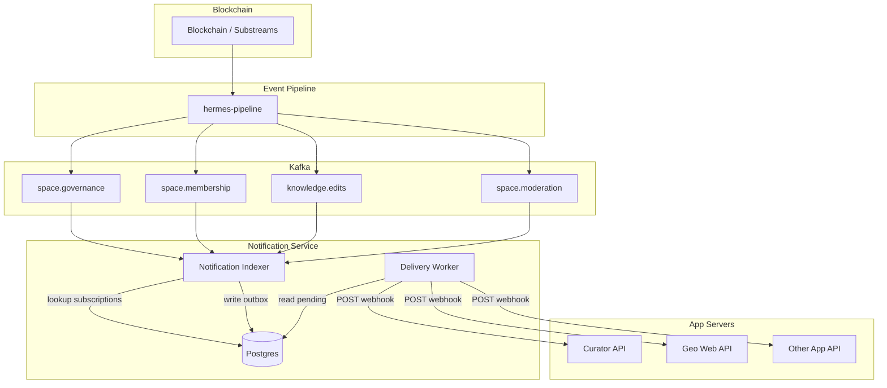
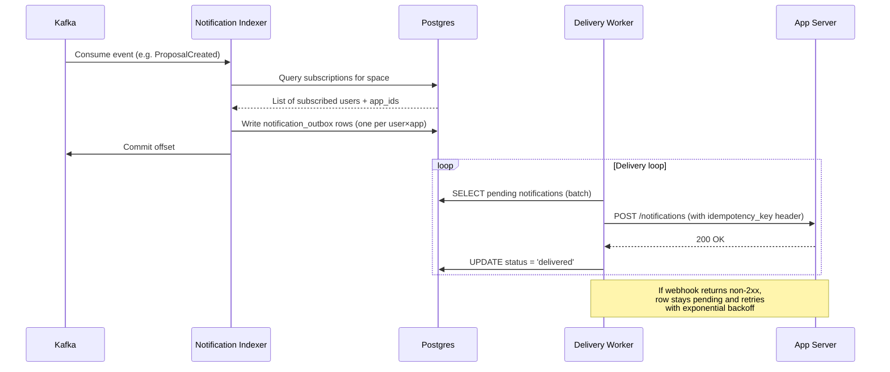
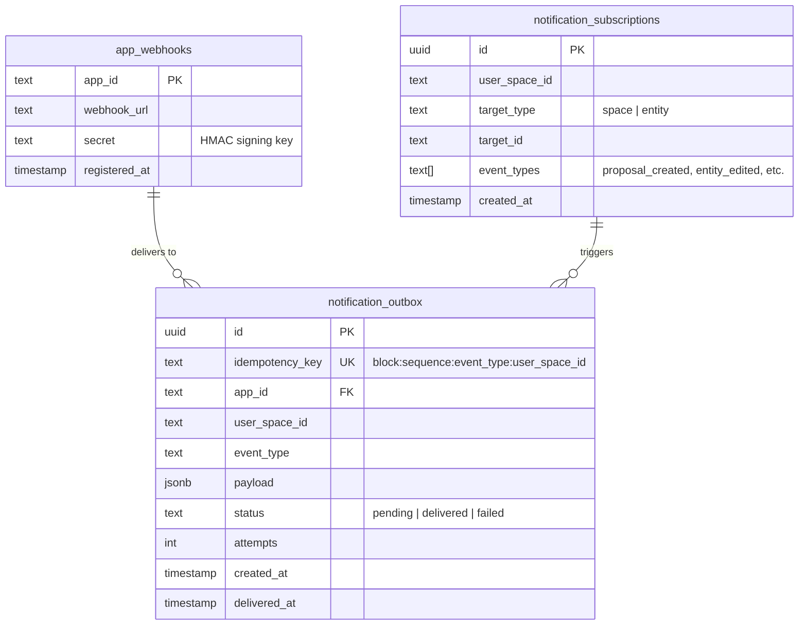
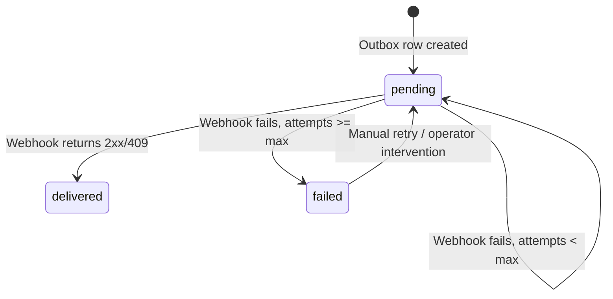

# Notification Service (RFC)

## Summary

A standalone notification indexer that consumes blockchain events from Kafka, determines who should be notified, and delivers notifications via webhooks to registered app servers. Each app server (Curator iOS, Geo web, etc.) owns the last mile — deciding how and where to notify users on their platform.

## Goals

- Notify users of relevant activity in the knowledge graph (proposals, edits, membership changes)
- Support multiple front-end apps via registered webhooks
- Guarantee at-least-once delivery with idempotency
- Decouple notification logic from existing indexers (kg-indexer, search-indexer)

## Non-Goals

- Managing push tokens, APNs, FCM, or device-level delivery (app servers own this)
- Real-time websocket notifications (future work)
- In-app notification UI (each front-end owns this)

---

## Architecture



---

## Event Flow



---

## Notification Types

### Governance

| Event | Kafka Topic | Who Gets Notified | Subscription Type |
|---|---|---|---|
| Proposal created | `space.governance` | Editors of the space | Implicit (membership) |
| Proposal voted on | `space.governance` | Proposal creator | Implicit (authorship) |
| Proposal executed | `space.governance` | Proposal creator + space editors | Implicit |
| Proposal rejected/failed | `space.governance` | Proposal creator + space editors | Implicit |
| Proposal expiring soon | `space.governance` | Editors who haven't voted | Implicit (membership) |
| Proposal on watched entity | `space.governance` | Entity subscribers | Explicit |
| Voting settings changed | `space.governance` | Space editors | Implicit (membership) |

### Membership

| Event | Kafka Topic | Who Gets Notified | Subscription Type |
|---|---|---|---|
| You were added as editor/member | `space.membership` | The added user | Implicit (direct) |
| You were removed as editor/member | `space.membership` | The removed user | Implicit (direct) |
| Editor/member added to your space | `space.membership` | Existing editors of the space | Implicit (membership) |
| Editor/member removed from your space | `space.membership` | Existing editors of the space | Implicit (membership) |
| User left space | `space.membership` | Existing editors of the space | Implicit (membership) |

### Knowledge Graph

| Event | Kafka Topic | Who Gets Notified | Subscription Type |
|---|---|---|---|
| Entity edited | `knowledge.edits` | Entity subscribers | Explicit |

### Moderation

| Event | Kafka Topic | Who Gets Notified | Subscription Type |
|---|---|---|---|
| Content flagged | `space.moderation` | Space editors | Implicit (membership) |
| Content unflagged | `space.moderation` | The editor whose content was flagged | Implicit (direct) |
| Editor flagged | `space.moderation` | The flagged editor | Implicit (direct) |
| Editor unflagged | `space.moderation` | The unflagged editor | Implicit (direct) |

---

## Subscription Model

Two kinds of subscriptions:

### Implicit (derived from existing state)

Editors and members of a space are automatically subscribed to governance events in that space. Resolved at notification time by querying the existing `editors` and `members` tables.

### Explicit (user opt-in)

Users subscribe to specific entities to get notified when proposals or edits affect them. Stored in a new table.



---

## Idempotency

Every blockchain event includes `BlockchainMetadata`:
- `block_number` (u64)
- `sequence` (u32 — order within block)
- `transaction_hash` (bytes)

The idempotency key is deterministically derived:

```
idempotency_key = hash(block_number + ":" + sequence + ":" + event_type + ":" + user_space_id)
```

This key is:
- Passed to the outbox as a `UNIQUE` constraint (prevents duplicate writes)
- Sent to the app server as an `X-Idempotency-Key` header (app server deduplicates on their end)

---

## Webhook Contract

### Registration

App servers register via API or config:

```json
{
  "app_id": "curator-ios",
  "webhook_url": "https://curator-api.example.com/geo/notifications",
  "secret": "whsec_..."
}
```

### Delivery

The delivery worker POSTs to the registered webhook:

```http
POST /geo/notifications
Content-Type: application/json
X-Idempotency-Key: abc123...
X-Signature: sha256=<HMAC of payload using secret>

{
  "event_type": "proposal_created",
  "user_space_id": "31cfe99fdf3549ef89094548f04858ff",
  "space_id": "a542cac04434987163d31071f3223af5",
  "data": {
    "proposal_id": "...",
    "proposal_name": "Add new editor",
    "created_by": "...",
    "space_name": "Crypto"
  },
  "timestamp": "2026-03-11T15:30:00Z",
  "block_number": 12345678
}
```

### Expected Response

- `200` — Notification accepted. Delivery worker marks as `delivered`.
- `409` — Duplicate (already processed). Delivery worker marks as `delivered`.
- `4xx/5xx` — Retry with exponential backoff (max 5 attempts, then `failed`).

---

## Failure Handling



- **Kafka unreachable:** Indexer retries connection (standard consumer behavior)
- **Postgres unreachable:** Indexer pauses consumption until DB recovers (no offset commit)
- **Webhook unreachable:** Outbox rows stay `pending`, delivery worker retries with exponential backoff
- **Duplicate events:** `idempotency_key` UNIQUE constraint prevents duplicate outbox rows

---

## Deployment

Follows the same pattern as search-indexer and scoring-service:

```
k8s namespace: notifications (or notifications-staging)
├── notification-indexer   (Deployment — Kafka consumer, writes outbox)
└── delivery-worker        (Deployment — reads outbox, calls webhooks)
```

Both share the same Postgres database. The indexer and delivery worker are separate deployments so they scale independently — the indexer is bound by Kafka throughput, the worker by webhook latency.

---

## Open Questions

1. **User ↔ device mapping:** How does the app server know which device/user to notify? The notification payload includes `user_space_id` — the app server needs its own mapping of `user_space_id → user account → device token`. The Curator app already has user-to-email mappings that could serve as a starting point.

2. **Subscription management API:** Where does the subscribe/unsubscribe API live? Options: (a) in the existing API service, (b) in the notification service itself. Leaning toward (a) since it's user-facing.

3. **Notification preferences:** Do users control which event types they receive? Per-space mute? This can start simple (all-or-nothing) and add granularity later.

4. **Backfill:** When a user subscribes to an entity, do they get historical notifications? Probably not — only forward-looking.

5. **Rate limiting:** Should we batch notifications to avoid spamming? e.g., "5 proposals created in Crypto space" instead of 5 separate notifications.

---

## Future Work

Potential notification types that could be added later:

### Trust & Topology
- **Space verified/related** — Space editors notified when another space extends trust to theirs
- **Subtopic added** — Space editors notified when their space is declared a subtopic of another
- **New subspace created** — Parent space editors notified when a child space is created under theirs

### Curation
- **Vote cast on your entity** — Entity creator notified of upvotes/downvotes (from `curation.votes` topic)
- **Score milestone** — Notify when an entity crosses a score threshold (e.g., top 10% in its space)

### Engagement
- **Notification batching/digests** — Aggregate multiple notifications into a single summary (e.g., daily digest of activity in your spaces)
- **Real-time websocket channel** — Push notifications to connected clients without polling
- **Notification preferences UI** — Per-space and per-event-type mute/unmute controls
