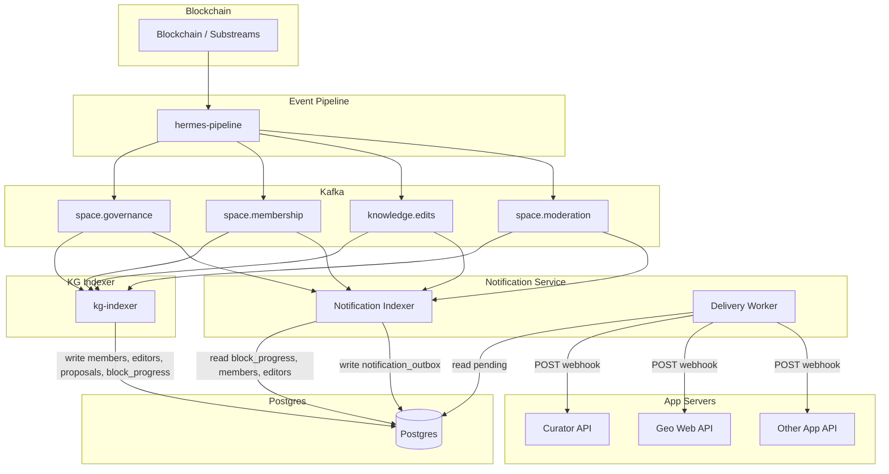
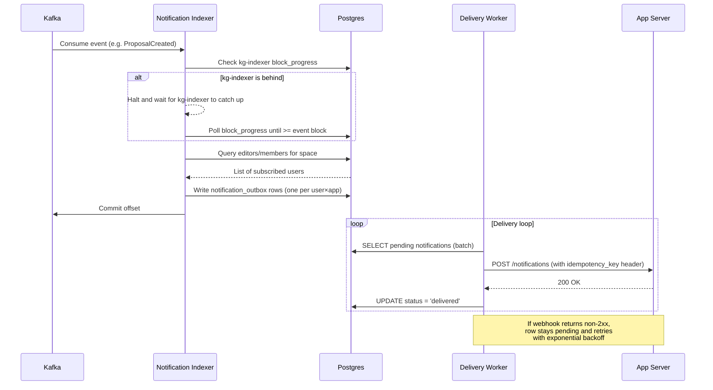
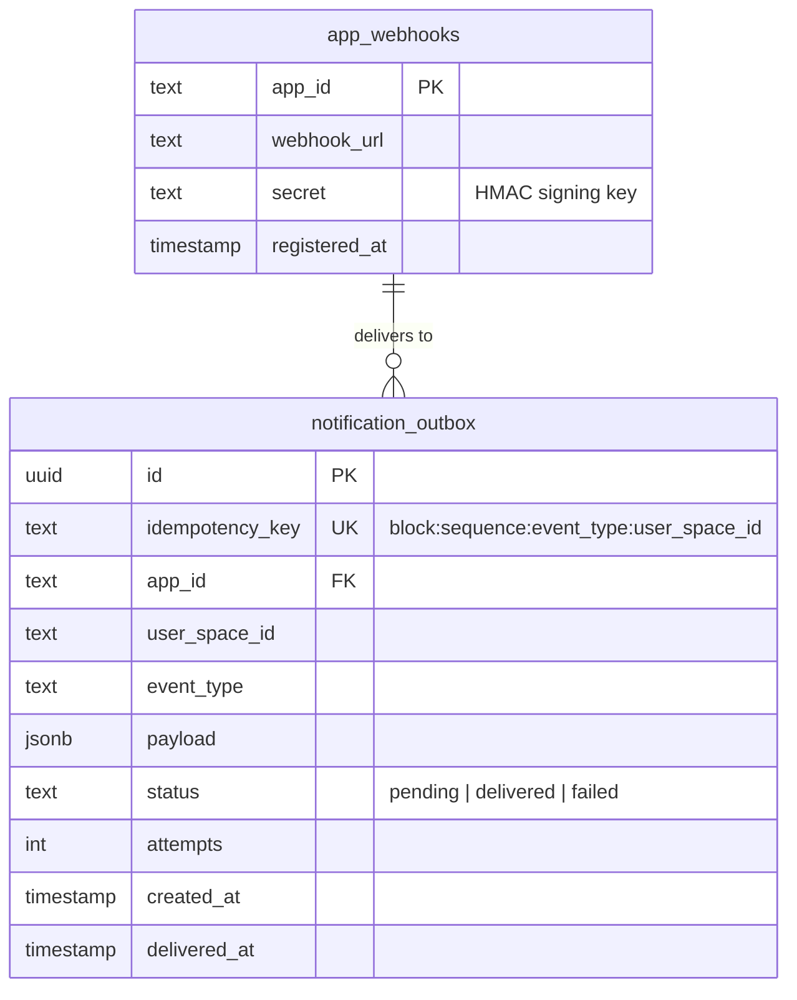
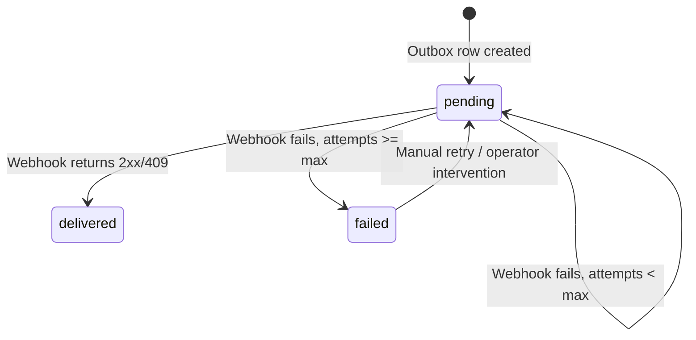
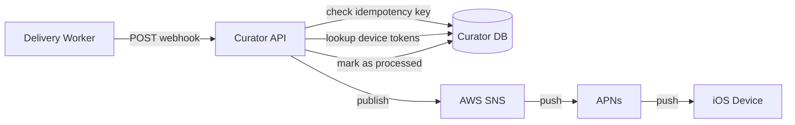
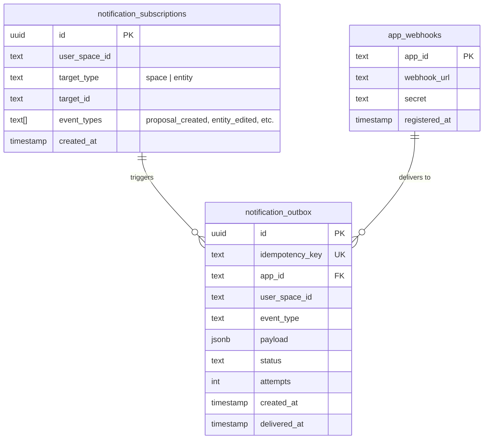

# Notification Service (RFC)

## Summary

A standalone notification indexer that consumes blockchain events from Kafka, determines who should be notified, and delivers notifications via webhooks to registered app servers. The notification indexer resolves recipients by reading membership data from the kg-indexer's Postgres database, using a lag-behind strategy to ensure consistency. Each app server (Curator iOS, Geo web, etc.) owns the last mile, deciding how and where to notify users on their platform.

## Goals

- Notify users of relevant activity in the knowledge graph (proposals, edits, membership changes)
- Support multiple front-end apps via registered webhooks
- Guarantee at-least-once delivery with idempotency
- Decouple notification logic from existing indexers (kg-indexer, search-indexer)

## Non-Goals

- Managing push tokens, APNs (Apple Push Notification service), FCM (Firebase Cloud Messaging), or device-level delivery (app servers own this)
- Real-time websocket notifications (future work)
- In-app notification UI (each front-end owns this)

---

## User Stories

### End User

1. A user opens the Curator app and logs in. The app registers their device for push notifications. No additional setup is required — notifications start arriving based on their existing roles in the knowledge graph.

2. A user is an editor of the **Health** space. Another editor creates a proposal to add a new entity. The user receives a push notification: **"New Proposal in Health"**. They tap it and are taken to the proposal in the app.

3. A user creates a proposal in the **Crypto** space. When another editor votes on it, the user receives a notification: **"New Vote on your proposal in Crypto"**. When the proposal is executed or rejected, they receive a final status notification.

4. A user is added as an editor to a new space. They receive a notification: **"You were added as an editor to AI"**.

### App Developer

1. A developer building a new Geo front-end registers a webhook URL with the notification service and receives a shared HMAC (Hash-based Message Authentication Code) secret.

2. The developer implements a POST endpoint that verifies the signature, deduplicates on the idempotency key, and maps `user_space_id` to their own user model.

3. The developer chooses how to deliver notifications to their users (push, email, in-app, etc.) — the notification service doesn't prescribe this.

4. The developer's app server starts receiving all notification events immediately. No per-user registration with the notification service is needed — implicit subscriptions are resolved automatically from on-chain membership data.

---

## Architecture



---

## Event Flow



---

## Notification Types

### Governance

| Event | Kafka Topic | Who Gets Notified | Subscription Type |
|---|---|---|---|
| Proposal created | `space.governance` | Editors of the space | Implicit (membership) |
| Proposal voted on | `space.governance` | Proposal creator | Implicit (authorship) |
| Proposal executed | `space.governance` | Proposal creator + space editors | Implicit |
| Proposal rejected/failed | `space.governance` | Proposal creator + space editors | Implicit |
| Proposal expiring soon | `space.governance` | Editors who haven't voted | Implicit (membership) |
| Voting settings changed | `space.governance` | Space editors | Implicit (membership) |

### Membership

| Event | Kafka Topic | Who Gets Notified | Subscription Type |
|---|---|---|---|
| You were added as editor/member | `space.membership` | The added user | Implicit (direct) |
| You were removed as editor/member | `space.membership` | The removed user | Implicit (direct) |
| Editor/member added to your space | `space.membership` | Existing editors of the space | Implicit (membership) |
| Editor/member removed from your space | `space.membership` | Existing editors of the space | Implicit (membership) |
| User left space | `space.membership` | Existing editors of the space | Implicit (membership) |

### Moderation

| Event | Kafka Topic | Who Gets Notified | Subscription Type |
|---|---|---|---|
| Content flagged | `space.moderation` | Space editors | Implicit (membership) |
| Content unflagged | `space.moderation` | The editor whose content was flagged | Implicit (direct) |
| Editor flagged | `space.moderation` | The flagged editor | Implicit (direct) |
| Editor unflagged | `space.moderation` | The unflagged editor | Implicit (direct) |

---

## Subscription Model

All subscriptions are **implicit** — derived from existing state. Editors and members of a space are automatically subscribed to governance, membership, and moderation events in that space. Resolved at notification time by querying the `editors` and `members` tables in the **kg-indexer's Postgres database**. Most app servers do not maintain their own databases; they rely on Gaia's DB via GraphQL, so the notification service must perform these lookups itself. No new subscription tables are needed.

> **v1 simplification:** Subscription resolution can be skipped initially — all notifications for all events are sent to all registered webhooks, and each app server decides which users/events it cares about. Per-user subscription lookups can be added later to reduce webhook traffic.



---

## Consistency: Lag-Behind Strategy

The notification indexer reads membership data (editors, members) from tables that the **kg-indexer writes to** in the shared Postgres instance. Both the notification indexer and the kg-indexer consume from the same Kafka topics, but they are independent consumers with no guarantee they process events in lockstep.

**The problem:** If the notification indexer processes a `ProposalCreated` event in block N before the kg-indexer has finished processing block N, the membership tables may not yet reflect changes from that block (e.g., an editor added in the same block). This would cause the notification indexer to resolve recipients against stale data.

**The solution:** The notification indexer checks the kg-indexer's `block_progress` table before processing each event. If the kg-indexer has not yet processed up to the event's block number, the notification indexer **halts and waits**, polling the `block_progress` table until the kg-indexer catches up. Only then does it proceed with the membership lookup and outbox write.

```
notification_indexer_loop:
    event = consume next event from Kafka
    loop
        kg_block = SELECT block_number FROM kg_indexer.block_progress
        if kg_block >= event.block_number then break
        sleep(backoff)
    end
    recipients = SELECT editors FROM kg_indexer.members WHERE space_id = event.space_id
    write outbox rows for recipients
    commit Kafka offset
```

This means the notification indexer will always lag slightly behind the kg-indexer, but guarantees that membership lookups are consistent with the state of the block being processed.

---

## Idempotency

Every blockchain event includes `BlockchainMetadata` (defined in `hermes-schema/proto/blockchain_metadata.proto`):
- `block_number` (u64)
- `sequence` (u32 — position in the filtered actions array for that block)
- `cursor` (string — Substreams cursor)
- `created_at` (u64 — Unix timestamp)
- `created_by` (bytes — address)

**Note on `sequence`:** This is the enumeration index of the action within the block's actions array, not the EVM log index or transaction index. The substreams layer extracts logs from the block, filters for valid actions (`block.logs().filter_map(parse_action)`), and the pipeline assigns each action its array position as the sequence value. Since the actions array is deterministic for a given block, `block_number + sequence` uniquely identifies each action.

The idempotency key is deterministically derived:

```
idempotency_key = hash(block_number + ":" + sequence + ":" + event_type + ":" + user_space_id)
```

This key is:
- Passed to the outbox as a `UNIQUE` constraint (prevents duplicate writes)
- Sent to the app server as an `X-Idempotency-Key` header (app server deduplicates on their end)

---

## Webhook API

### Registration

App servers register via API or config. All notifications are delivered to all registered webhooks — there is no per-app filtering of event types. Each app server is responsible for ignoring notification types it doesn't care about.

> **v1 simplification:** Webhook registration can be skipped initially. Webhooks are manually set in the database. A registration API can be added later when there are more than a handful of app servers.

```json
{
  "app_id": "curator-ios",
  "webhook_url": "https://curator-api.example.com/geo/notifications",
  "secret": "whsec_..."
}
```

### Delivery

The delivery worker POSTs to the registered webhook once per user per event:

```http
POST /geo/notifications
Content-Type: application/json
X-Idempotency-Key: abc123...
X-Signature: sha256=<HMAC of payload using secret>

{
  "data": {
    "event_type": "proposal_created",
    "user_space_id": "31cfe99fdf3549ef89094548f04858ff",
    "space_id": "a542cac04434987163d31071f3223af5",
    "proposal_id": "...",
    "proposal_name": "Add new editor",
    "created_by": "...",
    "space_name": "Crypto",
    "timestamp": "2026-03-11T15:30:00Z",
    "block_number": 12345678
  }
}
```

### Expected Response

- `200` — Notification accepted. Delivery worker marks as `delivered`.
- `409` — Duplicate (already processed). Delivery worker marks as `delivered`.
- `4xx/5xx` — Retry with exponential backoff (max 5 attempts, then `failed`).

---

## Failure Handling



- **Kafka unreachable:** Indexer retries connection (standard consumer behavior)
- **Postgres unreachable:** Indexer pauses consumption until DB recovers (no offset commit)
- **kg-indexer behind:** Notification indexer halts and polls `block_progress` until the kg-indexer catches up (see [Consistency: Lag-Behind Strategy](#consistency-lag-behind-strategy))
- **Webhook unreachable:** Outbox rows stay `pending`, delivery worker retries with exponential backoff
- **Duplicate events:** `idempotency_key` UNIQUE constraint prevents duplicate outbox rows

---

## Deployment

Follows the same pattern as search-indexer and scoring-service:

```
k8s namespace: notifications (or notifications-staging)
├── notification-indexer   (Deployment — Kafka consumer, writes outbox)
└── delivery-worker        (Deployment — reads outbox, calls webhooks)
```

All components share the same Postgres instance. The kg-indexer writes to membership and block_progress tables; the notification indexer reads those tables and writes to its own notification_outbox and app_webhooks tables; the delivery worker reads from notification_outbox. The indexer and delivery worker are separate deployments so they scale independently: the indexer is bound by Kafka throughput, the worker by webhook latency.

---

## Open Questions

1. **User ↔ device mapping:** How does the app server know which device/user to notify? The notification payload includes `user_space_id` — the app server needs its own mapping of `user_space_id → user account → device token`. The Curator app already has user-to-email mappings that could serve as a starting point.

2. **Notification preferences:** Do users control which event types they receive? Per-space mute? This can start simple (all-or-nothing) and add granularity later.

3. **Rate limiting:** Should we batch notifications to avoid spamming? e.g., "5 proposals created in Crypto space" instead of 5 separate notifications.

4. **Cross-app read status:** Should marking a notification as "read" in one Geo app (e.g., Curator iOS) mark it as read across all apps (Geobrowser, Curator, etc.)? If so, read status would need to live in the notification service rather than in each app server independently. Alternatively, these apps could share a single app server for notification handling.

---

## Example: Curator App with AWS SNS

This section illustrates how an app server (the Curator iOS app) would integrate with the notification service using AWS SNS (Simple Notification Service) for push delivery.

### Overview



### 1. Register Webhook

The Curator API registers its webhook with the notification service:

```json
{
  "app_id": "curator-ios",
  "webhook_url": "https://curator-api.example.com/geo/notifications",
  "secret": "whsec_abc123..."
}
```

### 2. Curator Database Tables

```sql
CREATE TABLE curator_devices (
    user_space_id TEXT NOT NULL,
    device_token TEXT NOT NULL,
    sns_endpoint_arn TEXT NOT NULL,
    PRIMARY KEY (user_space_id, device_token)
);

CREATE TABLE processed_notifications (
    idempotency_key TEXT PRIMARY KEY
);
```

### 3. Map Users to Devices

The Curator app maintains its own mapping of Geo users to device tokens. When a user logs into the Curator app, the app registers their APNs device token with AWS SNS using `@aws-sdk/client-sns` and stores the endpoint ARN alongside their `user_space_id`. The SNS endpoint ARN (Amazon Resource Name) is unique per device, so each registered device gets its own ARN. If a user has multiple devices (e.g., iOS app and web app), the app server would need to store multiple endpoint ARNs per user and fan out notifications to each:

```typescript
import { SNSClient, CreatePlatformEndpointCommand } from "@aws-sdk/client-sns"

const sns = new SNSClient({ region: "us-east-1" })

async function registerDevice(userSpaceId: string, apnsDeviceToken: string) {
  const { EndpointArn } = await sns.send(
    new CreatePlatformEndpointCommand({
      PlatformApplicationArn: "arn:aws:sns:us-east-1:123456789:app/APNS/curator",
      Token: apnsDeviceToken,
    })
  )

  // Store mapping in Curator's own database
  await db.query(
    `INSERT INTO curator_devices (user_space_id, device_token, sns_endpoint_arn)
     VALUES ($1, $2, $3)
     ON CONFLICT (user_space_id, device_token) DO UPDATE SET sns_endpoint_arn = $3`,
    [userSpaceId, apnsDeviceToken, EndpointArn]
  )
}
```

### 4. Receive and Route Notifications

When the Curator API receives a webhook POST from the delivery worker:

```typescript
import { SNSClient, PublishCommand } from "@aws-sdk/client-sns"
import crypto from "node:crypto"

const sns = new SNSClient({ region: "us-east-1" })

app.post("/geo/notifications", async (req, res) => {
  // 1. Verify HMAC signature
  const expected = crypto
    .createHmac("sha256", WEBHOOK_SECRET)
    .update(JSON.stringify(req.body))
    .digest("hex")

  if (req.headers["x-signature"] !== `sha256=${expected}`) {
    return res.status(401).send("Invalid signature")
  }

  // 2. Deduplicate on the app server side. AWS SNS standard topics
  //    are at-least-once delivery with no built-in deduplication,
  //    so the app server must track processed idempotency keys.
  const idempotencyKey = req.headers["x-idempotency-key"]
  if (await db.hasProcessed(idempotencyKey)) {
    return res.status(409).send("Already processed")
  }

  // 3. Look up user's SNS endpoint
  const { event_type, user_space_id, data } = req.body
  const device = await db.query(
    "SELECT sns_endpoint_arn FROM curator_devices WHERE user_space_id = $1",
    [user_space_id]
  )

  if (!device) return res.status(200).send("No device registered")

  // 4. Publish push notification via AWS SNS
  await sns.send(
    new PublishCommand({
      TargetArn: device.sns_endpoint_arn,
      MessageStructure: "json",
      Message: JSON.stringify({
        APNS: JSON.stringify({
          aps: {
            alert: {
              title: `New ${event_type} in ${data.space_name}`,
              body: data.proposal_name,
            },
            sound: "default",
          },
        }),
      }),
    })
  )

  await db.markProcessed(idempotencyKey)
  return res.status(200).send("OK")
})
```

### 5. What the Curator App Owns

The notification service is only responsible for delivering the webhook. Everything else is the Curator app's responsibility:

- User ↔ device token mapping and SNS endpoint registration
- AWS SNS platform application setup
- Push notification formatting and localization
- Notification preferences and muting
- Badge counts and notification history
- Notification timing and deduplication strategies — e.g., debouncing rapid successive events, using APNs/FCM collapse keys to replace stale notifications, or holding notifications for a grace period before pushing to the device

---

## Future Work

Potential notification types that could be added later:

### Trust & Topology
- **Space verified/related** — Space editors notified when another space extends trust to theirs
- **Subtopic added** — Space editors notified when their space is declared a subtopic of another
- **New subspace created** — Parent space editors notified when a child space is created under theirs

### Explicit Subscriptions (User Opt-In)

Users subscribe to specific entities or spaces to get notified when proposals or edits affect them. Requires a new `notification_subscriptions` table and a subscription management API. Alternatively, this could be implemented entirely in the app layer — each app server manages its own subscriptions and filters the notifications it receives via webhook.



Notification types enabled by explicit subscriptions:

| Event | Kafka Topic | Who Gets Notified |
|---|---|---|
| Proposal on watched entity | `space.governance` | Entity subscribers |
| Entity edited | `knowledge.edits` | Entity subscribers |

### Curation
- **Vote cast on your entity** — Entity creator notified of upvotes/downvotes (from `curation.votes` topic)
- **Score milestone** — Notify when an entity crosses a score threshold (e.g., top 10% in its space)

### Webhook Filtering
- **Event type filter on webhook registration** — Add an `event_types` column to `app_webhooks` so apps only receive notification types they care about

### Engagement
- **Notification batching/digests** — Aggregate multiple notifications into a single summary (e.g., daily digest of activity in your spaces)
- **Notification preferences UI** — Per-space and per-event-type mute/unmute controls
