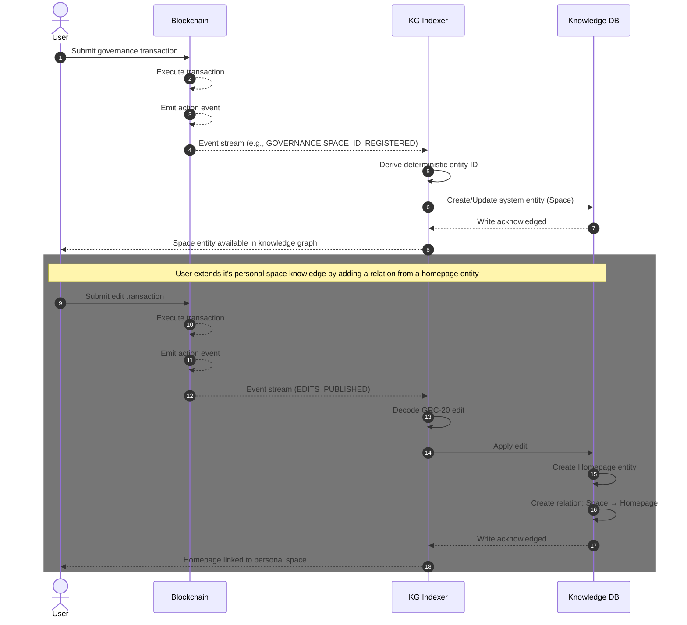
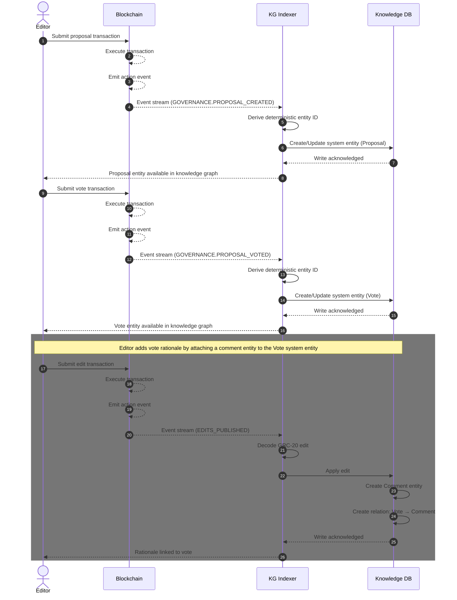
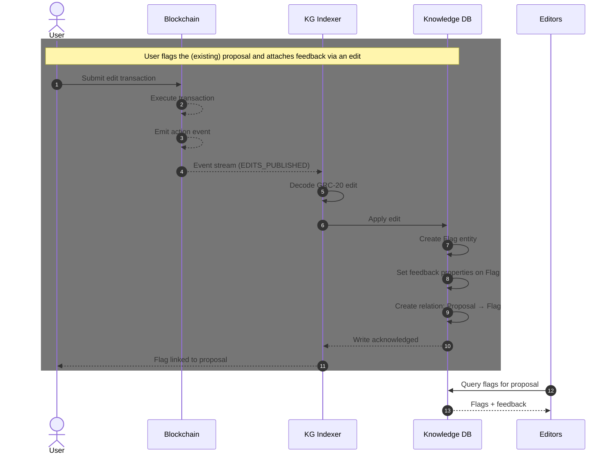
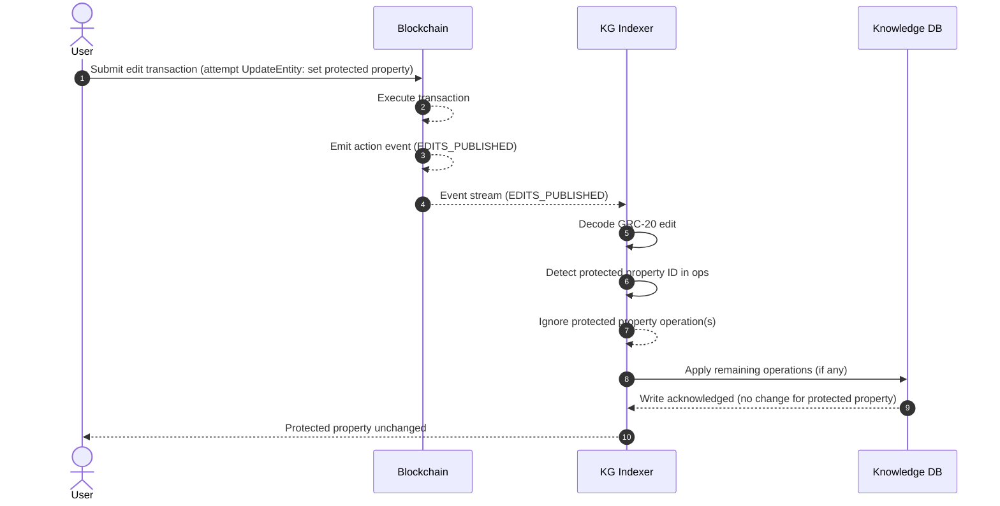
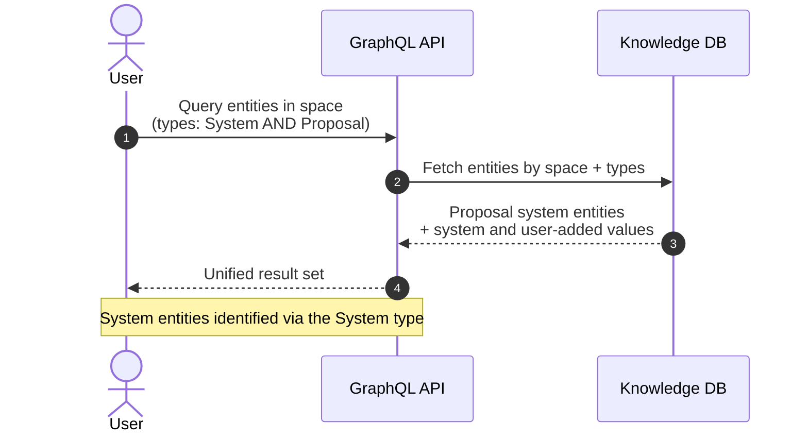

## 1. Introduction

Today, the GEO system has two separate data sources: **onchain state** (spaces, proposals, members, votes, etc. from governance action events) and **knowledge data** (entities, relations, and values from `EDITS_PUBLISHED`). These live in different layers and are queried differently, making it harder to build a unified view of the world.

System entities unify both into the knowledge graph layer by automatically materializing onchain state as KG entities. Onchain-derived properties are protected from user edits, but users can freely extend these entities with additional knowledge — creating a single, queryable graph that reflects both onchain truth and community-contributed data.

This creates a two-layer model:

- **System layer** — properties derived from onchain events, protected from user edits
- **Knowledge layer** — users can freely extend system entities with additional properties, relations, and types via normal edits

### 1.1 Design Principles

- **Onchain truth** — system properties reflect onchain state and cannot be overwritten by user edits
- **Extensible** — users can add any non-system properties, relations, and types to system entities
- **Deterministic** — all indexers derive the same entity IDs and state from the same events
- **Minimal** — the protocol defines the smallest set of protected properties; everything else is open

### 1.2 Terminology

| Term | Definition |
| --- | --- |
| System Entity | An entity automatically created/updated from an onchain action event |
| System Property | A property on a system entity that is derived from onchain state and protected from user edits |
| System Relation | A relation on a system entity that is derived from onchain state and protected from user edits (e.g., type assignments) |
| Protected Property | A hardcoded property ID that the indexer enforces as read-only on system entities |
| Protected Relation Type | A hardcoded relation type ID that the indexer enforces as read-only on system entities |

## 2. Entity Placement

System entities live in the **same space that emitted the event**. When a space emits a governance action, the resulting system entity belongs to that space's resolved state.

This ensures:

- Entities are discoverable where users expect them (in the space they relate to)
- Users with edit permissions in that space can extend the entity with additional knowledge
- Cross-space references work naturally via GRC-20 relation space pins

## 3. Deterministic IDs

System entity IDs are deterministically derived from event data so that all indexers converge on the same state. This follows the GRC-20 spec's `derived_id` pattern for deterministic UUID generation.

```
entity_id = derived_uuid("geo:system:" || event_identifier || ":" || data)
```

Where:

- `event_identifier` is the action name (e.g., `GOVERNANCE.SPACE_ID_REGISTERED`)
- `data` is the unique key for that event instance (e.g., the space address for a registered space)

**Requirements:**

- The derivation MUST be deterministic: the same event data always produces the same entity ID
- The derivation MUST produce unique IDs: different events MUST NOT collide
- The `data` component MUST include enough information to uniquely identify the event instance within its type

## 4. Protection Model

### 4.1 System Properties

System properties and system relations are hardcoded sets of IDs reserved exclusively for system use. These IDs are **globally protected,** the indexer ignores any `EDITS_PUBLISHED` operation that references a protected property ID or protected relation type, regardless of which entity it targets.

This means:

- Protected property IDs and relation type IDs are reserved and cannot be used by user edits on any entity
- The enforcement is simple: if an op references a protected property or relation type → ignore that op

Users can still freely:

- Add values for non-system properties on any entity (including system entities)
- Create non-system relations to/from system entities

<aside>
⚠️

We propose using hardcoded system property IDs to avoid database reads during indexing and maximize throughput.

</aside>

### 4.2 Enforcement Rules

**Value operations:**

| Operation | Condition | Resolution |
| --- | --- | --- |
| CreateEntity with values | Any value references a protected property | Ignored for those values; non-protected values applied normally |
| UpdateEntity `set` | Property is protected | Ignored for that property |
| UpdateEntity `unset` | Property is protected | Ignored for that property |
| Any op | Property is not protected | Applied normally |

**Relation operations:**

| Operation | Condition | Resolution |
| --- | --- | --- |
| CreateRelation | Relation type is a protected relation type | Ignored |
| DeleteRelation | Relation targets a system-created relation | Ignored |
| Any op | Relation type is not protected | Applied normally |

<aside>
⚠️

The indexer MUST ignore any value or relation operation in `EDITS_PUBLISHED` that references a protected property ID or a protected relation type. This applies globally, the check is on the property/relation type ID alone, not on the target entity.

</aside>

### 4.3 Protected Property and Relation Type IDs

The sets of protected property IDs and protected relation type IDs are hardcoded in the indexer. These lists will be defined as part of the event-to-entity mapping.

## 5. Indexer Flow

When the indexer encounters an onchain action event:

1. **Identify the event type** — read the `action` field from the Action event
2. **Derive the system entity ID** — compute the deterministic ID from the event data
3. **Apply the event mapping** — create or update the system entity with the appropriate system properties based on the event type and its data
4. **Write to the space** — the system entity is written to the space that emitted the event

When the indexer processes an `EDITS_PUBLISHED` event:

1. **Decode the edit** — standard GRC-20 edit decoding
2. **Check the edit's properties dictionary** — if any property ID in the dictionary is a protected property, ignore all value operations referencing that property
3. **Apply remaining operations normally**

## 6. Event-to-Entity Mapping

Each mapping is a function that takes an Action event (fromSpaceId, toSpaceId, action, subject, data) and returns a set of GRC-20 ops to create/update system entities.

```tsx
mapping(fromSpaceId, toSpaceId, action, subject, data) → List<Op>
```

The returned ops are applied to the `toSpaceId` space.

### 6.1 Well-Known System IDs

**System Types:**

| Name | UUID | Description |
| --- | --- | --- |
| System | TBD | Base type for all system entities |
| Space | TBD | A registered onchain space |
| Proposal | TBD | A governance proposal |

**System Properties (Protected):**

| Name | UUID | Data Type | Description |
| --- | --- | --- | --- |
| Space Address | TBD | BYTES | The space's onchain contract address |
| Proposal Id | TBD | BYTES | The onchain proposal identifier |
| Voting Mode | TBD | INTEGER | The proposal's voting mode |
| Created By | TBD | BYTES | The fromSpaceId that initiated the event |
| Created At Block | TBD | INTEGER | The block number when the event was emitted |

These property IDs are added to the `PROTECTED_PROPERTIES` set.

<aside>
⚠️

The following is an initial list of actions for generating GRC-20 knowledge content. In the long term, all emitted events will have their own knowledge generated.

</aside>

### 6.2 GOVERNANCE.SPACE_ID_REGISTERED

**Event fields:**

| Field | Value |
| --- | --- |
| `fromSpaceId` | The registering space |
| `toSpaceId` | The registered space |
| `subject` | `bytes32(bytes20(spaceAddress))` — the space contract address |
| `data` | Empty |

**Deterministic ID:**

```rust
entity_id = derived_uuid("geo:system:GOVERNANCE.SPACE_ID_REGISTERED:" || toSpaceId)
```

**Mapping function:**

```rust
mapping(fromSpaceId, toSpaceId, action, subject, data) → [
  // Create the space system entity with system properties
  CreateEntity {
    id: derived_uuid("geo:system:GOVERNANCE.SPACE_ID_REGISTERED:" || toSpaceId)
    values: [
      { property: <Space Address>,    value: subject[:20] },
      { property: <Created By>,       value: fromSpaceId },
      { property: <Created At Block>, value: block_number },
    ]
  },

  // Types → System
  CreateRelation {
    id: derived_uuid("geo:system:rel:System:" || entity_id)
    type: <Types>
    from: entity_id
    to: <System>
  },

  // Types → Space
  CreateRelation {
    id: derived_uuid("geo:system:rel:Space:" || entity_id)
    type: <Types>
    from: entity_id
    to: <Space>
  },
]
```

### 6.3 GOVERNANCE.PROPOSAL_CREATED

**Event fields:**

| Field | Value |
| --- | --- |
| `fromSpaceId` | The space that created the proposal |
| `toSpaceId` | The space where the proposal lives |
| `subject` | `bytes32(_proposalId)` — the proposal ID |
| `data` | `abi.encode(_proposalId, VotingMode, Action[])` |

**Deterministic ID:**

```rust
entity_id = derived_uuid("geo:system:GOVERNANCE.PROPOSAL_CREATED:" || toSpaceId || ":" || proposalId)
```

The ID includes both `toSpaceId` and `proposalId` to ensure uniqueness across spaces.

**Mapping function:**

```rust
mapping(fromSpaceId, toSpaceId, action, subject, data) → [
  // Decode data
  (proposalId, votingMode, actions) = abi.decode(data)

  // Create the proposal system entity with system properties
  CreateEntity {
    id: derived_uuid("geo:system:GOVERNANCE.PROPOSAL_CREATED:" || toSpaceId || ":" || proposalId)
    values: [
      { property: <Proposal Id>,      value: proposalId },
      { property: <Voting Mode>,      value: votingMode },
      { property: <Created By>,       value: fromSpaceId },
      { property: <Created At Block>, value: block_number },
    ]
  },

  // Types → System
  CreateRelation {
    id: derived_uuid("geo:system:rel:System:" || entity_id)
    type: <Types>
    from: entity_id
    to: <System>
  },

  // Types → Proposal
  CreateRelation {
    id: derived_uuid("geo:system:rel:Proposal:" || entity_id)
    type: <Types>
    from: entity_id
    to: <Proposal>
  },
]
```

<aside>
⚠️

We use GRC-20 ops as the mapping function output to provide a clear interface for generating the content.

</aside>

## 7. User Stories

### 7.1 Personal Space with Homepage

> As a user, I want to create my personal space and then assign a homepage to it.
> 
1. User registers a space onchain → `GOVERNANCE.SPACE_ID_REGISTERED` event fires
2. Indexer creates a **Space** system entity with protected properties (address, etc.)
3. User publishes an edit that creates a homepage entity and a relation from the space system entity to the homepage
4. The space system entity now has both system-derived properties (address) and user-added knowledge (homepage)

**Layers involved:**

- System layer: space entity creation with protected properties
- Knowledge layer: homepage relation added via `EDITS_PUBLISHED`



### 7.2 Voting on a Proposal with Rationale

> As an editor, I want to vote on a proposal and then attach a comment on it with my vote rationale.
> 
1. A proposal is created onchain → `GOVERNANCE.PROPOSAL_CREATED` event fires
2. Indexer creates a **Proposal** system entity with protected properties (voting mode, status, etc.)
3. Editor votes onchain → `GOVERNANCE.PROPOSAL_VOTED` event fires
4. Indexer creates/updates a **Vote** system entity with protected properties (vote option, voter, etc.)
5. Editor publishes an edit that adds a comment/rationale relation to the vote system entity

**Layers involved:**

- System layer: proposal entity, vote entity, and vote status from onchain events
- Knowledge layer: comment/rationale attached via `EDITS_PUBLISHED`



### 7.3 Flagging a Proposal with Feedback

> As a user, I want to be able to flag a proposal and provide my feedback for editors to consider rejecting it.
> 
1. A proposal exists as a system entity (from `GOVERNANCE.PROPOSAL_CREATED`)
2. User publishes an edit that creates a flag entity with feedback properties and a relation to the proposal system entity
3. Editors can query flags on the proposal and read the user's feedback

**Layers involved:**

- System layer: proposal entity from onchain event
- Knowledge layer: flag entity and feedback created entirely via `EDITS_PUBLISHED`



### 7.4 Attempting to Modify a Protected Property

> As a user, I want to modify the creation date of a proposal.
> 
1. A proposal exists as a system entity (from `GOVERNANCE.PROPOSAL_CREATED`) with a protected `created_at` property
2. User publishes an edit that includes an `UpdateEntity` op setting a new value for the `created_at` property on the proposal entity
3. The indexer checks the edit's properties dictionary, finds `created_at` is a protected property ID, and **ignores** the operation
4. The proposal's creation date remains unchanged

**Layers involved:**

- System layer: creation date is a protected property, enforced by the indexer
- Knowledge layer: the edit is rejected for that property — no state change occurs



### 7.5 Querying System Proposals

> As a user, I want to query the GraphQL API to get all system proposals in a space.
> 
1. User queries entities filtered by types `System` AND `Proposal` within a space
2. The API returns all proposal system entities, each with:
    - System properties (voting mode, status, created_at, etc.) — derived from onchain events
    - Any user-added properties (comments, flags, etc.) — added via `EDITS_PUBLISHED`
3. User can inspect any entity's types to confirm it is a system entity

**Layers involved:**

- System layer: entities are identifiable via the `System` type
- Knowledge layer: user-added properties returned alongside system properties in a unified response



## 8. Querying and Identifying System Entities

### 8.1 System Type

All system entities are assigned a `Types` relation to a well-known **System** type entity. This type lives in the Root Space alongside other well-known IDs.

When the indexer creates a system entity from an action event, it MUST create a `Types` relation from the entity to the System type. Additional types specific to the event (e.g., `Proposal`, `Space`, `Vote`) are also assigned as defined by the event-to-entity mapping.

### 8.2 Type-Based Filtering

Users identify system entities by filtering on the `System` type via the existing GraphQL API. Since GRC-20 entities support multiple types, users can compose filters:

| Filter | Result |
| --- | --- |
| `types: [System]` | All system entities |
| `types: [Proposal]` | All proposals (system or user-created) |
| `types: [System, Proposal]` | Only system proposal entities |
| `types: [System, Space]` | Only system space entities |

No new API endpoints or fields are required — the existing type filtering mechanism is sufficient.

### 8.3 Identifying System Properties

System properties are identifiable by their property IDs. Since the set of protected property IDs is hardcoded and well-known (Section 4.3), API consumers can check whether a property on an entity is system-managed by comparing its ID against the published set.

The API returns all properties on an entity uniformly — both system and user-added. Consumers distinguish them by property ID:

- **Known system property ID** → onchain-derived, protected
- **Any other property ID** → user-added via edits

## 9. Interaction with GRC-20

System entities are standard GRC-20 entities. They participate in the graph like any other entity:

- They have UUIDs as IDs
- They can be targets of relations
- They can have type memberships
- They can be referenced cross-space via relation space pins
- Their non-system properties follow standard LWW resolution

The only difference is the protection layer: system properties are derived from onchain events and enforced by the indexer, not by the GRC-20 protocol itself. This is an indexer-level rule, not a change to the GRC-20 binary format or edit structure.

# Open questions

- Should we require generating GRC-20 edits for system entities? This would ensure that every entity has a GRC-20 edit uploaded to IPFS, making it easier to replicate the knowledge graph state by replaying the GRC-20 ops
    - The KG indexer should have knowledge publishing capabilities. It may need to bypass certain permissions to publish content in targeted spaces.
- On which space should system entities be created? Using the `to_space_id` emitted by actions seems like the best approach.
