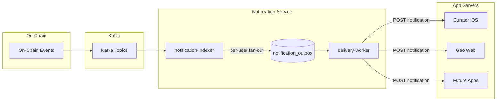

# Tech Design: Geo Notification Service

# Background

The Geo ecosystem produces a variety of on-chain events — governance proposals, knowledge graph edits, space membership changes, content moderation actions, and more. These events are emitted on-chain and streamed through a Kafka pipeline (`hermes-pipeline`) into various indexers that write to PostgreSQL.

Today, there is no mechanism to proactively inform app servers (Curator iOS, Geo web, etc.) when on-chain events happen. Users must manually poll or open the app to discover activity in their spaces. This creates a poor user experience and delays participation.

### Relevant Links

- [RFC 0004: Notification Service](docs/rfcs/0004-notification-service.md)
- [PR #464 Discussion](https://github.com/defi-wonderland/gaia/pull/464) — v1 scope decisions
- [`hermes-schema/proto/`](hermes-schema/proto/) — Protobuf definitions for all on-chain event types
- [`kg-indexer/src/handlers/`](kg-indexer/src/handlers/) — Existing event handling across topics

### Participants

- **Notification Indexer** — Rust service that consumes on-chain events and writes to the notification outbox
- **Delivery Worker** — Rust service that delivers notifications to registered webhooks
- **App Servers** (Curator, Geo, etc.) — External consumers that receive webhook calls and handle last-mile delivery (push notifications, in-app badges, etc.)
- **Users** — Members of spaces (e.g. editors in governance spaces) who receive per-user notifications

# General

The notification service is a general-purpose system that bridges on-chain events to app servers via webhooks. When an event occurs in a space, the service resolves all relevant users in that space and delivers a per-user webhook notification to every registered app server.

The architecture is event-type agnostic — the notification-indexer subscribes to Kafka topics, transforms events into webhook payloads, and writes them to the outbox. Adding support for new event types (e.g. knowledge graph edits, membership changes) requires only adding new Kafka handlers to the indexer. The outbox, delivery worker, and webhook contract remain unchanged.

**v1 ships with governance events** as the first supported category. Future versions will extend to other Kafka topics.



### Design Principles

- **Per-user delivery**: Each notification is addressed to a specific user (`user_space_id`). The notification service resolves users from the database — app servers don't need to know space membership.
- **Idempotent**: Unique idempotency keys (event + user) prevent duplicate notifications. App servers can safely deduplicate using the `idempotency_key` field.
- **Signed**: Every webhook call includes an `X-Geo-Signature` HMAC-SHA256 header so app servers can verify authenticity.
- **Versioned**: Payloads include a `version` field to enable future schema evolution without breaking existing consumers.
- **Decoupled**: The outbox pattern separates event processing from delivery. If a webhook is down, notifications queue up and retry automatically.

## Requirements

1. Provide a general-purpose pipeline for delivering on-chain events to app servers via webhooks.
2. For each event, resolve all relevant users in the affected space and create per-user notifications.
3. Deliver notifications to all registered webhooks.
4. Retry failed deliveries with exponential backoff (30s → 48hr cap, max 100 attempts).
5. Guarantee idempotency — reprocessing the same event produces no duplicates.
6. Spaces with zero relevant users produce zero notifications (no wasted work).
7. Staging and production environments are fully isolated (separate databases).
8. Support extensibility — adding new event types should only require new Kafka handlers.

## v1 Supported Event Types (Governance)

| Kafka Event | Webhook `event_type` | Source |
|---|---|---|
| `PROPOSAL_CREATED` | `proposal_created` | `space.governance` topic |
| `PROPOSAL_UPDATED` | `proposal_updated` | `space.governance` topic |
| `PROPOSAL_VOTED` | `proposal_voted` | `space.governance` topic |
| `PROPOSAL_EXECUTED` | `proposal_executed` | `space.governance` topic |
| `PROPOSAL_SETTINGS_UPDATED` | `proposal_settings_updated` | `space.governance` topic |
| *(expired proposals)* | `proposal_rejected` | Periodic DB poll (every 60s) |

Future versions may add events from other topics such as `knowledge.edits`, `space.membership`, and `space.moderation`.

# In-Depth

## Database Schema

### `app_webhooks`

Registered webhook endpoints. Manually seeded (no registration API in v1).

| Column | Type | Description |
|---|---|---|
| `id` | `uuid` PK | Auto-generated |
| `app_name` | `text` UNIQUE | Human-readable name (e.g. `curator-ios`) |
| `url` | `text` | HTTPS endpoint URL |
| `secret` | `text` | HMAC-SHA256 shared secret |
| `created_at` | `timestamptz` | Row creation time |
| `updated_at` | `timestamptz` | Last modification time |

### `notification_outbox`

One row per user per event. Written by the notification-indexer.

| Column | Type | Description |
|---|---|---|
| `id` | `uuid` PK | Auto-generated |
| `idempotency_key` | `text` UNIQUE | `{event_type}:{proposal_id}:{block_number}:{editor_id}` |
| `event_type` | `text` | e.g. `proposal_created` |
| `payload` | `jsonb` | Full webhook payload including `user_space_id` |
| `created_at` | `timestamptz` | Row creation time |
| `updated_at` | `timestamptz` | Last modification time |

### `notification_deliveries`

One row per outbox entry per webhook. Written by the notification-indexer, updated by the delivery-worker.

| Column | Type | Description |
|---|---|---|
| `id` | `uuid` PK | Auto-generated |
| `outbox_id` | `uuid` FK | References `notification_outbox.id` |
| `webhook_id` | `uuid` FK | References `app_webhooks.id` |
| `status` | `text` | `pending`, `delivered`, or `failed` |
| `attempts` | `smallint` | Number of delivery attempts |
| `last_error` | `text` | Last error message (nullable) |
| `next_retry_at` | `timestamptz` | When to retry next |
| `delivered_at` | `timestamptz` | When successfully delivered (nullable) |
| `created_at` | `timestamptz` | Row creation time |
| `updated_at` | `timestamptz` | Last modification time |

**Indexes:**
- `idx_deliveries_pending` on `(status, next_retry_at)` — optimizes the delivery-worker poll query
- `UNIQUE(outbox_id, webhook_id)` — prevents duplicate delivery rows

## Off-Chain: Notification Indexer

**Crate:** `notification-service/notification-indexer/`

The notification-indexer runs two concurrent tasks:

### Task 1: Kafka Consumer

Subscribes to Kafka topics for on-chain events (v1: `space.governance`, with environment-based topic prefix via `hermes-kafka`). For each message:

1. Reads the `event-type` header to determine the governance event type
2. Decodes the protobuf payload (`HermesProposalCreated`, `HermesProposalVoted`, etc.)
3. Extracts `space_id`, `proposal_id`, and event-specific fields (proposer, voter, vote option)
4. Queries `SELECT member_space_id FROM editors WHERE space_id = $1` to resolve editors
5. For each user, inserts an outbox row with the user's `user_space_id` stamped into the payload
6. Fans out delivery rows to all registered webhooks within the same transaction
7. Commits the Kafka offset

If the user lookup fails (DB error), the Kafka offset is **not** committed — the message will be reprocessed on restart. If the space has zero relevant users, the event is acknowledged and skipped.

### Task 2: Rejection Poller

Runs every `REJECTION_POLL_INTERVAL_SECS` (default 60s):

```sql
SELECT p.id, p.space_id, p.proposed_by, p.end_time
FROM proposals p
LEFT JOIN notification_outbox o
  ON o.event_type = 'proposal_rejected'
 AND (o.payload->>'proposal_id')::uuid = p.id
WHERE p.end_time < EXTRACT(EPOCH FROM now())
  AND p.executed_at IS NULL
  AND o.id IS NULL
```

For each expired proposal, resolves editors and inserts `proposal_rejected` notifications.

### Idempotency Keys

Each outbox row has a unique idempotency key computed as:

```
idempotency_key = SHA-256(block_number + ":" + sequence + ":" + event_type + ":" + user_space_id)
```

The `block_number` and `sequence` together uniquely identify an on-chain event (sequence handles multiple events within the same block), so they would be sufficient on their own. The `event_type` and `user_space_id` are included defensively to ensure per-user uniqueness.

For `proposal_rejected` (off-chain, no block/sequence), the input is `{proposal_id}:proposal_rejected:{user_space_id}` since a proposal can only be rejected once.

The `ON CONFLICT (idempotency_key) DO NOTHING` clause prevents duplicate outbox rows if the same event is processed twice (e.g. after a restart).

## Off-Chain: Delivery Worker

**Crate:** `notification-service/delivery-worker/`

A poll-based worker that delivers notifications to webhooks:

1. Queries pending deliveries: `WHERE status = 'pending' AND next_retry_at <= now()` with `FOR UPDATE SKIP LOCKED` (enables horizontal scaling)
2. For each delivery, POSTs the JSON payload to the webhook URL
3. Signs the request: `X-Geo-Signature: sha256={HMAC-SHA256(secret, body)}`
4. Handles the response:

| Response | Action |
|---|---|
| 2xx | Mark as `delivered` |
| 409 | Mark as `delivered` (duplicate, already processed) |
| 5xx, 429 | Increment attempts, schedule retry with exponential backoff |
| Other 4xx | Mark as `failed` (permanent, logged at `error` level) |
| Network error | Retry with backoff |
| Max retries exceeded | Mark as `failed` (logged at `error` level) |

### Retry Schedule

| Attempt | Delay |
|---|---|
| 1 | 30 seconds |
| 2 | 1 minute |
| 3 | 2 minutes |
| 4 | 4 minutes |
| 5 | 8 minutes |
| 6 | 16 minutes |
| 7 | 32 minutes |
| 8–13 | 1 hour → 34 hours |
| 14+ | 48 hours (capped) |

After 100 failed attempts, the delivery is permanently marked as `failed`.

## Webhook Payload

Every webhook POST body follows this JSON schema:

```json
{
  "version": 1,
  "event_type": "proposal_created",
  "space_id": "d4f5a6b7-...",
  "proposal_id": "c3e4f5a6-...",
  "user_space_id": "b2c3d4e5-...",
  "idempotency_key": "proposal_created:c3e4f5a6-...:12345:b2c3d4e5-...",
  "proposer_id": "a1b2c3d4-...",
  "block_number": 12345,
  "timestamp": 1700000000
}
```

### Fields

| Field | Type | Presence | Description |
|---|---|---|---|
| `version` | number | Always | Payload schema version (currently `1`) |
| `event_type` | string | Always | One of the 6 event types |
| `space_id` | UUID string | Always | Space where the event occurred |
| `proposal_id` | UUID string | Always | Proposal involved |
| `user_space_id` | UUID string | Always | The user this notification is addressed to |
| `idempotency_key` | string | Always | Unique deduplication key |
| `proposer_id` | UUID string | `created`, `updated`, `rejected` | Who created/updated the proposal |
| `voter_id` | UUID string | `voted` only | Who cast the vote |
| `vote` | string | `voted` only | `yes`, `no`, or `abstain` |
| `block_number` | number | All except `rejected` | On-chain block number |
| `timestamp` | number | Always | Unix timestamp in seconds |

## Deployment

### Kubernetes

Both services deploy as Kubernetes `Deployment` resources in isolated namespaces:

| Environment | Namespace | Kafka Prefix | Database |
|---|---|---|---|
| Production | `notifications` | *(none)* | Production DB via `scoring-service-credentials` |
| Staging | `notifications-staging` | `staging.` | Staging DB via `scoring-service-credentials` |

Staging and production are fully isolated — separate namespaces, separate secrets, separate databases. The delivery worker can never call production webhooks from staging.

Both services include:
- `startupProbe` and `livenessProbe` via `pgrep`
- Security context: `runAsNonRoot`, `runAsUser: 1001`
- Sentry integration (optional, via secrets)
- Heartbeat logging every 60s with cumulative stats

### Docker

Multi-stage builds based on `rust:1.92-bookworm` → `debian:bookworm-slim`. Built as standalone crates (not workspace members in Docker) for caching efficiency.

### CI/CD

| Workflow | Trigger | Action |
|---|---|---|
| `notification-indexer-tests.yml` | Push/PR to `main`/`dev` | `cargo test -p notification-indexer` |
| `delivery-worker-tests.yml` | Push/PR to `main`/`dev` | `cargo test -p delivery-worker` |
| `notification-service-e2e-tests.yml` | Push/PR to `main`/`dev` | Full e2e with Postgres + Kafka + mock webhook |
| `notification-indexer-deploy.yml` | Push to `main` | Build, push to DO registry, deploy to `notifications` |
| `notification-indexer-deploy-staging.yml` | Push to `dev` | Build, push to DO registry, deploy to `notifications-staging` |
| `delivery-worker-deploy.yml` | Push to `main` | Build, push to DO registry, deploy to `notifications` |
| `delivery-worker-deploy-staging.yml` | Push to `dev` | Build, push to DO registry, deploy to `notifications-staging` |

## Testing

### Unit Tests

Both crates include `#[cfg(test)]` unit tests covering protobuf parsing, payload construction, idempotency key formatting, HMAC computation, retry logic, and exponential backoff.

### E2E Tests

An end-to-end test suite (`notification-service/e2e-tests/`) starts Postgres and Kafka via docker-compose, runs both services, and uses a mock webhook server to verify the full pipeline. The tests cover three user-count scenarios (0, 1, and 3 users per space) to validate correct fan-out behavior, HMAC signatures, idempotency, and the absence of false positives.

## Invariants

1. **User fan-out completeness**: For every event in a space with N relevant users, exactly N outbox rows are created (one per user). For v1 governance events, relevant users are the editors of the space.
2. **Delivery fan-out completeness**: For every outbox row, exactly M delivery rows are created (one per registered webhook).
3. **Idempotency**: Processing the same Kafka message twice produces zero additional outbox rows.
4. **Zero-user silence**: Events for spaces with zero relevant users produce zero outbox rows and zero webhook calls.
5. **HMAC integrity**: Every webhook call's `X-Geo-Signature` header matches `sha256={HMAC-SHA256(secret, body)}`.
6. **Environment isolation**: Staging services never read from or write to the production database.
7. **Payload versioning**: Every webhook payload contains `"version": 1`.
8. **Retry termination**: Every delivery eventually reaches `delivered` or `failed` status (no infinite retries).

# External Requirements

App servers that want to receive notifications must:

1. **Register a webhook** by inserting a row into `app_webhooks` (manual DB insert in v1).
2. **Implement an HTTPS endpoint** that accepts POST requests with JSON bodies.
3. **Verify HMAC signatures** using the shared secret (see [WEBHOOK_INTEGRATION.md](WEBHOOK_INTEGRATION.md)).
4. **Handle idempotency** using the `idempotency_key` field to deduplicate retried deliveries.
5. **Return appropriate status codes**: 2xx for success, 409 for duplicate, 5xx to trigger retry.

A complete integration guide with TypeScript examples is provided in [WEBHOOK_INTEGRATION.md](WEBHOOK_INTEGRATION.md).

# Open Questions and Thoughts

1. **Webhook registration API**: v1 requires manual DB inserts. Should we add an authenticated API for app servers to register/update their webhooks?
2. **Subscription filtering**: Currently all events go to all webhooks. Should app servers be able to subscribe to specific event types or specific spaces?
3. **Member notifications**: Currently only editors receive notifications. Should members (non-editors) also be notified for certain event types?
4. **Rate limiting**: Should we add per-webhook rate limiting to prevent overwhelming a slow app server?
5. **Dead letter queue**: Permanently failed deliveries are logged at `error` level. Should we add a dedicated DLQ table or alerting integration for operational visibility?
6. **Health endpoints**: Both services use `pgrep`-based liveness probes. Should we add HTTP `/healthz` endpoints that check DB and Kafka connectivity?

> Please note that the design presented here serves as a foundational starting point. As the development process progresses, certain details may evolve and adjustments may be made. Therefore, the final implementation may differ from the initial design described in this document.

# Signatures

- *(pending review)*
