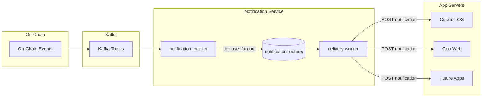
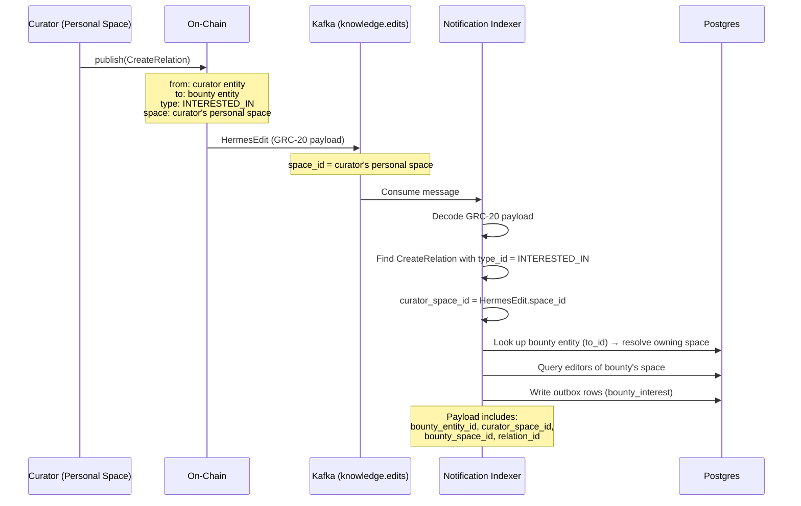
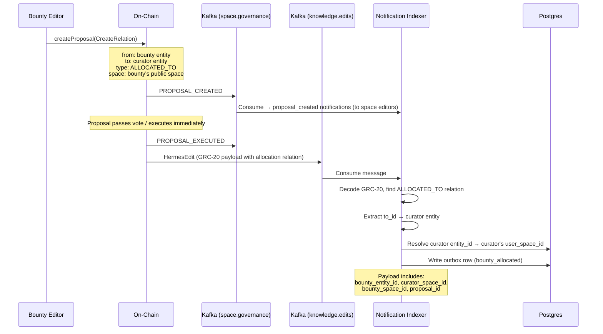
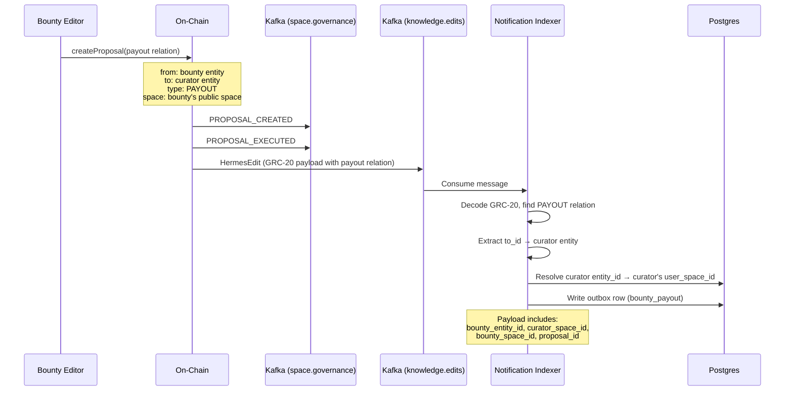

# Tech Design: Geo Notification Service

# Background

The Geo ecosystem produces a variety of on-chain events — governance proposals, knowledge graph edits, space membership changes, content moderation actions, and more. These events are emitted on-chain and streamed through a Kafka pipeline (`hermes-pipeline`) into various indexers that write to PostgreSQL.

Today, there is no mechanism to proactively inform app servers (Curator iOS, Geo web, etc.) when on-chain events happen. Users must manually poll or open the app to discover activity in their spaces. This creates a poor user experience and delays participation.

### Relevant Links

- [RFC 0004: Notification Service](docs/rfcs/0004-notification-service.md)
- [PR #464 Discussion](https://github.com/defi-wonderland/gaia/pull/464) — v1 scope decisions
- [`hermes-schema/proto/`](hermes-schema/proto/) — Protobuf definitions for all on-chain event types
- [`kg-indexer/src/handlers/`](kg-indexer/src/handlers/) — Existing event handling across topics

### Participants

- **Notification Indexer** — Rust service that consumes on-chain events and writes to the notification outbox
- **Delivery Worker** — Rust service that delivers notifications to registered webhooks
- **App Servers** (Curator, Geo, etc.) — External consumers that receive webhook calls and handle last-mile delivery (push notifications, in-app badges, etc.)
- **Users** — Members of spaces (e.g. editors in governance spaces) who receive per-user notifications

# General

The notification service is a general-purpose system that bridges on-chain events to app servers via webhooks. When an event occurs in a space, the service resolves all relevant users in that space and delivers a per-user webhook notification to every registered app server.

The architecture is event-type agnostic — the notification-indexer subscribes to Kafka topics, transforms events into webhook payloads, and writes them to the outbox. Adding support for new event types (e.g. knowledge graph edits, membership changes) requires only adding new Kafka handlers to the indexer. The outbox, delivery worker, and webhook contract remain unchanged.

**v1 ships with governance events** as the first supported category. Future versions will extend to other Kafka topics.



### Design Principles

- **Per-user delivery**: Each notification is addressed to a specific user (`user_space_id`). The notification service resolves recipients from the database — app servers don't need to know space membership.
    - **Governance (v1):** relevant users = editors of the event's `space_id` (queried from the `editors` table). Member notifications are explicitly out of scope for v1 — see Open Questions.
    - **Bounty (v1):** recipients depend on the relation type: `bounty_interest` notifies editors of the bounty's owning space; `bounty_allocated` / `bounty_payout` notify the target curator (resolved via `to_space_id` or entity→space lookup).
- **Idempotent**: Unique idempotency keys (event + user) prevent duplicate notifications. App servers can safely deduplicate using the `idempotency_key` field.
- **Signed**: Every webhook call includes an `X-Geo-Signature` HMAC-SHA256 header so app servers can verify authenticity. The HMAC-SHA256 is computed over the exact raw HTTP request body bytes as sent (UTF-8 JSON). No canonicalization or reordering is applied; app servers must verify the signature against the raw body bytes, not a re-serialized version.
- **Versioned**: Payloads include a `version` field to enable future schema evolution without breaking existing consumers.
- **Decoupled**: The outbox pattern separates event processing from delivery. If a webhook is down, notifications queue up and retry automatically.

## Requirements

1. Provide a general-purpose pipeline for delivering on-chain events to app servers via webhooks.
2. For each event, resolve all relevant users in the affected space and create per-user notifications.
3. Deliver notifications to all registered webhooks.
4. Retry failed deliveries with exponential backoff (30s → 48hr cap, max 100 attempts).
5. Guarantee idempotency — reprocessing the same event produces no duplicates.
6. Spaces with zero relevant users produce zero notifications (no wasted work).
7. Staging and production environments are fully isolated (separate databases).
8. Support extensibility — adding new event types should only require new Kafka handlers.

## v1 Supported Event Types

### Governance

| Kafka Event | Webhook `event_type` | Source |
|---|---|---|
| `PROPOSAL_CREATED` | `proposal_created` | `space.governance` topic |
| `PROPOSAL_UPDATED` | `proposal_updated` | `space.governance` topic |
| `PROPOSAL_VOTED` | `proposal_voted` | `space.governance` topic |
| `PROPOSAL_EXECUTED` | `proposal_executed` | `space.governance` topic |
| `PROPOSAL_SETTINGS_UPDATED` | `proposal_settings_updated` | `space.governance` topic |
| *(expired proposals)* | `proposal_rejected` | Periodic DB poll (every 60s) |

### Bounty Lifecycle

| Kafka Event | Webhook `event_type` | Source |
|---|---|---|
| `HermesEdit` containing interest `CreateRelation` | `bounty_interest` | `knowledge.edits` topic |
| `HermesEdit` containing allocation `CreateRelation` | `bounty_allocated` | `knowledge.edits` topic |
| `HermesEdit` containing payout `CreateRelation` | `bounty_payout` | `knowledge.edits` topic |

Footnote: For `bounty_interest`, `HermesEdit.space_id` is the curator's personal space (no DB lookup needed). For `bounty_allocated` / `bounty_payout`, the curator's space is resolved from the relation's `to_space_id` if present, otherwise via the entity→space DB lookup.

Bounty events require consuming the `knowledge.edits` Kafka topic. The notification-indexer decodes the GRC-20 payload from `HermesEdit` messages and inspects the relation `type_id` to identify bounty-specific relations. Well-known relation type UUIDs for bounty interest, allocation, and payout are defined in the protocol and configured via environment variables (e.g. `BOUNTY_INTEREST_RELATION_TYPE_ID`, `BOUNTY_ALLOCATED_RELATION_TYPE_ID`, `BOUNTY_PAYOUT_RELATION_TYPE_ID`).

#### Resolving entity_id → user_space_id

Bounty relations reference users by their **entity ID** (`from_id` or `to_id` in the relation). The notification service needs the user's **`user_space_id`** (their personal space UUID) to address notifications. There is no direct entity→space mapping table — instead, the resolution uses the "front page entity" pattern from the knowledge graph:

```sql
-- Given a user entity_id, find their personal space
SELECT r.space_id AS user_space_id
FROM relations r
JOIN spaces s ON s.id = r.space_id
WHERE r.from_entity_id = $1             -- the user's entity_id
  AND r.type_id = '8f151ba4-...'        -- SystemIds.TYPES relation
  AND r.to_entity_id = '362c1dbd-...'   -- SystemIds.SPACE_TYPE
  AND s.type = 'Personal'
LIMIT 1
```

Every personal space has a "front page entity" linked via a `TYPES → SPACE_TYPE` relation. This query finds the personal space that claims the given entity as its front page entity.

**Shortcut for bounty interest:** The `HermesEdit.space_id` is the curator's personal space (since they published from their personal space), so no DB lookup is needed — the `space_id` on the Kafka message *is* the curator's `user_space_id`.

**For allocation/payout:** The relation's `to_id` is the curator entity. The `to_space_id` field on the relation may also be populated (if the app set it), providing the curator's space directly. If absent, the DB lookup above is used as a fallback.

#### Bounty Interest

A curator expresses interest in a bounty by creating a relation in their **personal space** pointing from their user entity to the bounty entity. The notification service detects this relation and notifies the editors of the space that owns the bounty.

**Who gets notified:** Editors of the bounty's space (the maintainers who can allocate the bounty).

**How the recipient space is resolved:** The `to_id` (bounty entity) is looked up in the `relations` table to find which space(s) it belongs to. The editors of that space are the recipients.

**How the curator's space is resolved:** The `HermesEdit.space_id` is the curator's personal space (since they published the edit from their personal space). No additional DB lookup is needed.



#### Bounty Allocation

An editor of the bounty's space allocates a bounty by creating an allocation relation from the bounty entity to the allocated curator. The notification-indexer detects this allocation relation by consuming `knowledge.edits` directly (decoding the executed edit payload and inspecting `CreateRelation` operations), and emits a `bounty_allocated` notification to the allocated curator.

**Who gets notified:** The curator who was allocated (identified by the `to_id` of the allocation relation).

**How the curator's space is resolved:** Use the relation's `to_space_id` if populated; otherwise fall back to the entity→space DB lookup (see [Resolving entity_id → user_space_id](#resolving-entity_id--user_space_id)).



#### Bounty Payout

After work is completed, a payout relation is created from the bounty entity to the curator entity. In DAO/governance spaces this typically happens via a governance proposal that, when executed, publishes an edit containing the payout relation; in EOA spaces the relation may be created directly. The notification-indexer detects the payout relation type by consuming `knowledge.edits` and inspecting `CreateRelation` operations, and notifies the curator that they have been paid.

**Who gets notified:** The curator who received the payout (identified by the `to_id` of the payout relation).

**How the curator's space is resolved:** Same as allocation — use `to_space_id` if available, otherwise DB lookup.



#### Deduplication: Governance vs. Bounty Notifications

A bounty allocation will typically produce:

- a generic `proposal_executed` notification (to all space editors) from `space.governance` (DAO/governance spaces), and
- a targeted `bounty_allocated` notification (to the allocated curator) from `knowledge.edits` when the allocation relation is published.

These are intentionally separate notifications for different audiences. They are emitted from different Kafka topics (and may arrive at different times), so there is no single-event overlap; any deduplication/merging is an application-layer choice.

Future versions may add events from other topics such as `space.membership` and `space.moderation`.

# In-Depth

## Database Schema

### `app_webhooks`

Registered webhook endpoints. Manually seeded (no registration API in v1).

| Column | Type | Description |
|---|---|---|
| `id` | `uuid` PK | Auto-generated |
| `app_name` | `text` UNIQUE | Human-readable name (e.g. `curator-ios`) |
| `url` | `text` | HTTPS endpoint URL |
| `secret` | `text` | HMAC-SHA256 shared secret |
| `created_at` | `timestamptz` | Row creation time |
| `updated_at` | `timestamptz` | Last modification time |

### `notification_outbox`

One row per user per event. Written by the notification-indexer.

| Column | Type | Description |
|---|---|---|
| `id` | `uuid` PK | Auto-generated |
| `idempotency_key` | `text` UNIQUE | SHA-256 hex of `{block_number}:{sequence}:{event_type}:{user_space_id}` (see [Idempotency Keys](#idempotency-keys)) |
| `event_type` | `text` | e.g. `proposal_created` |
| `payload` | `jsonb` | Full webhook payload including `user_space_id` |
| `created_at` | `timestamptz` | Row creation time |
| `updated_at` | `timestamptz` | Last modification time |

### `notification_deliveries`

One row per outbox entry per webhook. Written by the notification-indexer, updated by the delivery-worker.

| Column | Type | Description |
|---|---|---|
| `id` | `uuid` PK | Auto-generated |
| `outbox_id` | `uuid` FK | References `notification_outbox.id` |
| `webhook_id` | `uuid` FK | References `app_webhooks.id` |
| `status` | `text` | `pending`, `in_progress`, `delivered`, or `failed` |
| `attempts` | `smallint` | Number of delivery attempts |
| `last_error` | `text` | Last error message (nullable) |
| `next_retry_at` | `timestamptz` | When to retry next |
| `delivered_at` | `timestamptz` | When successfully delivered (nullable) |
| `created_at` | `timestamptz` | Row creation time |
| `updated_at` | `timestamptz` | Last modification time |

**Indexes:**
- `idx_deliveries_pending` on `(status, next_retry_at)` — optimizes the delivery-worker poll query
- `UNIQUE(outbox_id, webhook_id)` — prevents duplicate delivery rows

## Off-Chain: Notification Indexer

**Crate:** `notification-service/notification-indexer/`

The notification-indexer runs three concurrent tasks:

### Task 1: Governance Consumer

Subscribes to `space.governance` (with environment-based topic prefix via `hermes-kafka`). For each message:

1. Reads the `event-type` header to determine the governance event type
2. Decodes the protobuf payload (`HermesProposalCreated`, `HermesProposalVoted`, etc.)
3. Extracts `space_id`, `proposal_id`, and event-specific fields (proposer, voter, vote option)
4. Queries `SELECT member_space_id FROM editors WHERE space_id = $1` to resolve editors
5. For each user, inserts an outbox row with the user's `user_space_id` stamped into the payload
6. Fans out delivery rows to all registered webhooks within the same transaction
7. Commits the Kafka offset

If the user lookup fails (DB error), the Kafka offset is **not** committed — the message will be reprocessed on restart. If the space has zero relevant users, the event is acknowledged and skipped.

### Task 2: Knowledge Edits Consumer

Subscribes to `knowledge.edits` (with environment-based topic prefix). For each `HermesEdit` message:

1. Decodes the protobuf `HermesEdit` envelope to extract `space_id` and `payload` (GRC-20 bytes)
2. Decodes the GRC-20 payload using the `grc-20` crate (`grc_20::decode_edit()`)
3. Iterates over `CreateRelation` operations in the edit
4. Checks each relation's `type_id` against the configured bounty relation type UUIDs:
   - **`BOUNTY_INTEREST_RELATION_TYPE_ID`** → `bounty_interest` notification
   - **`BOUNTY_ALLOCATED_RELATION_TYPE_ID`** → `bounty_allocated` notification
   - **`BOUNTY_PAYOUT_RELATION_TYPE_ID`** → `bounty_payout` notification
5. Relations with unrecognized `type_id` values are skipped (no notification)
6. For matched relations, resolves recipients and the curator's identity:
   - `bounty_interest`: `curator_space_id` = `HermesEdit.space_id` (no DB lookup needed). Look up the bounty entity (`to_id`) in the `relations` table → find its owning space → query editors of that space as recipients
   - `bounty_allocated` / `bounty_payout`: `curator_space_id` = relation's `to_space_id` if present, otherwise resolve `to_id` (curator entity) → `user_space_id` via the front-page-entity DB lookup. The curator is the sole recipient
7. Inserts outbox rows and fans out delivery rows
8. Commits the Kafka offset

**GRC-20 decoding:** The `HermesEdit.payload` field contains raw GRC-20 (or GRC2Z compressed) bytes. Each edit contains a list of operations (`CreateEntity`, `CreateRelation`, `SetTriple`, etc.). The notification-indexer only inspects `CreateRelation` operations and ignores all others. The `grc-20` crate is already used by the kg-indexer for the same purpose.

### Task 3: Rejection Poller

Runs every `REJECTION_POLL_INTERVAL_SECS` (default 60s):

```sql
SELECT p.id, p.space_id, p.proposed_by, p.end_time
FROM proposals p
LEFT JOIN notification_outbox o
  ON o.event_type = 'proposal_rejected'
 AND (o.payload->>'proposal_id')::uuid = p.id
WHERE p.end_time < EXTRACT(EPOCH FROM now())
  AND p.executed_at IS NULL
  AND o.id IS NULL
```

For each expired proposal, resolves editors and inserts `proposal_rejected` notifications.

### Idempotency Keys

Each outbox row has a unique idempotency key computed as:

```
idempotency_key = SHA-256(block_number + ":" + sequence + ":" + event_type + ":" + user_space_id)
```

The `block_number` and `sequence` together uniquely identify an on-chain event. `sequence` is `BlockchainMetadata.sequence` — the action index within the block (0-based) — and disambiguates multiple events within the same block. The `event_type` and `user_space_id` are included defensively to ensure per-user uniqueness.

For `proposal_rejected` (off-chain, no block/sequence), the input is `{proposal_id}:proposal_rejected:{user_space_id}` since a proposal can only be rejected once.

For bounty events (`bounty_interest`, `bounty_allocated`, `bounty_payout`), the same `block_number:sequence:event_type:user_space_id` formula applies since these originate from on-chain `HermesEdit` messages with full `BlockchainMetadata`.

The `ON CONFLICT (idempotency_key) DO NOTHING` clause prevents duplicate outbox rows if the same event is processed twice (e.g. after a restart).

## Off-Chain: Delivery Worker

**Crate:** `notification-service/delivery-worker/`

A poll-based worker that delivers notifications to webhooks concurrently:

1. Claims pending deliveries using a CTE that atomically selects and updates status to `in_progress`, releasing the `FOR UPDATE SKIP LOCKED` row lock immediately rather than holding it through the HTTP call.
2. Delivers up to `MAX_CONCURRENT_DELIVERIES` (default 10) webhooks concurrently via `tokio::JoinSet`.
3. For each delivery, POSTs the JSON payload to the webhook URL.
4. Signs the request: `X-Geo-Signature: sha256={HMAC-SHA256(secret, body)}`
5. Handles the response:

| Response | Action |
|---|---|
| 2xx | Mark as `delivered` |
| 409 | Mark as `delivered` (duplicate: `idempotency_key` already processed successfully). App servers should return 409 only in this case; it will not be retried. |
| 5xx, 429 | Increment attempts, schedule retry with exponential backoff |
| Other 4xx | Mark as `failed` (permanent, logged at `error` level) |
| Network error | Retry with backoff |
| Max retries exceeded | Mark as `failed` (logged at `error` level) |

A periodic stale-claim reaper (every 60s) resets `in_progress` deliveries older than 5 minutes back to `pending`, handling the case where a worker crashes mid-delivery.

### Retry Schedule

Retry delay formula: `delay_secs = min(30 * 2^(attempt-1), 172800)` (capped at 48 hours). No jitter is currently applied; jitter may be added in a future version.

| Attempt | Delay |
|---|---|
| 1 | 30 seconds |
| 2 | 1 minute |
| 3 | 2 minutes |
| 4 | 4 minutes |
| 5 | 8 minutes |
| 6 | 16 minutes |
| 7 | 32 minutes |
| 8–13 | 1 hour → 34 hours |
| 14+ | 48 hours (capped) |

After 100 failed attempts, the delivery is permanently marked as `failed`.

## Webhook Payload

Every webhook POST body uses a single top-level payload shape. Optional fields are omitted when not applicable (not set to `null`).

Example (governance):

```json
{
  "version": 1,
  "event_type": "proposal_created",
  "category": "governance",
  "space_id": "d4f5a6b7-...",
  "user_space_id": "b2c3d4e5-...",
  "idempotency_key": "<sha256-hex>",
  "block_number": 12345,
  "timestamp": 1700000000,

  "proposal_id": "c3e4f5a6-...",
  "proposer_id": "a1b2c3d4-..."
}
```

Example (bounty):

```json
{
  "version": 1,
  "event_type": "bounty_interest",
  "category": "bounty",
  "space_id": "d4f5a6b7-...",
  "user_space_id": "b2c3d4e5-...",
  "idempotency_key": "<sha256-hex>",
  "block_number": 12345,
  "timestamp": 1700000000,

  "bounty_entity_id": "...",
  "relation_id": "...",
  "curator_space_id": "...",
  "bounty_space_id": "...",
  "interested_user_space_id": "..."
}
```

Notes:

- `category` is always present and is either `"governance"` or `"bounty"`.
- `idempotency_key` is a lowercase hex-encoded SHA-256 digest (see [Idempotency Keys](#idempotency-keys)).

### Fields

#### Common (all event types)

| Field | Type | Presence | Description |
|---|---|---|---|
| `version` | number | Always | Payload schema version (currently `1`) |
| `event_type` | string | Always | Event type identifier |
| `category` | string | Always | Event category: `"governance"` or `"bounty"` |
| `space_id` | UUID string | Always | Space where the event occurred |
| `user_space_id` | UUID string | Always | The user this notification is addressed to |
| `idempotency_key` | string | Always | Unique deduplication key (SHA-256 hex) |
| `block_number` | number | All except `proposal_rejected` | On-chain block number |
| `timestamp` | number | Always | Unix timestamp in seconds |

#### Governance fields

| Field | Type | Presence | Description |
|---|---|---|---|
| `proposal_id` | UUID string | All governance events | Proposal involved |
| `proposer_id` | UUID string | `created`, `updated`, `rejected` | Who created/updated the proposal |
| `voter_id` | UUID string | `voted` only | Who cast the vote |
| `vote` | string | `voted` only | `yes`, `no`, or `abstain` |

#### Bounty fields

| Field | Type | Presence | Description |
|---|---|---|---|
| `bounty_entity_id` | UUID string | All bounty events | The bounty entity |
| `relation_id` | UUID string | All bounty events | The relation that triggered the notification |
| `curator_space_id` | UUID string | All bounty events | The curator's personal space (resolved from `HermesEdit.space_id` for interest, or entity→space lookup for allocation/payout) |
| `bounty_space_id` | UUID string | All bounty events | The space that owns the bounty |
| `interested_user_space_id` | UUID string | `bounty_interest` only | The personal space of the user who expressed interest (always equals `curator_space_id` — included explicitly so app servers can identify the interested user without understanding the curator resolution logic) |
| `proposal_id` | UUID string | `bounty_allocated`, `bounty_payout` | The governance proposal (absent for `bounty_interest` since no proposal is involved) |

## Deployment

### Kubernetes

Both services deploy as Kubernetes `Deployment` resources in isolated namespaces:

| Environment | Namespace | Kafka Prefix | Database |
|---|---|---|---|
| Production | `notifications` | *(none)* | Production DB via `scoring-service-credentials` |
| Staging | `notifications-staging` | `staging.` | Staging DB via `scoring-service-credentials` |

Staging and production are fully isolated — separate namespaces, separate secrets, separate databases. The delivery worker can never call production webhooks from staging.

Both services include:
- `startupProbe` and `livenessProbe` via `pgrep`
- Security context: `runAsNonRoot`, `runAsUser: 1001`
- Sentry integration (optional, via secrets)
- Heartbeat logging every 60s with cumulative stats

### Docker

Multi-stage builds based on `rust:1.92-bookworm` → `debian:bookworm-slim`. Built as standalone crates (not workspace members in Docker) for caching efficiency.

### CI/CD

| Workflow | Trigger | Action |
|---|---|---|
| `notification-indexer-tests.yml` | Push/PR to `main`/`dev` | `cargo test -p notification-indexer` |
| `delivery-worker-tests.yml` | Push/PR to `main`/`dev` | `cargo test -p delivery-worker` |
| `notification-service-e2e-tests.yml` | Push/PR to `main`/`dev` | Full e2e with Postgres + Kafka + mock webhook |
| `notification-indexer-deploy.yml` | Push to `main` | Build, push to DO registry, deploy to `notifications` |
| `notification-indexer-deploy-staging.yml` | Push to `dev` | Build, push to DO registry, deploy to `notifications-staging` |
| `delivery-worker-deploy.yml` | Push to `main` | Build, push to DO registry, deploy to `notifications` |
| `delivery-worker-deploy-staging.yml` | Push to `dev` | Build, push to DO registry, deploy to `notifications-staging` |

## Testing

### Unit Tests

Both crates include `#[cfg(test)]` unit tests covering protobuf parsing, payload construction, idempotency key formatting, HMAC computation, retry logic, and exponential backoff.

### E2E Tests

An end-to-end test suite (`notification-service/e2e-tests/`) starts Postgres and Kafka via docker-compose, runs both services, and uses a mock webhook server to verify the full pipeline. The tests cover three user-count scenarios (0, 1, and 3 users per space) to validate correct fan-out behavior, HMAC signatures, idempotency, and the absence of false positives.

## Invariants

1. **User fan-out completeness**: For every event in a space with N relevant users, exactly N outbox rows are created (one per user). For v1 governance events, relevant users are the editors of the space.
2. **Delivery fan-out completeness**: For every outbox row, exactly M delivery rows are created (one per registered webhook).
3. **Idempotency**: Processing the same Kafka message twice produces zero additional outbox rows.
4. **Zero-user silence**: Events for spaces with zero relevant users produce zero outbox rows and zero webhook calls.
5. **HMAC integrity**: Every webhook call's `X-Geo-Signature` header matches `sha256={HMAC-SHA256(secret, body)}`.
6. **Environment isolation**: Staging services never read from or write to the production database.
7. **Payload versioning**: Every webhook payload contains `"version": 1`.
8. **Retry termination**: Every delivery eventually reaches `delivered` or `failed` status (no infinite retries).

# External Requirements

App servers that want to receive notifications must:

1. **Register a webhook** by inserting a row into `app_webhooks` (manual DB insert in v1).
2. **Implement an HTTPS endpoint** that accepts POST requests with JSON bodies.
3. **Verify HMAC signatures** using the shared secret (see [WEBHOOK_INTEGRATION.md](WEBHOOK_INTEGRATION.md)).
4. **Handle idempotency** using the `idempotency_key` field to deduplicate retried deliveries.
5. **Return appropriate status codes**: 2xx for success, 409 for duplicate, 5xx to trigger retry.

A complete integration guide with TypeScript examples is provided in [WEBHOOK_INTEGRATION.md](WEBHOOK_INTEGRATION.md).

# Open Questions and Thoughts

1. **Webhook registration API**: v1 requires manual DB inserts. Should we add an authenticated API for app servers to register/update their webhooks?
2. **Subscription filtering**: Currently all events go to all webhooks. Should app servers be able to subscribe to specific event types or specific spaces?
3. **Member notifications**: Currently only editors receive notifications. Should members (non-editors) also be notified for certain event types?
4. **Rate limiting**: Should we add per-webhook rate limiting to prevent overwhelming a slow app server?
5. **Dead letter queue**: Permanently failed deliveries are logged at `error` level. Should we add a dedicated DLQ table or alerting integration for operational visibility?

> Please note that the design presented here serves as a foundational starting point. As the development process progresses, certain details may evolve and adjustments may be made. Therefore, the final implementation may differ from the initial design described in this document.

# Signatures

- *(pending review)*
